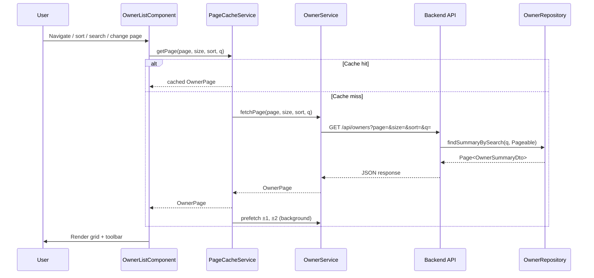

# Design Document: Owners Pagination

## Overview

This feature adds server-side pagination, sorting, and a client-side page cache to the Owners list screen. The backend already returns `Page<Owner>` via Spring Data `Pageable`, but the frontend discards page metadata. The design introduces:

1. **Backend**: A new `OwnerSummaryDto` with a JPQL-projected `displayName` field, a `PetSummaryDto` trimmed to `{id, name}`, and sort-key translation for the composed name.
2. **Frontend**: A 7-slot pagination toolbar, page size selector, column sorting, a sliding-window prefetch cache (±2 pages, max 5), and in-flight request cancellation via RxJS `switchMap`.

The scope is deliberately narrow: no URL state, no cross-component cache, no infinite scroll. State lives in the component and resets on route leave.

## Architecture



### Layer Responsibilities

| Layer | Responsibility |
|-------|---------------|
| `OwnerRepository` | New JPQL query projecting `OwnerSummaryDto` with `CONCAT` displayName |
| `OwnerRestController` | Sort-key translation (`name` → CONCAT expression), delegates to repository |
| `OwnerService` (frontend) | HTTP calls with pagination params, returns `Observable<OwnerPage>` |
| `PageCacheService` | Sliding-window cache logic, prefetch orchestration, eviction |
| `OwnerListComponent` | UI state machine (page, size, sort, search), toolbar rendering |
| `PaginationToolbarComponent` | Pure presentational component for the 7-slot pager |

## Components and Interfaces

### Backend

#### OwnerSummaryDto (new)

```java
public record OwnerSummaryDto(
    Integer id,
    String displayName,
    String address,
    String city,
    String telephone,
    List<PetSummaryDto> pets
) {}
```

#### PetSummaryDto (new)

```java
public record PetSummaryDto(
    Integer id,
    String name
) {}
```

#### Repository — New Query Method

```java
@Query("""
    SELECT new org.springframework.samples.petclinic.rest.dto.OwnerSummaryDto(
        owner.id,
        CONCAT(owner.firstName, ' ', owner.lastName),
        owner.address,
        owner.city,
        owner.telephone
    )
    FROM Owner owner
    WHERE :q IS NULL OR :q = ''
        OR UPPER(owner.firstName) LIKE UPPER(CONCAT('%', :q, '%'))
        OR UPPER(owner.lastName)  LIKE UPPER(CONCAT('%', :q, '%'))
        OR UPPER(owner.address)   LIKE UPPER(CONCAT('%', :q, '%'))
        OR UPPER(owner.city)      LIKE UPPER(CONCAT('%', :q, '%'))
        OR UPPER(owner.telephone) LIKE UPPER(CONCAT('%', :q, '%'))
        OR EXISTS (
            SELECT 1 FROM Pet pet
            WHERE pet.owner = owner
              AND UPPER(pet.name) LIKE UPPER(CONCAT('%', :q, '%'))
        )
    """)
Page<OwnerSummaryDto> findSummaryBySearch(@Param("q") String q, Pageable pageable);
```

**Note on pets**: The JPQL constructor expression cannot directly populate the `pets` list. The implementation will use a two-step approach:
1. Query returns `Page<OwnerSummaryDto>` with `pets` initially empty (or use a separate lightweight query).
2. A `@PostLoad`-style approach or a manual mapping step in the controller fetches pet summaries for the page of owner IDs via a single `IN` query.

Alternative: Use a Spring Data projection interface or keep the existing entity query but map to `OwnerSummaryDto` via MapStruct (avoiding the visit-loading problem by using `@BatchSize` on pets and not touching visits).

**Chosen approach**: Keep the existing `findBySearch` query returning `Page<Owner>` (pets are `LAZY` with `@BatchSize(10)`), and add a new `OwnerSummaryMapper` that maps `Owner` → `OwnerSummaryDto` without touching visits. This avoids JPQL constructor limitations with collections and leverages the existing query.

#### Controller — Sort Key Translation

```java
@GetMapping(produces = "application/json")
public Page<OwnerSummaryDto> listOwners(
        @RequestParam(name = "q", required = false) String q,
        @PageableDefault(size = 10, sort = "firstName,lastName", direction = Sort.Direction.ASC) Pageable pageable) {
    Pageable translated = translateSort(pageable);
    return ownerRepository.findBySearch(normalizeSearchTerm(q), translated)
        .map(ownerSummaryMapper::toSummaryDto);
}

private Pageable translateSort(Pageable pageable) {
    // Translate "name" sort key to Sort.by("firstName").and(Sort.by("lastName"))
    // Pass "city" through unchanged
}
```

**Sort translation logic**: When the incoming `sort` parameter contains `name`, replace it with a `Sort` on `firstName` then `lastName` (both in the same direction). This produces correct alphabetical ordering equivalent to `CONCAT(firstName, ' ', lastName)` for the vast majority of cases, and avoids the complexity of a custom JPQL ORDER BY expression. The `city` sort key passes through directly.

### Frontend

#### OwnerSummary (new interface)

```typescript
export interface OwnerSummary {
  id: number;
  displayName: string;
  address: string;
  city: string;
  telephone: string;
  pets: PetSummary[];
}

export interface PetSummary {
  id: number;
  name: string;
}
```

#### OwnerPage (updated — already exists)

```typescript
export interface OwnerPage {
  content: OwnerSummary[];
  totalElements: number;
  totalPages: number;
  number: number;  // 0-based page index
  size: number;
}
```

#### OwnerService — Updated Method

```typescript
getOwnerPage(params: { page: number; size: number; sort: string; q?: string }): Observable<OwnerPage> {
  let httpParams = new HttpParams()
    .set('page', params.page.toString())
    .set('size', params.size.toString())
    .set('sort', params.sort);
  if (params.q) {
    httpParams = httpParams.set('q', params.q);
  }
  return this.http.get<OwnerPage>(this.entityUrl, { params: httpParams });
}
```

#### PageCacheService (new)

```typescript
@Injectable()
export class PageCacheService {
  private cache = new Map<string, OwnerPage>();
  private currentParams: { size: number; sort: string; q?: string };

  getPage(page: number, size: number, sort: string, q?: string): OwnerPage | null;
  storePage(page: number, size: number, sort: string, q: string | undefined, data: OwnerPage): void;
  evictOutsideWindow(currentPage: number): void;
  invalidateAll(): void;
  getCacheKey(page: number, size: number, sort: string, q?: string): string;
}
```

Cache key format: `${page}:${size}:${sort}:${q ?? ''}`. On any change to `size`, `sort`, or `q`, the entire cache is invalidated (since those parameters change the result set).

#### PaginationToolbarComponent (new)

```typescript
@Component({ selector: 'app-pagination-toolbar' })
export class PaginationToolbarComponent {
  @Input() currentPage: number;   // 1-based for display
  @Input() totalPages: number;
  @Output() pageChange = new EventEmitter<number>();

  get slots(): PageSlot[];  // Pure computation
}

interface PageSlot {
  page: number;
  label: string;       // cardinal number, optionally with « or »
  isCurrent: boolean;
}
```

**Slot computation algorithm** (pure function):

```
computeSlots(current: number, total: number): PageSlot[]
  1. Start with candidate set: [1, current-2, current-1, current, current+1, current+2, total]
  2. Filter out values < 1 or > total
  3. Deduplicate (Set)
  4. Sort ascending
  5. Map to PageSlot with labels:
     - slot.page === 1 → prefix «
     - slot.page === total → suffix »
     - slot.page === current → mark isCurrent
```

## Data Models

### Backend Response Shape (GET /api/owners)

```json
{
  "content": [
    {
      "id": 1,
      "displayName": "George Franklin",
      "address": "110 W. Liberty St.",
      "city": "Madison",
      "telephone": "6085551023",
      "pets": [
        { "id": 1, "name": "Leo" }
      ]
    }
  ],
  "totalElements": 237,
  "totalPages": 24,
  "number": 0,
  "size": 10
}
```

### Frontend State Model (OwnerListComponent)

```typescript
interface PaginationState {
  page: number;        // 0-based (API convention)
  size: number;        // 10 | 25 | 50
  sort: string;        // "name,asc" | "name,desc" | "city,asc" | "city,desc"
  q: string;           // search term (empty string = no filter)
}
```

**Default state**: `{ page: 0, size: 10, sort: 'name,asc', q: '' }`

### State Transitions

| Trigger | Effect |
|---------|--------|
| Page button click | `page = targetPage` |
| Page size change | `page = 0`, `size = newSize`, invalidate cache |
| Sort column click (same) | `page = 0`, toggle direction, invalidate cache |
| Sort column click (different) | `page = 0`, `sort = newCol,asc`, invalidate cache |
| Search input (debounced) | `page = 0`, `q = newTerm`, invalidate cache |
| Route leave | Destroy component + cache |

## Correctness Properties

*A property is a characteristic or behavior that should hold true across all valid executions of a system — essentially, a formal statement about what the system should do. Properties serve as the bridge between human-readable specifications and machine-verifiable correctness guarantees.*

### Property 1: OwnerSummaryDto Mapping Completeness

*For any* Owner entity with any combination of firstName, lastName, address, city, telephone, and pets, the mapped OwnerSummaryDto SHALL contain: `id` equal to the entity id, `displayName` equal to `firstName + ' ' + lastName`, `address`, `city`, `telephone` matching the entity fields, and `pets` containing only `{id, name}` for each pet (no visit data).

**Validates: Requirements 1.1, 2.1**

### Property 2: Sort Ordering Correctness

*For any* set of owners and any valid sort parameter (`name,asc`, `name,desc`, `city,asc`, `city,desc`), the returned page content SHALL be ordered according to the specified field and direction. For `name` sort, ordering is by `firstName + ' ' + lastName`; for `city` sort, ordering is by the `city` field.

**Validates: Requirements 1.3, 1.4, 1.5, 2.2**

### Property 3: Page Metadata Consistency

*For any* valid page request with parameters (page, size, q), the response metadata SHALL satisfy: `number == requested page`, `size == requested size`, `totalPages == ceil(totalElements / size)`, and `number < totalPages` (when totalElements > 0).

**Validates: Requirements 1.7**

### Property 4: Pagination Toolbar Slot Invariants

*For any* (currentPage, totalPages) where totalPages ≥ 1 and 1 ≤ currentPage ≤ totalPages, the computed slot array SHALL satisfy: (a) length ≤ 7, (b) all page numbers are unique, (c) all page numbers are in [1, totalPages], and (d) the array is sorted in ascending order.

**Validates: Requirements 3.1, 3.6, 3.7, 3.8**

### Property 5: Pagination Toolbar Current Page Marking

*For any* (currentPage, totalPages) where totalPages ≥ 1, exactly one slot in the computed array SHALL be marked as `isCurrent`, and its page number SHALL equal `currentPage`.

**Validates: Requirements 3.5**

### Property 6: Total-Results Summary Formatting

*For any* (page, size, totalElements) where totalElements > 0, the summary string SHALL equal `Showing {start}–{end} of {totalElements} owners` where `start = page * size + 1` and `end = min((page + 1) * size, totalElements)`.

**Validates: Requirements 5.1**

### Property 7: Sort State Transitions

*For any* current sort state (column, direction): (a) clicking the same column SHALL produce (column, opposite direction), and (b) clicking a different column SHALL produce (otherColumn, asc).

**Validates: Requirements 6.2, 6.3**

### Property 8: State Change Resets Page

*For any* current pagination state, when the page size, sort column, sort direction, or search term changes, the page SHALL reset to 0.

**Validates: Requirements 4.3, 6.6, 7.1**

### Property 9: Search Retains Sort

*For any* sort state (column, direction) and any new search term, after the search is applied the sort state SHALL remain (column, direction) unchanged.

**Validates: Requirements 7.2**

### Property 10: Cache Window Invariant

*For any* sequence of page navigations, at all times the cache SHALL contain at most 5 entries, and every cached page number SHALL be within [currentPage - 2, currentPage + 2] ∩ [0, totalPages - 1].

**Validates: Requirements 8.1, 8.2, 8.3**

### Property 11: Cached Page Served Without Network Request

*For any* page that exists in the cache, navigating to that page SHALL return the cached data immediately without issuing an HTTP request.

**Validates: Requirements 8.5**

## Error Handling

| Scenario | Handling |
|----------|----------|
| API returns HTTP 4xx/5xx | Display error message, keep current grid content (if any), hide loading indicator |
| API timeout | Same as above; RxJS `switchMap` ensures stale responses are ignored |
| Invalid page number (> totalPages) | Clamp to last valid page and re-request |
| Empty search results | Show empty-state message, hide pagination toolbar and summary |
| Prefetch failure | Silently discard — user will see loading indicator if they navigate to that page |
| Rapid navigation (in-flight cancellation) | `switchMap` cancels previous HTTP request; only latest response is rendered |

## Testing Strategy

### Backend Tests

**Unit tests (JUnit 5 + Mockito)**:
- `OwnerSummaryMapper` mapping correctness (entity → DTO)
- Sort key translation logic (`name` → `firstName,lastName`)
- Controller integration test with `@WebMvcTest` verifying pagination params pass through

**Integration tests (Spring Boot Test + Testcontainers)**:
- Repository query returns correct page with CONCAT-based ordering
- Pagination metadata is accurate for known data sets
- Search + sort + pagination combined scenarios

**Property-based tests (jqwik)**:
- Property 2: Sort ordering correctness — generate random owner sets, verify ordering
- Property 3: Page metadata consistency — generate random (totalElements, page, size), verify invariants

### Frontend Tests

**Unit tests (Karma + Jasmine)**:
- `PaginationToolbarComponent` slot computation with specific examples (from brainstorm worked examples)
- `PageCacheService` eviction logic
- `OwnerListComponent` state transitions (sort toggle, page size change, search reset)
- Loading indicator visibility states
- In-flight cancellation via `switchMap`

**Property-based tests (fast-check)**:
- Property 4: Toolbar slot invariants — generate random (currentPage, totalPages)
- Property 5: Current page marking — generate random (currentPage, totalPages)
- Property 6: Summary formatting — generate random (page, size, totalElements)
- Property 7: Sort state transitions — generate random sort states and click targets
- Property 8: State change resets page — generate random states and trigger types
- Property 9: Search retains sort — generate random sort states and search terms
- Property 10: Cache window invariant — generate random navigation sequences

**Configuration**:
- Minimum 100 iterations per property test
- Each property test tagged: `Feature: owners-pagination, Property {N}: {title}`

### End-to-End Tests (Playwright)

- Full pagination flow: navigate pages, verify content changes
- Sort by Name and City, verify visual indicators
- Page size change resets to page 1
- Search filters results and resets page
- Empty state hides pager
