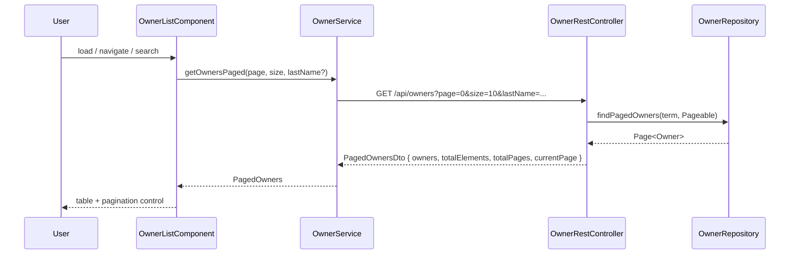

# Design Document: Owners Pagination

## Overview

Add server-side pagination to the `GET /api/owners` endpoint and a matching pagination UI to
the Angular owners-list screen. The current implementation loads every owner in a single
in-memory pass; this design replaces that with a database-level `Page` query, a new
`PagedOwners` response envelope, and a frontend pagination control that keeps the existing
unified search filter working alongside page navigation.

Key design decisions:
- **In-memory filtering is replaced by a database query** using Spring Data's `Pageable` +
  a JPQL query that handles the unified search across owner and pet fields.
- **The response envelope** (`PagedOwners`) is a plain DTO — not Spring's `Page<T>` — so the
  API contract is stable and independent of Spring internals.
- **Sorting** is done at the database level (`ORDER BY firstName || ' ' || lastName ASC`) to
  guarantee consistent page boundaries.
- **The frontend** introduces a dedicated `PaginationControlComponent` and updates
  `OwnerService` to call the new paginated endpoint; `OwnerListComponent` is refactored to
  own pagination state.

---

## Architecture



### Layer responsibilities

| Layer | Change |
|---|---|
| `OwnerRepository` | Add `findPagedOwners(String term, Pageable p)` JPQL query |
| `PagedOwnersDto` | New DTO: `owners`, `totalElements`, `totalPages`, `currentPage` |
| `OwnerRestController.listOwners` | Accept `page`/`size` params, validate, delegate to repository, return `PagedOwnersDto` |
| `openapi.yaml` | New `PagedOwners` schema; updated `GET /api/owners` params + response |
| `OwnerService` (Angular) | Replace `getOwners()` / `searchOwners()` with `getOwnersPaged()` |
| `OwnerListComponent` | Own `currentPage`, `pageSize`, `totalPages` state; react to pagination events |
| `PaginationControlComponent` | New standalone component: prev/next/numbered buttons + page-size selector |
| `owner-page.ts` | Align interface fields to API contract (`owners`, `currentPage`) |

---

## Components and Interfaces

### Backend

#### `OwnerRepository` — new query method

```java
@Query("""
    SELECT DISTINCT o FROM Owner o LEFT JOIN o.pets p
    WHERE :term = ''
       OR LOWER(FUNCTION('REPLACE', o.firstName,  '\u00e9', 'e')) LIKE %:term%
       OR LOWER(o.lastName)   LIKE %:term%
       OR LOWER(o.address)    LIKE %:term%
       OR LOWER(o.city)       LIKE %:term%
       OR o.telephone         LIKE %:term%
       OR LOWER(p.name)       LIKE %:term%
    ORDER BY CONCAT(o.firstName, ' ', o.lastName) ASC
    """)
Page<Owner> findPagedOwners(@Param("term") String term, Pageable pageable);
```

The `normalizeForSearch` logic currently in the controller (diacritic stripping) is kept in
the controller: the controller normalises the incoming `lastName` parameter before passing it
as `term`.

#### `PagedOwnersDto`

```java
public record PagedOwnersDto(
    List<OwnerDto> owners,
    long totalElements,
    int totalPages,
    int currentPage
) {}
```

#### `PageRequestParams` — request DTO with validation

```java
public record PageRequestParams(
    @RequestParam(required = false) String lastName,
    @RequestParam(defaultValue = "0") @Min(0) int page,
    @RequestParam(defaultValue = "10") @Min(1) @Max(100) int size
) {}
```

#### `OwnerRestController.listOwners` — updated signature

```java
@GetMapping(produces = "application/json")
public ResponseEntity<PagedOwnersDto> listOwners(@Valid PageRequestParams params)
```

Validation is handled by Bean Validation (`@Valid` + `@Min`/`@Max` on the record components);
`ExceptionControllerAdvice` catches `ConstraintViolationException` and returns `400` with a
`ProblemDetail` message — no manual `if` checks in the controller.

### Frontend

#### `OwnerPage` interface (updated `owner-page.ts`)

```typescript
export interface OwnerPage {
  owners: Owner[];
  totalElements: number;
  totalPages: number;
  currentPage: number;
}
```

> Note: the existing stub uses Spring's internal field names (`content`, `number`). This
> design aligns it to the API contract field names defined in the requirements.

#### `OwnerService` — updated methods

```typescript
getOwnersPaged(page: number, size: number, lastName?: string): Observable<OwnerPage>
```

The old `getOwners()` and `searchOwners()` methods are removed; all callers use
`getOwnersPaged`.

#### `PaginationControlComponent`

Inputs: `currentPage`, `totalPages`, `pageSize`, `loading: boolean`
Outputs: `pageChange: EventEmitter<number>`, `pageSizeChange: EventEmitter<number>`

Renders:
- "Previous" button (disabled when `currentPage === 0` or `loading`)
- Numbered page buttons (disabled when `loading`)
- "Next" button (disabled when `currentPage === totalPages - 1` or `loading`)
- Page-size `<select>` with options 10 / 20 / 50

#### `OwnerListComponent` — state additions

```typescript
currentPage = 0;
pageSize = 10;
totalPages = 0;
loading = false;
errorMessage: string | null = null;
previousOwners: Owner[] | null = null;  // snapshot for error recovery
```

---

## Data Models

### `PagedOwners` API response (JSON)

```json
{
  "owners": [ /* OwnerDto[] */ ],
  "totalElements": 42,
  "totalPages": 5,
  "currentPage": 0
}
```

### `GET /api/owners` query parameters (updated)

| Parameter | Type | Default | Constraints |
|---|---|---|---|
| `lastName` | string | — | optional, substring match |
| `page` | integer | `0` | `>= 0`, else 400 |
| `size` | integer | `10` | `1–100`, else 400 |

### Sorting

Owners are sorted by `CONCAT(firstName, ' ', lastName) ASC` at the database level. This
matches the display string shown in the UI (`{{ owner.firstName }} {{ owner.lastName }}`).

---

## Correctness Properties

*A property is a characteristic or behavior that should hold true across all valid executions
of a system — essentially, a formal statement about what the system should do. Properties
serve as the bridge between human-readable specifications and machine-verifiable correctness
guarantees.*

### Property 1: Pagination covers all owners exactly once

*For any* collection of owners and any valid page size, iterating through all pages (page 0
through `totalPages - 1`) and collecting every returned owner should yield a list that
contains every owner in the collection exactly once, with no duplicates and no omissions.

**Validates: Requirements 1.1, 1.2, 2.1**

---

### Property 2: Default parameters produce a valid first page

*For any* non-empty owner collection, calling `GET /api/owners` with no `page` or `size`
parameters should return a response equivalent to calling it with `page=0&size=10`.

**Validates: Requirements 1.2**

---

### Property 3: Filtered pagination covers all matching owners exactly once

*For any* collection of owners and any search term, iterating through all pages of the
filtered result should yield exactly the owners that match the search term — no more, no
fewer — across all pages combined.

**Validates: Requirements 1.3, 2.1**

---

### Property 4: Out-of-range page returns empty owners with correct metadata

*For any* owner collection and any `page` value `>= totalPages`, the API should return an
empty `owners` array while `totalElements` and `totalPages` still reflect the true counts.

**Validates: Requirements 1.4, 2.2**

---

### Property 5: Invalid parameters are rejected

*For any* `size < 1` or `size > 100`, or any `page < 0`, the API should return HTTP 400.

**Validates: Requirements 1.5, 1.6**

---

### Property 6: Sorted order is consistent across pages

*For any* collection of owners and any valid page size, the sequence of owners obtained by
concatenating all pages in order should be sorted ascending by `firstName + " " + lastName`.

**Validates: Requirements 1.7**

---

### Property 7: `totalElements` equals the count of matching owners

*For any* owner collection and any search term (including the empty term), `totalElements`
in the response should equal the number of owners in the collection that match the term.

**Validates: Requirements 1.3, 2.1**

---

### Property 8: Page-size change resets to page 0 and covers all owners

*For any* owner collection, when the user changes the page size, the frontend should request
`page=0` with the new size, and the resulting `totalPages` should equal
`ceil(totalElements / newSize)`.

**Validates: Requirements 3.7**

---

### Property 9: Search filter change resets to page 0

*For any* search term change (including clearing the filter), the frontend should always
issue the next request with `page=0`.

**Validates: Requirements 4.1, 4.2**

---

## Error Handling

### Backend

| Condition | Response |
|---|---|
| `page < 0` | `400 Bad Request` — `@Min(0)` on `PageRequestParams.page` |
| `size < 1` or `size > 100` | `400 Bad Request` — `@Min(1) @Max(100)` on `PageRequestParams.size` |
| `page >= totalPages` (valid but empty) | `200 OK` with empty `owners`, correct metadata |
| Unexpected server error | `500 Internal Server Error` via `ExceptionControllerAdvice` |

`ExceptionControllerAdvice` catches `ConstraintViolationException` and returns `ProblemDetail` — no manual validation in the controller.

### Frontend

- While a request is in flight, `loading = true` disables all pagination controls (prevents
  duplicate requests).
- On API error: the error banner "Failed to load owners. Please try again." is shown above
  the table; the previous page's owners are restored from `previousOwners`; a "Retry" button
  repeats the last request.
- On zero results: the table and pagination control are hidden; the message
  `No owners matching "<filter>"` is shown.

---

## Testing Strategy

### Backend — unit / integration tests (`OwnerTest.java`)

Extend the existing `@SpringBootTest` + `MockMvc` test class with:

- `listOwners_defaultPagination` — no params → page 0, size 10, correct envelope fields
- `listOwners_secondPage` — `page=1&size=2` with 3+ owners → correct slice
- `listOwners_outOfRange` — `page=999` → empty owners, correct `totalElements`
- `listOwners_invalidSize_tooSmall` — `size=0` → 400
- `listOwners_invalidSize_tooLarge` — `size=101` → 400
- `listOwners_invalidPage_negative` — `page=-1` → 400
- `listOwners_filteredPagination` — `lastName=Fr&page=0&size=5` → only matching owners
- `listOwners_sortedOrder` — owners returned in `firstName lastName` ascending order

### Backend — property-based tests

Use **jqwik** (already available in the Spring Boot test classpath via `net.jqwik:jqwik`).
Each property test runs a minimum of 100 tries.

```
// Feature: owners-pagination, Property 1: pagination covers all owners exactly once
// Feature: owners-pagination, Property 3: filtered pagination covers all matching owners exactly once
// Feature: owners-pagination, Property 4: out-of-range page returns empty owners with correct metadata
// Feature: owners-pagination, Property 5: invalid parameters are rejected
// Feature: owners-pagination, Property 6: sorted order is consistent across pages
// Feature: owners-pagination, Property 7: totalElements equals the count of matching owners
```

Each property test generates random owner collections (via `@ForAll @Size(min=0, max=50)
List<@Valid OwnerData>`) and random pagination parameters, saves them to the H2 in-memory
database inside a `@Transactional` test, calls the controller via `MockMvc`, and asserts the
property.

### Frontend — unit tests (Jasmine / Karma)

- `OwnerService`: `getOwnersPaged` sends correct URL with `page`, `size`, `lastName` params
- `OwnerListComponent`: initial load requests page 0 / size 10; page navigation updates
  `currentPage`; search input resets `currentPage` to 0; error state shows banner and
  restores previous owners; loading flag disables controls
- `PaginationControlComponent`: "Previous" disabled on page 0; "Next" disabled on last page;
  numbered buttons emit correct page index; page-size selector emits new size

### Frontend — property-based tests

Use **fast-check** (`npm install --save-dev fast-check`).

```
// Feature: owners-pagination, Property 8: page-size change resets to page 0 and covers all owners
// Feature: owners-pagination, Property 9: search filter change resets to page 0
```

Each property test generates random `OwnerPage` responses and user interaction sequences,
runs them through the component logic, and asserts the invariants hold.

### QA (Selenium)

Extend the existing Selenium suite in `qa/` with an end-to-end scenario:
- Load owners list → verify pagination control is visible
- Navigate to page 2 → verify different owners are shown
- Change page size to 20 → verify page resets to 1
- Enter a search term → verify page resets to 1 and only matching owners appear
