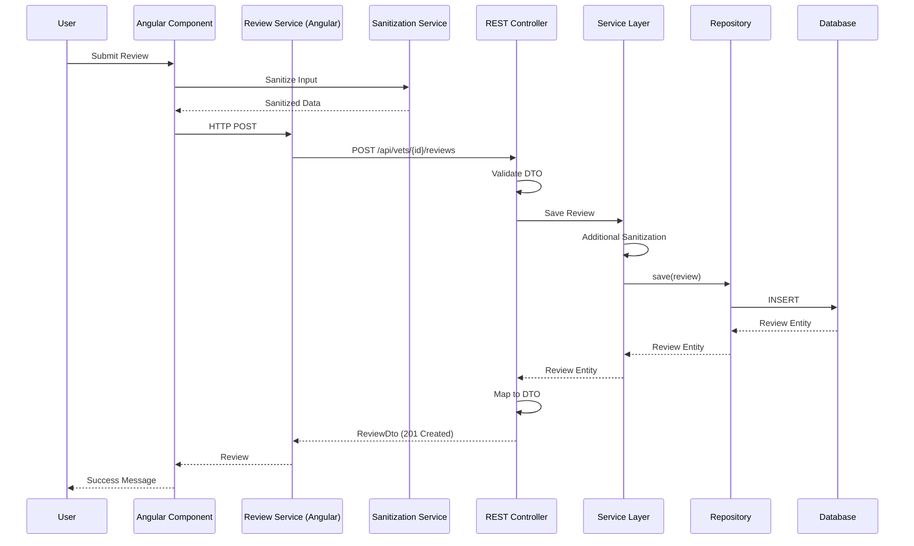
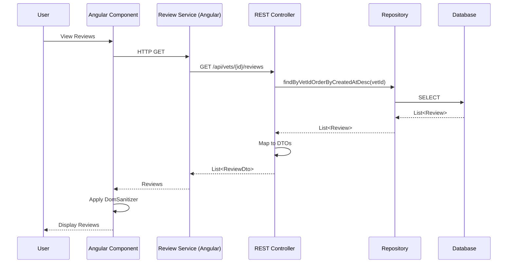

# Design Document: Veterinarian Reviews

## Overview

The veterinarian review feature enables users to rate veterinarians with a 1-5 star rating and provide optional text feedback. Reviews are displayed in the veterinarians list with the average star rating, and users can view all historical reviews on a dedicated page. The feature integrates into the existing Angular pet clinic application, extending the vets module with new components and services.

The design follows Angular best practices with a modular architecture, separating concerns between presentation (components), business logic (services), and data models (interfaces). Security is a primary concern, with XSS protection implemented through input sanitization and Angular's built-in security features.

## Architecture

### Frontend Architecture

#### Component Structure

The review feature consists of three main components integrated into the existing vets module:

1. **Review Form Component** (`vet-review-form`): Modal or inline form for submitting reviews
2. **Review Preview Component** (`vet-review-preview`): Displays review summary in the vet list
3. **Review Details Component** (`vet-review-details`): Full-page view of all reviews for a veterinarian

#### Service Layer

- **Review Service** (`review.service.ts`): Handles HTTP communication with the backend API for CRUD operations on reviews
- **Sanitization Service** (`sanitization.service.ts`): Provides XSS protection by sanitizing user input

#### Routing

New routes added to `vets-routing.module.ts`:
- `/vets/:id/reviews` - Review details page showing all reviews for a veterinarian

#### Module Integration

The review feature will be part of the existing `VetsModule`, sharing dependencies and following the established patterns for services, routing, and component organization.

### Backend Architecture

The backend follows Spring Boot layered architecture with clear separation of concerns:

#### Layer Structure

1. **Entity Layer** (`model` package): JPA entities representing database tables
   - `Review.java`: Review entity with JPA annotations

2. **Repository Layer** (`repository` package): Spring Data JPA repositories for database access
   - `ReviewRepository.java`: Interface extending Spring Data Repository with custom queries

3. **Service Layer** (optional, if business logic complexity warrants it):
   - `ReviewService.java`: Business logic for review operations, validation, and sanitization

4. **Controller Layer** (`rest` package): REST API endpoints
   - `ReviewRestController.java`: Handles HTTP requests for review operations

5. **DTO Layer** (`rest.dto` package): Data Transfer Objects for API requests/responses
   - `ReviewDto.java`: Full review data with ID
   - `ReviewFieldsDto.java`: Review submission data without ID
   - `ReviewStatsDto.java`: Aggregated review statistics

6. **Mapper Layer** (`mapper` package): MapStruct mappers for entity-DTO conversion
   - `ReviewMapper.java`: Bidirectional mapping between Review entities and DTOs

#### Technology Stack

- **Spring Boot**: Application framework
- **Spring Data JPA**: Database access and ORM
- **Hibernate**: JPA implementation
- **PostgreSQL/H2**: Database (PostgreSQL for production, H2 for testing)
- **Lombok**: Reduces boilerplate code with annotations
- **MapStruct**: Type-safe bean mapping
- **Jakarta Validation**: Bean validation annotations
- **Swagger/OpenAPI**: API documentation
- **OWASP Java HTML Sanitizer**: Industry-standard HTML sanitization library for XSS protection
  - Maven dependency: `com.googlecode.owasp-java-html-sanitizer:owasp-java-html-sanitizer:20220608.1`

#### Maven Dependency Configuration

Add the following dependency to `pom.xml`:

```xml
<dependency>
    <groupId>com.googlecode.owasp-java-html-sanitizer</groupId>
    <artifactId>owasp-java-html-sanitizer</artifactId>
    <version>20220608.1</version>
</dependency>
```

This library provides:
- Battle-tested XSS protection maintained by OWASP security experts
- Configurable HTML sanitization policies
- Automatic handling of edge cases and encoding issues
- Superior reliability compared to manual regex-based approaches

### Full Stack Data Flow





## Components and Interfaces

### Frontend Data Models

#### Review Interface
```typescript
export interface Review {
  id: number;
  vetId: number;
  rating: number;        // 1-5 star rating
  feedback: string;      // Max 500 characters, sanitized
  createdAt: Date;       // Timestamp for sorting
}
```

#### ReviewSubmission Interface
```typescript
export interface ReviewSubmission {
  vetId: number;
  rating: number;
  feedback: string;
}
```

#### ReviewStats Interface
```typescript
export interface ReviewStats {
  vetId: number;
  averageRating: number;
  totalReviews: number;
  mostRecentReview: Review | null;
}
```

### Frontend Component Interfaces

#### VetReviewFormComponent

**Purpose**: Provides UI for submitting new reviews

**Inputs**:
- `vetId: number` - The veterinarian being reviewed

**Outputs**:
- `reviewSubmitted: EventEmitter<Review>` - Emits when review is successfully saved

**Key Methods**:
- `submitReview()`: Validates and submits the review
- `validateRating(rating: number): boolean`: Ensures rating is 1-5
- `validateFeedback(feedback: string): boolean`: Ensures feedback ≤ 500 chars

**Template Features**:
- Star rating selector (1-5 stars, clickable)
- Textarea for feedback with character counter (500 max)
- Submit and cancel buttons
- Error message display area
- Success confirmation message

#### VetReviewPreviewComponent

**Purpose**: Displays review summary in the veterinarian list

**Inputs**:
- `vetId: number` - The veterinarian whose reviews to display
- `reviewStats: ReviewStats` - Aggregated review data

**Key Methods**:
- `renderStars(rating: number): string[]`: Converts numeric rating to star array

**Template Features**:
- Visual star representation of average rating
- "View Reviews" link
- "No reviews available" message when empty

#### VetReviewDetailsComponent

**Purpose**: Full-page display of all reviews for a veterinarian

**Inputs**:
- `vetId: number` - From route parameter

**Key Methods**:
- `loadReviews()`: Fetches all reviews for the veterinarian
- `sortReviewsByDate(reviews: Review[]): Review[]`: Sorts in reverse chronological order

**Template Features**:
- Veterinarian name and info header
- List of all reviews with full text
- Star rating display for each review
- Timestamp for each review
- Back navigation button

### Service Interfaces

#### ReviewService

**Purpose**: Manages HTTP communication for review operations

**Methods**:
```typescript
getReviewsByVetId(vetId: number): Observable<Review[]>
getReviewStats(vetId: number): Observable<ReviewStats>
submitReview(submission: ReviewSubmission): Observable<Review>
deleteReview(reviewId: number): Observable<void>
```

**API Endpoints**:
- `GET /api/vets/{vetId}/reviews` - Fetch all reviews for a vet
- `GET /api/vets/{vetId}/reviews/stats` - Fetch aggregated stats
- `POST /api/vets/{vetId}/reviews` - Submit new review
- `DELETE /api/reviews/{reviewId}` - Delete a review (admin only)

#### SanitizationService

**Purpose**: Provides XSS protection for user input

**Methods**:
```typescript
sanitizeFeedback(input: string): string
removeHtmlTags(input: string): string
escapeSpecialCharacters(input: string): string
validateNoScriptTags(input: string): boolean
```

**Implementation Strategy**:
- Use Angular's `DomSanitizer` for HTML sanitization
- Strip all HTML tags using regex
- Escape `<`, `>`, `&`, `"`, `'` characters
- Reject input containing `<script>`, `<iframe>`, or event handlers like `onclick`

### Backend Components

#### Review Entity

**File**: `petclinic-rest/src/main/java/org/springframework/samples/petclinic/model/Review.java`

```java
package org.springframework.samples.petclinic.model;

import jakarta.persistence.*;
import jakarta.validation.constraints.*;
import lombok.Getter;
import lombok.Setter;
import java.time.LocalDateTime;

@Entity
@Table(name = "reviews")
@Getter
@Setter
public class Review {

    @Id
    @GeneratedValue(strategy = GenerationType.IDENTITY)
    private Integer id;

    @NotNull
    @ManyToOne(fetch = FetchType.LAZY)
    @JoinColumn(name = "vet_id", nullable = false)
    private Vet vet;

    @NotNull
    @Min(1)
    @Max(5)
    @Column(nullable = false)
    private Integer rating;

    @Size(max = 500)
    @Column(length = 500)
    private String feedback;

    @NotNull
    @Column(name = "created_at", nullable = false, updatable = false)
    private LocalDateTime createdAt;

    @PrePersist
    protected void onCreate() {
        createdAt = LocalDateTime.now();
    }
}
```

#### Review Repository

**File**: `petclinic-rest/src/main/java/org/springframework/samples/petclinic/repository/ReviewRepository.java`

```java
package org.springframework.samples.petclinic.repository;

import org.springframework.data.jpa.repository.Query;
import org.springframework.data.repository.Repository;
import org.springframework.data.repository.query.Param;
import org.springframework.samples.petclinic.model.Review;

import java.util.List;
import java.util.Optional;

public interface ReviewRepository extends Repository<Review, Integer> {
    
    @Query("SELECT r FROM Review r WHERE r.vet.id = :vetId ORDER BY r.createdAt DESC")
    List<Review> findByVetIdOrderByCreatedAtDesc(@Param("vetId") int vetId);
    
    @Query("SELECT r FROM Review r WHERE r.vet.id = :vetId ORDER BY r.createdAt DESC LIMIT 1")
    Optional<Review> findMostRecentByVetId(@Param("vetId") int vetId);
    
    @Query("SELECT AVG(r.rating) FROM Review r WHERE r.vet.id = :vetId")
    Double findAverageRatingByVetId(@Param("vetId") int vetId);
    
    @Query("SELECT COUNT(r) FROM Review r WHERE r.vet.id = :vetId")
    Long countByVetId(@Param("vetId") int vetId);
    
    Optional<Review> findById(int id);
    
    void save(Review review);
    
    void delete(Review review);
}
```

#### Review Service

**File**: `petclinic-rest/src/main/java/org/springframework/samples/petclinic/service/ReviewService.java`

```java
package org.springframework.samples.petclinic.service;

import lombok.RequiredArgsConstructor;
import org.owasp.html.PolicyFactory;
import org.owasp.html.Sanitizers;
import org.springframework.stereotype.Service;
import org.springframework.samples.petclinic.mapper.ReviewMapper;
import org.springframework.samples.petclinic.model.Review;
import org.springframework.samples.petclinic.repository.ReviewRepository;
import org.springframework.samples.petclinic.rest.dto.ReviewStatsDto;

import java.util.List;

@Service
@RequiredArgsConstructor
public class ReviewService {
    
    private final ReviewRepository reviewRepository;
    private final ReviewMapper reviewMapper;
    
    // OWASP HTML Sanitizer with no allowed HTML (strips all tags)
    private static final PolicyFactory SANITIZER = Sanitizers.FORMATTING.and(Sanitizers.BLOCKS);
    private static final PolicyFactory PLAIN_TEXT_ONLY = new PolicyFactory() {
        @Override
        public String sanitize(String html) {
            // Strip all HTML tags, keeping only plain text
            return org.owasp.html.HtmlPolicyBuilder.sanitize(html, 
                new org.owasp.html.HtmlPolicyBuilder().toFactory());
        }
    };
    
    public Review sanitizeAndSave(Review review) {
        if (review.getFeedback() != null) {
            String sanitized = sanitizeFeedback(review.getFeedback());
            review.setFeedback(sanitized);
        }
        reviewRepository.save(review);
        return review;
    }
    
    public String sanitizeFeedback(String feedback) {
        if (feedback == null || feedback.isEmpty()) {
            return feedback;
        }
        
        // Use OWASP HTML Sanitizer to strip all HTML tags and prevent XSS
        // This library is battle-tested and maintained by security experts
        String sanitized = org.owasp.html.HtmlPolicyBuilder.sanitize(
            feedback,
            new org.owasp.html.HtmlPolicyBuilder().toFactory()
        );
        
        // Trim whitespace that may result from tag removal
        return sanitized.trim();
    }
    
    public List<Review> getReviewsByVetId(int vetId) {
        return reviewRepository.findByVetIdOrderByCreatedAtDesc(vetId);
    }
    
    public ReviewStatsDto getReviewStats(int vetId) {
        Double avgRating = reviewRepository.findAverageRatingByVetId(vetId);
        Long totalReviews = reviewRepository.countByVetId(vetId);
        Review mostRecent = reviewRepository.findMostRecentByVetId(vetId).orElse(null);
        
        ReviewStatsDto stats = new ReviewStatsDto();
        stats.setVetId(vetId);
        stats.setAverageRating(avgRating != null ? Math.round(avgRating * 10.0) / 10.0 : 0.0);
        stats.setTotalReviews(totalReviews != null ? totalReviews.intValue() : 0);
        stats.setMostRecentReview(mostRecent != null ? reviewMapper.toReviewDto(mostRecent) : null);
        
        return stats;
    }
    
    public void deleteReview(Review review) {
        reviewRepository.delete(review);
    }
}
```

#### Review REST Controller

**File**: `petclinic-rest/src/main/java/org/springframework/samples/petclinic/rest/ReviewRestController.java`

```java
package org.springframework.samples.petclinic.rest;

import jakarta.transaction.Transactional;
import lombok.RequiredArgsConstructor;
import org.springframework.http.HttpStatus;
import org.springframework.http.ResponseEntity;
import org.springframework.samples.petclinic.mapper.ReviewMapper;
import org.springframework.samples.petclinic.model.Review;
import org.springframework.samples.petclinic.model.Vet;
import org.springframework.samples.petclinic.repository.VetRepository;
import org.springframework.samples.petclinic.rest.dto.ReviewDto;
import org.springframework.samples.petclinic.rest.dto.ReviewFieldsDto;
import org.springframework.samples.petclinic.rest.dto.ReviewStatsDto;
import org.springframework.samples.petclinic.service.ReviewService;
import org.springframework.validation.annotation.Validated;
import org.springframework.web.bind.annotation.*;
import org.springframework.web.util.UriComponentsBuilder;

import java.net.URI;
import java.util.List;

@RestController
@RequestMapping("/api/vets/{vetId}/reviews")
@RequiredArgsConstructor
public class ReviewRestController {

    private final ReviewMapper reviewMapper;
    private final ReviewService reviewService;
    private final VetRepository vetRepository;

    @GetMapping
    public List<ReviewDto> getReviewsByVetId(@PathVariable int vetId) {
        List<Review> reviews = reviewService.getReviewsByVetId(vetId);
        return reviewMapper.toReviewDtos(reviews);
    }

    @GetMapping("/stats")
    public ReviewStatsDto getReviewStats(@PathVariable int vetId) {
        return reviewService.getReviewStats(vetId);
    }

    @PostMapping
    public ResponseEntity<ReviewDto> addReview(
            @PathVariable int vetId,
            @RequestBody @Validated ReviewFieldsDto reviewFieldsDto) {
        
        Vet vet = vetRepository.findById(vetId)
            .orElseThrow(() -> new IllegalArgumentException("Veterinarian not found"));
        
        Review review = reviewMapper.toReview(reviewFieldsDto);
        review.setVet(vet);
        
        Review savedReview = reviewService.sanitizeAndSave(review);
        ReviewDto reviewDto = reviewMapper.toReviewDto(savedReview);
        
        URI createdReviewUri = UriComponentsBuilder
            .fromPath("/api/vets/{vetId}/reviews/{id}")
            .buildAndExpand(vetId, savedReview.getId())
            .toUri();
        
        return ResponseEntity.created(createdReviewUri).body(reviewDto);
    }

    @Transactional
    @DeleteMapping("/{reviewId}")
    public ResponseEntity<Void> deleteReview(
            @PathVariable int vetId,
            @PathVariable int reviewId) {
        
        Review review = reviewService.getReviewsByVetId(vetId).stream()
            .filter(r -> r.getId().equals(reviewId))
            .findFirst()
            .orElseThrow(() -> new IllegalArgumentException("Review not found"));
        
        reviewService.deleteReview(review);
        return ResponseEntity.noContent().build();
    }
}
```

#### Review DTOs

**File**: `petclinic-rest/src/main/java/org/springframework/samples/petclinic/rest/dto/ReviewDto.java`

```java
package org.springframework.samples.petclinic.rest.dto;

import com.fasterxml.jackson.annotation.JsonFormat;
import io.swagger.v3.oas.annotations.media.Schema;
import jakarta.validation.constraints.*;
import lombok.Data;
import java.time.LocalDateTime;

@Data
public class ReviewDto {

    @Min(0)
    @Schema(accessMode = Schema.AccessMode.READ_ONLY, example = "1", 
            description = "The ID of the review.", requiredMode = Schema.RequiredMode.REQUIRED)
    private Integer id;

    @NotNull
    @Min(0)
    @Schema(example = "1", description = "The ID of the veterinarian.")
    private Integer vetId;

    @NotNull
    @Min(1)
    @Max(5)
    @Schema(example = "5", description = "Star rating between 1 and 5.")
    private Integer rating;

    @Size(max = 500)
    @Schema(example = "Excellent care for my pet!", 
            description = "Optional text feedback, max 500 characters.")
    private String feedback;

    @JsonFormat(pattern = "yyyy-MM-dd'T'HH:mm:ss")
    @Schema(accessMode = Schema.AccessMode.READ_ONLY, 
            example = "2024-01-15T10:30:00", 
            description = "Timestamp when the review was created.")
    private LocalDateTime createdAt;
}
```

**File**: `petclinic-rest/src/main/java/org/springframework/samples/petclinic/rest/dto/ReviewFieldsDto.java`

```java
package org.springframework.samples.petclinic.rest.dto;

import io.swagger.v3.oas.annotations.media.Schema;
import jakarta.validation.constraints.*;
import lombok.Data;

@Data
public class ReviewFieldsDto {

    @NotNull
    @Min(1)
    @Max(5)
    @Schema(example = "5", description = "Star rating between 1 and 5.", requiredMode = Schema.RequiredMode.REQUIRED)
    private Integer rating;

    @Size(max = 500)
    @Schema(example = "Excellent care for my pet!", 
            description = "Optional text feedback, max 500 characters.")
    private String feedback;
}
```

**File**: `petclinic-rest/src/main/java/org/springframework/samples/petclinic/rest/dto/ReviewStatsDto.java`

```java
package org.springframework.samples.petclinic.rest.dto;

import io.swagger.v3.oas.annotations.media.Schema;
import lombok.Data;

@Data
public class ReviewStatsDto {

    @Schema(example = "1", description = "The ID of the veterinarian.")
    private Integer vetId;

    @Schema(example = "4.5", description = "Average rating rounded to one decimal place.")
    private Double averageRating;

    @Schema(example = "10", description = "Total number of reviews.")
    private Integer totalReviews;

    @Schema(description = "The most recent review for this veterinarian.")
    private ReviewDto mostRecentReview;
}
```

#### Review Mapper

**File**: `petclinic-rest/src/main/java/org/springframework/samples/petclinic/mapper/ReviewMapper.java`

```java
package org.springframework.samples.petclinic.mapper;

import org.mapstruct.Mapper;
import org.mapstruct.Mapping;
import org.springframework.samples.petclinic.model.Review;
import org.springframework.samples.petclinic.rest.dto.ReviewDto;
import org.springframework.samples.petclinic.rest.dto.ReviewFieldsDto;

import java.util.List;

@Mapper(componentModel = "spring")
public interface ReviewMapper {
    
    @Mapping(source = "vet.id", target = "vetId")
    ReviewDto toReviewDto(Review review);

    @Mapping(target = "id", ignore = true)
    @Mapping(target = "vet", ignore = true)
    @Mapping(target = "createdAt", ignore = true)
    Review toReview(ReviewFieldsDto reviewFieldsDto);

    List<ReviewDto> toReviewDtos(List<Review> reviews);
}
```

### REST API Specification

#### Endpoint: Get Reviews for Veterinarian

**HTTP Method**: `GET`  
**Path**: `/api/vets/{vetId}/reviews`  
**Description**: Retrieves all reviews for a specific veterinarian, sorted by creation date (most recent first)

**Path Parameters**:
- `vetId` (integer, required): The ID of the veterinarian

**Response**: `200 OK`
```json
[
  {
    "id": 1,
    "vetId": 1,
    "rating": 5,
    "feedback": "Excellent care for my pet!",
    "createdAt": "2024-01-15T10:30:00"
  },
  {
    "id": 2,
    "vetId": 1,
    "rating": 4,
    "feedback": "Very professional and caring.",
    "createdAt": "2024-01-10T14:20:00"
  }
]
```

**Error Responses**:
- `404 Not Found`: Veterinarian does not exist

#### Endpoint: Get Review Statistics

**HTTP Method**: `GET`  
**Path**: `/api/vets/{vetId}/reviews/stats`  
**Description**: Retrieves aggregated statistics for a veterinarian's reviews

**Path Parameters**:
- `vetId` (integer, required): The ID of the veterinarian

**Response**: `200 OK`
```json
{
  "vetId": 1,
  "averageRating": 4.5,
  "totalReviews": 10,
  "mostRecentReview": {
    "id": 1,
    "vetId": 1,
    "rating": 5,
    "feedback": "Excellent care for my pet!",
    "createdAt": "2024-01-15T10:30:00"
  }
}
```

**Error Responses**:
- `404 Not Found`: Veterinarian does not exist

#### Endpoint: Submit Review

**HTTP Method**: `POST`  
**Path**: `/api/vets/{vetId}/reviews`  
**Description**: Creates a new review for a veterinarian

**Path Parameters**:
- `vetId` (integer, required): The ID of the veterinarian

**Request Body**:
```json
{
  "rating": 5,
  "feedback": "Excellent care for my pet!"
}
```

**Validation Rules**:
- `rating`: Required, integer between 1 and 5 (inclusive)
- `feedback`: Optional, max 500 characters, will be sanitized

**Response**: `201 Created`
```json
{
  "id": 1,
  "vetId": 1,
  "rating": 5,
  "feedback": "Excellent care for my pet!",
  "createdAt": "2024-01-15T10:30:00"
}
```

**Headers**:
- `Location`: `/api/vets/1/reviews/1`

**Error Responses**:
- `400 Bad Request`: Validation failure (invalid rating, feedback too long, contains malicious content)
  ```json
  {
    "error": "Validation failed",
    "message": "Rating must be between 1 and 5"
  }
  ```
- `404 Not Found`: Veterinarian does not exist

#### Endpoint: Delete Review

**HTTP Method**: `DELETE`  
**Path**: `/api/vets/{vetId}/reviews/{reviewId}`  
**Description**: Deletes a specific review (admin only)

**Path Parameters**:
- `vetId` (integer, required): The ID of the veterinarian
- `reviewId` (integer, required): The ID of the review to delete

**Response**: `204 No Content`

**Error Responses**:
- `404 Not Found`: Review or veterinarian does not exist
- `403 Forbidden`: User does not have permission to delete reviews

### Backend Validation and Sanitization

#### Input Validation

**Jakarta Validation Annotations** (applied at DTO level):
- `@NotNull`: Ensures rating is provided
- `@Min(1)` / `@Max(5)`: Ensures rating is between 1 and 5
- `@Size(max = 500)`: Ensures feedback does not exceed 500 characters

**Custom Validation** (applied in ReviewService):
- OWASP HTML Sanitizer: Strips all HTML tags and prevents XSS attacks using industry-standard library
- Whitespace trimming: Removes leading/trailing whitespace after sanitization

#### Sanitization Strategy

**Defense in Depth**:
1. **Frontend sanitization**: Angular DomSanitizer and custom sanitization service
2. **Backend validation**: Jakarta Bean Validation at controller entry point
3. **Backend sanitization**: OWASP Java HTML Sanitizer library in ReviewService before database storage
4. **Database constraints**: Column length limits and NOT NULL constraints
5. **Output encoding**: Frontend treats stored data as plain text during rendering

**OWASP Java HTML Sanitizer**:
- Industry-standard library maintained by security experts
- Battle-tested against XSS attacks
- Configured to strip all HTML tags (plain text only policy)
- Automatically handles edge cases and encoding issues
- More reliable than manual regex-based sanitization

**Sanitization Flow**:
```
User Input → Frontend Sanitization → HTTP Request → DTO Validation → 
OWASP Sanitizer (ReviewService) → Database Storage → Retrieval → Frontend Display (as plain text)
```

#### Error Messages

**Validation Errors**:
- Invalid rating: "Rating must be between 1 and 5"
- Feedback too long: "Feedback must be 500 characters or less"
- Malicious content: "Feedback contains invalid content. Please remove any HTML or script tags"
- Missing veterinarian: "Veterinarian not found"

**HTTP Status Codes**:
- `200 OK`: Successful retrieval
- `201 Created`: Successful creation
- `204 No Content`: Successful deletion
- `400 Bad Request`: Validation failure
- `404 Not Found`: Resource not found
- `500 Internal Server Error`: Unexpected server error

## Data Models

### Database Schema

#### Reviews Table

**Table Name**: `reviews`

**Columns**:

| Column Name | Data Type | Constraints | Description |
|------------|-----------|-------------|-------------|
| `id` | INTEGER | PRIMARY KEY, AUTO_INCREMENT | Unique identifier for the review |
| `vet_id` | INTEGER | NOT NULL, FOREIGN KEY → vets(id) | Reference to the veterinarian being reviewed |
| `rating` | INTEGER | NOT NULL, CHECK (rating >= 1 AND rating <= 5) | Star rating (1-5) |
| `feedback` | VARCHAR(500) | NULL | Optional text feedback, sanitized |
| `created_at` | TIMESTAMP | NOT NULL, DEFAULT CURRENT_TIMESTAMP | Creation timestamp |

**Indexes**:
- Primary key index on `id` (automatic)
- Index on `vet_id` for efficient queries by veterinarian
- Index on `created_at` for sorting operations

**Foreign Key Constraints**:
- `vet_id` references `vets(id)` with `ON DELETE CASCADE` (when a vet is deleted, their reviews are also deleted)

**DDL (PostgreSQL)**:
```sql
CREATE TABLE reviews (
    id SERIAL PRIMARY KEY,
    vet_id INTEGER NOT NULL,
    rating INTEGER NOT NULL CHECK (rating >= 1 AND rating <= 5),
    feedback VARCHAR(500),
    created_at TIMESTAMP NOT NULL DEFAULT CURRENT_TIMESTAMP,
    CONSTRAINT fk_reviews_vet FOREIGN KEY (vet_id) 
        REFERENCES vets(id) ON DELETE CASCADE
);

CREATE INDEX idx_reviews_vet_id ON reviews(vet_id);
CREATE INDEX idx_reviews_created_at ON reviews(created_at DESC);
```

**DDL (H2 for testing)**:
```sql
CREATE TABLE reviews (
    id INTEGER AUTO_INCREMENT PRIMARY KEY,
    vet_id INTEGER NOT NULL,
    rating INTEGER NOT NULL CHECK (rating >= 1 AND rating <= 5),
    feedback VARCHAR(500),
    created_at TIMESTAMP NOT NULL DEFAULT CURRENT_TIMESTAMP,
    FOREIGN KEY (vet_id) REFERENCES vets(id) ON DELETE CASCADE
);

CREATE INDEX idx_reviews_vet_id ON reviews(vet_id);
CREATE INDEX idx_reviews_created_at ON reviews(created_at DESC);
```

#### Database Migration

**Migration File**: `src/main/resources/db/migration/V{version}__add_reviews_table.sql`

The migration should be added to the existing Flyway or Liquibase migration structure (if used), or executed manually during deployment.

### Review Entity

The Review entity represents a single user review of a veterinarian.

**Fields**:
- `id`: Unique identifier (auto-generated)
- `vet`: Foreign key relationship to Vet entity
- `rating`: Integer between 1 and 5 (inclusive)
- `feedback`: String, max 500 characters, sanitized
- `createdAt`: Timestamp for sorting and display

**Validation Rules**:
- `rating`: Must be integer 1-5
- `feedback`: Max 500 characters, no HTML tags, no script content
- `vet`: Must reference existing veterinarian
- `createdAt`: Auto-set on creation, immutable

**JPA Annotations**:
- `@Entity`: Marks as JPA entity
- `@Table(name = "reviews")`: Maps to reviews table
- `@Id` / `@GeneratedValue`: Auto-generated primary key
- `@ManyToOne`: Many reviews belong to one vet
- `@PrePersist`: Automatically sets createdAt before insert

**Storage**:
- PostgreSQL database (production)
- H2 database (testing)
- Indexed on `vet_id` for efficient queries
- Indexed on `created_at` for sorting

### ReviewStats Aggregation

Computed on-demand via repository queries:
- `averageRating`: `AVG(rating)` rounded to 1 decimal place
- `totalReviews`: `COUNT(*)`
- `mostRecentReview`: `MAX(created_at)` with full review data

**Query Performance**:
- Indexes on `vet_id` and `created_at` ensure efficient aggregation
- Consider caching for high-traffic scenarios

### Data Relationships

```
Vet (1) ←→ (N) Review
```

A veterinarian can have zero or many reviews. Each review belongs to exactly one veterinarian. When a veterinarian is deleted, all associated reviews are cascade deleted.

## Correctness Properties

*A property is a characteristic or behavior that should hold true across all valid executions of a system-essentially, a formal statement about what the system should do. Properties serve as the bridge between human-readable specifications and machine-verifiable correctness guarantees.*


### Property Reflection

After analyzing all acceptance criteria, I identified several areas of redundancy:

**Redundancy Group 1 - Rating Validation**:
- Properties 1.2 (form requires rating 1-5), 1.6 (reject ratings outside 1-5), and 4.1 (reject non-integer ratings) all test rating validation
- These can be combined into a single comprehensive property about rating validation

**Redundancy Group 2 - Feedback Length Validation**:
- Properties 1.3 (accept feedback ≤500 chars) and 4.2 (reject feedback >500 chars) test the same constraint from different angles
- These can be combined into one property about feedback length validation

**Redundancy Group 3 - XSS Protection**:
- Properties 6.1 (sanitize malicious scripts), 6.2 (remove HTML tags), 6.3 (escape special chars), 6.4 (render as plain text), and 6.5 (reject script tags) all address XSS protection
- These can be consolidated into two properties: one for input sanitization and one for safe output rendering

**Redundancy Group 4 - UI Element Presence**:
- Properties 2.5 (View Reviews link present) and 3.1 (submit button present) both test for UI element presence
- These can be combined into one property about required UI elements

**Redundancy Group 5 - Text Truncation**:
- Properties 2.2 (limit to 100 chars) and 2.3 (truncate with ellipsis) describe the same behavior
- These should be one property about truncation behavior

After reflection, the unique properties to test are:

1. Rating validation (combines 1.2, 1.6, 4.1)
2. Feedback length validation (combines 1.3, 4.2)
3. Review-vet association (1.4, 3.2)
4. UI feedback on actions (1.1, 1.5, 4.3)
5. Most recent review display (2.1)
6. Text truncation with ellipsis (2.2, 2.3)
7. Average rating calculation (2.4, 5.3)
8. Navigation behavior (2.6)
9. Complete review display (2.7, 2.8)
10. Chronological sorting (2.9)
11. Required UI elements (2.5, 3.1, 3.3)
12. Required fields validation (4.4)
13. Visual star representation (5.1)
14. Line break preservation (5.2)
15. XSS input sanitization (6.1, 6.2, 6.3, 6.5)
16. XSS output protection (6.4)

### Property 1: Rating Validation

*For any* review submission, the rating value must be an integer between 1 and 5 (inclusive), and any rating outside this range or of non-integer type should be rejected with an error message.

**Validates: Requirements 1.2, 1.6, 4.1**

### Property 2: Feedback Length Validation

*For any* review submission, text feedback with 500 or fewer characters should be accepted, and feedback exceeding 500 characters should be rejected with an error message.

**Validates: Requirements 1.3, 4.2**

### Property 3: Review-Veterinarian Association

*For any* valid review submission for a specific veterinarian, the saved review must contain the correct veterinarian identifier, ensuring reviews are always associated with the intended veterinarian.

**Validates: Requirements 1.4, 3.2**

### Property 4: Form Display on Button Click

*For any* veterinarian in the list, clicking the submit review button should display the review form component.

**Validates: Requirements 1.1**

### Property 5: Success Confirmation Display

*For any* successfully saved review, the system should display a confirmation message to the user.

**Validates: Requirements 1.5**

### Property 6: Specific Error Messages

*For any* validation failure (invalid rating, excessive length, missing required field), the system should display a specific error message describing the particular validation failure, not a generic error.

**Validates: Requirements 4.3**

### Property 7: Most Recent Review Display

*For any* veterinarian with one or more reviews, the veterinarian list should display the review with the most recent createdAt timestamp.

**Validates: Requirements 2.1**

### Property 8: Text Truncation with Ellipsis

*For any* review feedback text, if the text exceeds 100 characters, the preview should display exactly the first 100 characters followed by "..." (ellipsis), and if the text is 100 characters or less, it should be displayed in full without ellipsis.

**Validates: Requirements 2.2, 2.3**

### Property 9: Average Rating Calculation

*For any* veterinarian with reviews, the displayed average rating should equal the sum of all rating values divided by the count of reviews, rounded to exactly one decimal place.

**Validates: Requirements 2.4, 5.3**

### Property 10: Review Details Navigation

*For any* veterinarian, clicking the "View Reviews" link should navigate to the review details page with the correct veterinarian ID in the route.

**Validates: Requirements 2.6**

### Property 11: Complete Review Display

*For any* veterinarian, the review details page should display all reviews associated with that veterinarian, with each review showing both the complete star rating and the full untruncated text feedback.

**Validates: Requirements 2.7, 2.8**

### Property 12: Reverse Chronological Sorting

*For any* list of reviews on the review details page, the reviews should be sorted by createdAt timestamp in descending order (most recent first).

**Validates: Requirements 2.9**

### Property 13: Required UI Elements Present

*For any* veterinarian in the veterinarian list, the rendered output should contain both a "View Reviews" link and a submit review button that are visible.

**Validates: Requirements 2.5, 3.1, 3.3**

### Property 14: Required Field Validation

*For any* review submission without a veterinarian identifier, the system should reject the submission with an error message.

**Validates: Requirements 4.4**

### Property 15: Visual Star Representation

*For any* displayed rating value, the output should use a visual star representation (star icons or symbols) rather than just numeric text.

**Validates: Requirements 5.1**

### Property 16: Line Break Preservation

*For any* review feedback containing newline characters, when displayed on the review details page, the line breaks should be preserved in the rendered output.

**Validates: Requirements 5.2**

### Property 17: XSS Input Sanitization

*For any* review feedback input, the system should sanitize the text using the OWASP Java HTML Sanitizer library to remove all HTML tags and prevent XSS attacks before storage.

**Validates: Requirements 6.1, 6.2, 6.3, 6.5**

### Property 18: XSS Output Protection

*For any* stored review feedback, when rendered in the UI, the text should be treated as plain text (not HTML) to prevent any script execution.

**Validates: Requirements 6.4**

## Error Handling

### Validation Errors

**Rating Validation Errors**:
- Invalid range: "Rating must be between 1 and 5 stars"
- Non-integer: "Rating must be a whole number"
- Missing rating: "Please select a rating"

**Feedback Validation Errors**:
- Exceeds length: "Feedback must be 500 characters or less (currently: {count} characters)"

**Required Field Errors**:
- Missing vet ID: "Unable to submit review: veterinarian not specified"

### HTTP Errors

**Network Errors**:
- Connection failure: "Unable to connect to server. Please check your connection and try again"
- Timeout: "Request timed out. Please try again"

**Server Errors**:
- 400 Bad Request: Display specific validation error from server response
- 404 Not Found: "Veterinarian not found"
- 500 Internal Server Error: "An error occurred while processing your request. Please try again later"

### Error Display Strategy

- Display validation errors inline near the relevant form field
- Display network/server errors in a dismissible alert at the top of the form
- Clear previous errors when user corrects input
- Maintain form state (don't clear valid fields) when validation fails
- Log errors to console for debugging (in development mode)

### Error Recovery

**Retry Logic**:
- Implement retry for transient network errors (max 3 attempts with exponential backoff)
- Allow user to manually retry failed submissions

**Graceful Degradation**:
- If review stats fail to load, show veterinarian list without review data
- If individual review fails to load, show error for that review but display others
- Cache submitted reviews locally until confirmed saved (prevent data loss)

## Testing Strategy

### Frontend Testing

#### Unit Testing

Unit tests will focus on specific examples, edge cases, and component integration points using Jasmine and Karma (Angular's default testing framework).

**Component Tests**:
- VetReviewFormComponent: Test form initialization, button states, error display
- VetReviewPreviewComponent: Test empty state display, truncation edge cases (exactly 100 chars, 99 chars, 101 chars)
- VetReviewDetailsComponent: Test empty review list, single review, navigation

**Service Tests**:
- ReviewService: Test HTTP error handling, response parsing, API endpoint construction
- SanitizationService: Test specific malicious inputs (e.g., `<script>alert('xss')</script>`, ``)

**Edge Cases**:
- Empty feedback (Property 5.4 edge case)
- No reviews for veterinarian (Property 2.10 edge case)
- Exactly 100 character feedback (boundary condition)
- Exactly 500 character feedback (boundary condition)
- Rating boundaries (1 and 5)
- Special characters in feedback: newlines, quotes, unicode

**Integration Tests**:
- Form submission flow: user input → validation → service call → success message
- Navigation flow: vet list → click View Reviews → details page loads
- Error flow: invalid input → error display → correction → successful submission

#### Property-Based Testing

Property-based tests will verify universal properties across randomized inputs using fast-check (JavaScript property-based testing library). Each test will run a minimum of 100 iterations.

**Configuration**:
```typescript
import * as fc from 'fast-check';

// Example configuration
fc.assert(
  fc.property(/* arbitraries */, (/* params */) => {
    // test logic
  }),
  { numRuns: 100 }
);
```

**Property Test Suite**:

1. **Property 1 Test**: Generate random integers (including negatives, zero, values >5) and non-integers (floats, strings, null) and verify rating validation
   - Tag: **Feature: veterinarian-reviews, Property 1: Rating must be integer 1-5**

2. **Property 2 Test**: Generate random strings of varying lengths (0-1000 chars) and verify feedback length validation
   - Tag: **Feature: veterinarian-reviews, Property 2: Feedback length ≤500 characters**

3. **Property 3 Test**: Generate random vet IDs and verify saved reviews contain correct vetId
   - Tag: **Feature: veterinarian-reviews, Property 3: Review-vet association preserved**

4. **Property 8 Test**: Generate random strings and verify truncation logic (≤100 chars: no ellipsis, >100 chars: truncate + "...")
   - Tag: **Feature: veterinarian-reviews, Property 8: Text truncation with ellipsis**

5. **Property 9 Test**: Generate random arrays of ratings (1-5) and verify average calculation and rounding
   - Tag: **Feature: veterinarian-reviews, Property 9: Average rating calculation correct**

6. **Property 11 Test**: Generate random review sets and verify all reviews are displayed with complete data
   - Tag: **Feature: veterinarian-reviews, Property 11: All reviews displayed completely**

7. **Property 12 Test**: Generate random review arrays with random timestamps and verify sorting order
   - Tag: **Feature: veterinarian-reviews, Property 12: Reviews sorted reverse chronologically**

8. **Property 17 Test**: Generate random strings including HTML tags, script tags, and special characters, verify sanitization removes/escapes them
   - Tag: **Feature: veterinarian-reviews, Property 17: XSS input sanitization**

**Arbitraries (Generators)**:
```typescript
// Rating generator
const validRating = fc.integer({ min: 1, max: 5 });
const invalidRating = fc.oneof(
  fc.integer({ max: 0 }),
  fc.integer({ min: 6 }),
  fc.float(),
  fc.string()
);

// Feedback generator
const validFeedback = fc.string({ maxLength: 500 });
const invalidFeedback = fc.string({ minLength: 501 });

// Malicious input generator
const maliciousInput = fc.oneof(
  fc.constant('<script>alert("xss")</script>'),
  fc.constant(''),
  fc.constant('<div onclick="alert(1)">click</div>'),
  fc.string().map(s => `<script>${s}</script>`)
);

// Review generator
const review = fc.record({
  id: fc.integer({ min: 1 }),
  vetId: fc.integer({ min: 1 }),
  rating: validRating,
  feedback: validFeedback,
  createdAt: fc.date()
});
```

### Backend Testing

#### Unit Testing

Backend unit tests will use JUnit 5, Mockito, and AssertJ for testing individual components in isolation.

**Repository Tests**:
- Test custom queries with in-memory H2 database
- Verify sorting and filtering logic
- Test aggregation queries (average rating, count)

**Service Tests**:
- ReviewService: Test sanitization logic with mocked repository
- Test malicious input detection and rejection
- Test HTML tag removal and character escaping
- Verify business logic for review statistics calculation

**Controller Tests**:
- Test request validation using MockMvc
- Verify response status codes and headers
- Test error handling and exception mapping
- Verify DTO mapping correctness

**Mapper Tests**:
- ReviewMapper: Test entity-to-DTO and DTO-to-entity conversion
- Verify field mapping correctness
- Test null handling

**Example Unit Test**:
```java
@ExtendWith(MockitoExtension.class)
class ReviewServiceTest {
    
    @Mock
    private ReviewRepository reviewRepository;
    
    @InjectMocks
    private ReviewService reviewService;
    
    @Test
    void sanitizeFeedback_shouldRemoveHtmlTags() {
        String input = "Great vet! <b>Highly</b> recommended.";
        String expected = "Great vet! Highly recommended.";
        
        String result = reviewService.sanitizeFeedback(input);
        
        assertThat(result).isEqualTo(expected);
    }
    
    @Test
    void sanitizeFeedback_shouldRemoveScriptTags() {
        String input = "Nice vet <script>alert('xss')</script>";
        String expected = "Nice vet";
        
        String result = reviewService.sanitizeFeedback(input);
        
        // OWASP sanitizer strips script tags completely
        assertThat(result).isEqualTo(expected.trim());
        assertThat(result).doesNotContain("<script>");
        assertThat(result).doesNotContain("alert");
    }
    
    @Test
    void sanitizeFeedback_shouldHandleEventHandlers() {
        String input = "";
        
        String result = reviewService.sanitizeFeedback(input);
        
        // OWASP sanitizer removes all HTML and event handlers
        assertThat(result).isEmpty();
    }
    
    @Test
    void sanitizeFeedback_shouldPreservePlainText() {
        String input = "This is plain text with no HTML";
        
        String result = reviewService.sanitizeFeedback(input);
        
        assertThat(result).isEqualTo(input);
    }
}
```

#### Integration Testing

Integration tests will use Spring Boot Test with TestContainers for PostgreSQL or in-memory H2 database.

**REST API Integration Tests**:
- Test full request-response cycle
- Verify database persistence
- Test transaction boundaries
- Verify cascade delete behavior

**Example Integration Test**:
```java
@SpringBootTest(webEnvironment = SpringBootTest.WebEnvironment.RANDOM_PORT)
@Transactional
class ReviewRestControllerIntegrationTest {
    
    @Autowired
    private TestRestTemplate restTemplate;
    
    @Autowired
    private ReviewRepository reviewRepository;
    
    @Autowired
    private VetRepository vetRepository;
    
    @Test
    void addReview_shouldCreateReviewAndReturnCreated() {
        // Given
        Vet vet = createTestVet();
        vetRepository.save(vet);
        
        ReviewFieldsDto reviewDto = new ReviewFieldsDto();
        reviewDto.setRating(5);
        reviewDto.setFeedback("Excellent care!");
        
        // When
        ResponseEntity<ReviewDto> response = restTemplate.postForEntity(
            "/api/vets/" + vet.getId() + "/reviews",
            reviewDto,
            ReviewDto.class
        );
        
        // Then
        assertThat(response.getStatusCode()).isEqualTo(HttpStatus.CREATED);
        assertThat(response.getHeaders().getLocation()).isNotNull();
        assertThat(response.getBody().getRating()).isEqualTo(5);
        assertThat(response.getBody().getFeedback()).isEqualTo("Excellent care!");
        
        // Verify database persistence
        List<Review> reviews = reviewRepository.findByVetIdOrderByCreatedAtDesc(vet.getId());
        assertThat(reviews).hasSize(1);
        assertThat(reviews.get(0).getRating()).isEqualTo(5);
    }
    
    @Test
    void addReview_withInvalidRating_shouldReturnBadRequest() {
        // Given
        Vet vet = createTestVet();
        vetRepository.save(vet);
        
        ReviewFieldsDto reviewDto = new ReviewFieldsDto();
        reviewDto.setRating(6); // Invalid rating
        reviewDto.setFeedback("Test");
        
        // When
        ResponseEntity<String> response = restTemplate.postForEntity(
            "/api/vets/" + vet.getId() + "/reviews",
            reviewDto,
            String.class
        );
        
        // Then
        assertThat(response.getStatusCode()).isEqualTo(HttpStatus.BAD_REQUEST);
    }
    
    @Test
    void getReviewsByVetId_shouldReturnReviewsInReverseChronologicalOrder() {
        // Given
        Vet vet = createTestVet();
        vetRepository.save(vet);
        
        Review review1 = createReview(vet, 5, "First review");
        review1.setCreatedAt(LocalDateTime.now().minusDays(2));
        reviewRepository.save(review1);
        
        Review review2 = createReview(vet, 4, "Second review");
        review2.setCreatedAt(LocalDateTime.now().minusDays(1));
        reviewRepository.save(review2);
        
        // When
        ResponseEntity<ReviewDto[]> response = restTemplate.getForEntity(
            "/api/vets/" + vet.getId() + "/reviews",
            ReviewDto[].class
        );
        
        // Then
        assertThat(response.getStatusCode()).isEqualTo(HttpStatus.OK);
        assertThat(response.getBody()).hasSize(2);
        assertThat(response.getBody()[0].getFeedback()).isEqualTo("Second review");
        assertThat(response.getBody()[1].getFeedback()).isEqualTo("First review");
    }
}
```

#### Property-Based Testing (Backend)

Backend property-based tests will use JUnit 5 parameterized tests with `@ParameterizedTest` and method sources. Each test will cover multiple test cases to verify universal properties.

**Configuration**:
```java
@ParameterizedTest
@MethodSource("testDataProvider")
void propertyTest(/* parameters */) {
    // test logic
}

static Stream<Arguments> testDataProvider() {
    return Stream.of(/* test data */);
}
```

**Property Test Suite**:

1. **Property 1 Test**: Test various integers to verify rating validation
   - Tag: **Feature: veterinarian-reviews, Property 1: Rating must be integer 1-5**

```java
@ParameterizedTest
@ValueSource(ints = {1, 2, 3, 4, 5})
void ratingValidation_shouldAcceptValidRatings(int validRating) {
    ReviewFieldsDto dto = new ReviewFieldsDto();
    dto.setRating(validRating);
    
    // Valid ratings should pass validation
    Set<ConstraintViolation<ReviewFieldsDto>> violations = validator.validate(dto);
    assertThat(violations).isEmpty();
}

@ParameterizedTest
@ValueSource(ints = {-100, -1, 0, 6, 10, 100})
void ratingValidation_shouldRejectInvalidRatings(int invalidRating) {
    ReviewFieldsDto dto = new ReviewFieldsDto();
    dto.setRating(invalidRating);
    
    // Invalid ratings should fail
    Set<ConstraintViolation<ReviewFieldsDto>> violations = validator.validate(dto);
    assertThat(violations).isNotEmpty();
}
```

2. **Property 2 Test**: Test various string lengths to verify feedback length validation
   - Tag: **Feature: veterinarian-reviews, Property 2: Feedback length ≤500 characters**

```java
@ParameterizedTest
@MethodSource("validFeedbackStrings")
void feedbackValidation_shouldAcceptValidLengths(String validFeedback) {
    ReviewFieldsDto dto = new ReviewFieldsDto();
    dto.setRating(5);
    dto.setFeedback(validFeedback);
    
    // Valid feedback should pass
    Set<ConstraintViolation<ReviewFieldsDto>> violations = validator.validate(dto);
    assertThat(violations).isEmpty();
}

static Stream<String> validFeedbackStrings() {
    return Stream.of(
        "",
        "Short feedback",
        "A".repeat(500),  // Exactly 500 characters
        "Medium length feedback with some details about the veterinarian"
    );
}

@ParameterizedTest
@MethodSource("invalidFeedbackStrings")
void feedbackValidation_shouldRejectOver500Characters(String invalidFeedback) {
    ReviewFieldsDto dto = new ReviewFieldsDto();
    dto.setRating(5);
    dto.setFeedback(invalidFeedback);
    
    // Invalid feedback should fail
    Set<ConstraintViolation<ReviewFieldsDto>> violations = validator.validate(dto);
    assertThat(violations).isNotEmpty();
}

static Stream<String> invalidFeedbackStrings() {
    return Stream.of(
        "A".repeat(501),  // Just over limit
        "A".repeat(1000)  // Way over limit
    );
}
```

3. **Property 17 Test**: Test various malicious inputs to verify sanitization
   - Tag: **Feature: veterinarian-reviews, Property 17: XSS input sanitization**

```java
@ParameterizedTest
@MethodSource("maliciousInputs")
void sanitization_shouldRemoveAllHtmlTags(String maliciousInput) {
    String result = reviewService.sanitizeFeedback(maliciousInput);
    
    // OWASP sanitizer should remove all HTML tags and malicious content
    assertThat(result).doesNotContainIgnoringCase("<script");
    assertThat(result).doesNotContainIgnoringCase("</script>");
    assertThat(result).doesNotContainIgnoringCase(" maliciousInputs() {
    return Stream.of(
        "<script>alert('xss')</script>",
        "",
        "<div onclick='alert(1)'>Click me</div>",
        "<iframe src='javascript:alert(1)'></iframe>",
        "<b>bold text</b>",
        "Test & special < characters >",
        "<script>document.cookie</script>",
        "",
        "<body onload=alert('xss')>",
        "<a href='http://evil.com'>link</a>",
        "Mixed <tag> & \"quotes\" with 'apostrophes'"
    );
}
```

#### Repository Testing

Repository tests will use `@DataJpaTest` with H2 in-memory database for fast, isolated testing.

**Example Repository Test**:
```java
@DataJpaTest
class ReviewRepositoryTest {
    
    @Autowired
    private ReviewRepository reviewRepository;
    
    @Autowired
    private VetRepository vetRepository;
    
    @Test
    void findByVetIdOrderByCreatedAtDesc_shouldReturnReviewsInCorrectOrder() {
        // Given
        Vet vet = createTestVet();
        vetRepository.save(vet);
        
        Review oldReview = createReview(vet, 5, "Old review");
        oldReview.setCreatedAt(LocalDateTime.now().minusDays(5));
        reviewRepository.save(oldReview);
        
        Review newReview = createReview(vet, 4, "New review");
        newReview.setCreatedAt(LocalDateTime.now());
        reviewRepository.save(newReview);
        
        // When
        List<Review> reviews = reviewRepository.findByVetIdOrderByCreatedAtDesc(vet.getId());
        
        // Then
        assertThat(reviews).hasSize(2);
        assertThat(reviews.get(0).getFeedback()).isEqualTo("New review");
        assertThat(reviews.get(1).getFeedback()).isEqualTo("Old review");
    }
    
    @Test
    void findAverageRatingByVetId_shouldCalculateCorrectAverage() {
        // Given
        Vet vet = createTestVet();
        vetRepository.save(vet);
        
        reviewRepository.save(createReview(vet, 5, "Great"));
        reviewRepository.save(createReview(vet, 4, "Good"));
        reviewRepository.save(createReview(vet, 3, "OK"));
        
        // When
        Double average = reviewRepository.findAverageRatingByVetId(vet.getId());
        
        // Then
        assertThat(average).isEqualTo(4.0);
    }
}
```

### Testing Balance

**Frontend**:
- Unit tests: ~30-40 tests covering specific scenarios, edge cases, and component behavior
- Property tests: ~8-10 tests covering universal properties with 100+ iterations each

**Backend**:
- Unit tests: ~40-50 tests covering service logic, sanitization, validation
- Integration tests: ~15-20 tests covering full API flows and database operations
- Property tests: ~5-8 tests covering validation and sanitization properties with 100+ iterations each
- Repository tests: ~10-15 tests covering custom queries and aggregations

**Overall Coverage**:
- Together: Comprehensive coverage where unit tests catch concrete bugs and property tests verify general correctness across input space
- Integration tests ensure components work together correctly
- Both frontend and backend tests are required for merge approval

### Test Execution

**Frontend**:
- Run tests on every commit (CI/CD integration)
- Command: `ng test` (unit tests), `ng test --code-coverage` (with coverage)

**Backend**:
- Run tests on every commit (CI/CD integration)
- Command: `mvn test` (unit tests), `mvn verify` (integration tests)
- Minimum code coverage: 80% line coverage, 70% branch coverage

**CI/CD Pipeline**:
1. Run frontend unit tests
2. Run frontend property tests
3. Run backend unit tests
4. Run backend integration tests
5. Run backend property tests
6. Generate coverage reports
7. Fail build if coverage thresholds not met or any test fails
