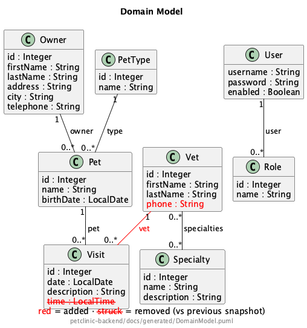
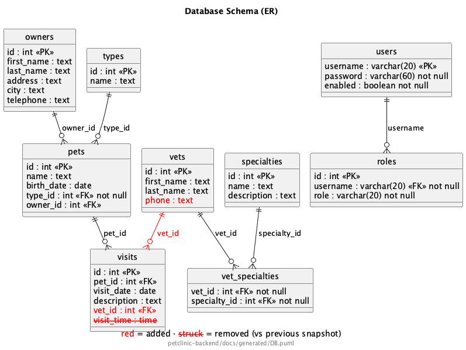
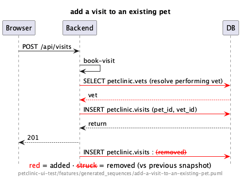

# Architecture delta — visual PR review

Comparing `4e0f9e29ee991419f35f789ad7bc93f38ddb003c` → `9287c897c04d1259130d17166ea27bd9a27793b3`.

**Legend:** red = added · ~~red strike-through~~ = removed.

### DomainModel

delta via puml_diff

### DB

delta via puml_diff

### add-a-visit-to-an-existing-pet

delta via puml_diff

---

Unchanged: packages, C1-Context.
