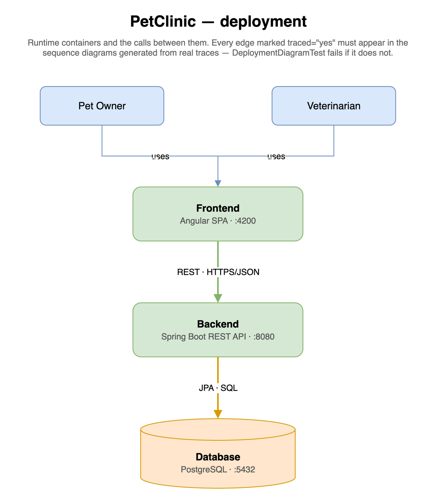

# Architecture

Every diagram is **generated from the code** and rendered live via the
[PlantUML proxy](https://plantuml.com/) off the GitHub-hosted `.puml` source —
each carries a `footer` with its own repo path, so the render is self-identifying.

#### Deployment (FE → BE → DB)

> The only hand-drawn diagram here, and the only one that needs to be: the backend cannot
> introspect the Angular SPA or PostgreSQL. It stays honest anyway — it is a `.drawio.png`,
> so the mxGraph XML rides inside the picture (open it in the draw.io desktop app and edit
> it in place), and every box and arrow carries metadata that `DeploymentDiagramTest`
> checks against the sequence diagrams generated from real traces.

#### Domain model

#### Database (ER)

#### Packages (logical architecture)

#### E2E sequence (from real traces)

#### C4 — System Context

#### Code City (3D)
[Open the Code City in your browser →](https://victorrentea.github.io/petclinic/petclinic-backend/docs/generated/codecity/codecity.html)

> Regenerate with `petclinic-backend/docs/generate-codecity.sh`. It clones the generators —
> [victorrentea/code-city](https://github.com/victorrentea/code-city), a standalone tool
> that works on any Java repo — into `petclinic-backend/.tools/codecity/` and runs them on this one.

> More C4 views (containers, per-component focus) live in
> [`petclinic-backend/docs/README.md`](petclinic-backend/docs/README.md).
