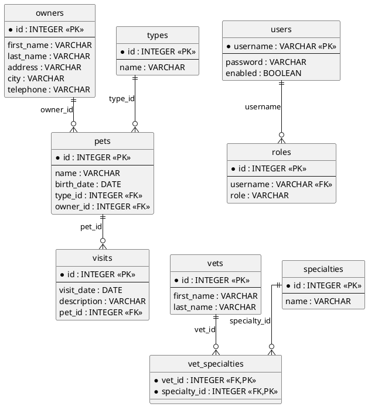

# Spring PetClinic - Full Stack Application

[](https://github.com/spring-petclinic/petclinic-rest/actions/workflows/maven-build-master.yml)
[](https://github.com/spring-petclinic/petclinic-rest/actions/workflows/docker-build.yml)
[](https://sonarcloud.io/dashboard?id=spring-petclinic_petclinic-rest)
[](https://sonarcloud.io/dashboard?id=spring-petclinic_petclinic-rest)

Full-stack veterinary clinic management application with:
- **Backend**: Spring Boot REST API (Java 21)
- **Frontend**: Angular SPA

[See the presentation of the Spring Petclinic Framework version](http://fr.slideshare.net/AntoineRey/spring-framework-petclinic-sample-application)

## Architecture Overview

This is a full-stack implementation with clear separation:
- `petclinic-backend/` - Spring Boot REST API
- `petclinic-frontend/` - Angular client

### Petclinic ER Model



## Quick Start - Run Full Stack

```sh
./run-all.sh
```

Then access:
- **Frontend**: http://localhost:4200
- **Backend API**: http://localhost:8080
- **Swagger UI**: http://localhost:8080/swagger-ui.html

## Backend (Spring Boot REST API)

Located in `petclinic-backend/`

### Run Backend Only

```sh
cd petclinic-backend
./mvnw spring-boot:run
```

### Backend Tech Stack
- Java 21
- Spring Boot 3.x
- Spring Data JPA
- OpenAPI 3.1 / Swagger
- H2 (default) or PostgreSQL
- MapStruct for DTO mapping

### 📖 OpenAPI REST API Documentation

API documentation (OAS 3.1): [http://localhost:8080/v3/api-docs](http://localhost:8080/v3/api-docs)

### 📌 API Endpoints Overview

| **Method** | **Endpoint** | **Description** |
|-----------|------------|----------------|
| **Owners** |  |  |
| **GET** | `/api/owners` | Retrieve all pet owners |
| **GET** | `/api/owners/{ownerId}` | Get a pet owner by ID |
| **POST** | `/api/owners` | Add a new pet owner |
| **PUT** | `/api/owners/{ownerId}` | Update an owner's details |
| **DELETE** | `/api/owners/{ownerId}` | Delete an owner |
| **Pets** |  |  |
| **GET** | `/api/pets` | Retrieve all pets |
| **GET** | `/api/pets/{petId}` | Get a pet by ID |
| **PUT** | `/api/pets/{petId}` | Update pet details |
| **DELETE** | `/api/pets/{petId}` | Delete a pet |
| **Vets** |  |  |
| **GET** | `/api/vets` | Retrieve all veterinarians |
| **GET** | `/api/vets/{vetId}` | Get a vet by ID |
| **POST** | `/api/vets` | Add a new vet |
| **PUT** | `/api/vets/{vetId}` | Update vet details |
| **DELETE** | `/api/vets/{vetId}` | Delete a vet |
| **Pet Types** |  |  |
| **GET** | `/api/pettypes` | Retrieve all pet types |
| **POST** | `/api/pettypes` | Add a new pet type |
| **Specialties** |  |  |
| **GET** | `/api/specialties` | Retrieve all vet specialties |
| **POST** | `/api/specialties` | Add a new specialty |
| **Visits** |  |  |
| **GET** | `/api/visits` | Retrieve all vet visits |
| **POST** | `/api/visits` | Add a new visit |
| **Users** |  |  |
| **POST** | `/api/users` | Create a new user |

### Database Configuration

**H2 (Default)**
- In-memory, auto-populated at startup
- H2 Console: http://localhost:8080/h2-console
  - JDBC URL: `jdbc:h2:mem:petclinic`
  - Username: `sa`
  - Password: _(blank)_

**PostgreSQL**
```properties
spring.profiles.active=postgres
```
```sh
docker run -e POSTGRES_USER=petclinic -e POSTGRES_PASSWORD=petclinic \
  -e POSTGRES_DB=petclinic -p 5432:5432 postgres:16.3
```

Or use docker-compose:
```sh
cd petclinic-backend
docker-compose --profile postgres up
```

### Security Configuration

Basic authentication is **disabled by default**. To enable:

```properties
petclinic.security.enable=true
```

**Roles**:
- `OWNER_ADMIN` → Owner, Pet, PetType, Visit endpoints
- `VET_ADMIN` → PetType, Specialty, Vet endpoints
- `ADMIN` → User management

Default user: `admin` / `admin`

### Testing

**Unit Tests**:
```sh
cd petclinic-backend
./mvnw test
```

**Performance Tests (JMeter)**:
```sh
jmeter -n -t src/test/jmeter/petclinic-jmeter-crud-benchmark.jmx \
  -Jthreads=100 -Jduration=600 -l results/petclinic-test-results.jtl
```

**API Tests (Postman + Newman)**:
```sh
cd petclinic-backend
./postman-tests.sh
```

See [petclinic-backend/README.md](petclinic-backend/readme.md) for detailed backend documentation.

## Frontend (Angular SPA)

Located in `petclinic-frontend/`

### Run Frontend Only

```sh
cd petclinic-frontend
npm install
npm start
```

Frontend runs at: http://localhost:4200

### Frontend Tech Stack
- Angular 16
- Angular Material
- Bootstrap 3
- RxJS

### Prerequisites
- Node.js 16+
- npm


## Docker Support

**Backend**:
```sh
docker run -p 8080:8080 springcommunity/petclinic-rest
```

**Build with Jib**:
```sh
cd petclinic-backend
mvn compile jib:build -Djib.to.auth.username=xxx -Djib.to.auth.password=xxx
```

## Development

### Generated Code (Backend)

Some backend classes are generated during build time:

| Package | Tool |
|---------|------|
| `org.springframework.samples.petclinic.mapper` | MapStruct |
| `org.springframework.samples.petclinic.rest.dto` | OpenAPI Generator |

Run to generate:
```sh
cd petclinic-backend
mvn clean install
```

### Looking for Something Specific?

| Component | Location |
|-----------|----------|
| Backend REST controllers | [petclinic-backend/src/main/java/.../rest](petclinic-backend/src/main/java/org/springframework/samples/petclinic/rest) |
| Backend repositories | [petclinic-backend/src/main/java/.../repository](petclinic-backend/src/main/java/org/springframework/samples/petclinic/repository) |
| Backend domain model | [petclinic-backend/src/main/java/.../model](petclinic-backend/src/main/java/org/springframework/samples/petclinic/model) |
| Frontend components | [petclinic-frontend/src/app](petclinic-frontend/src/app) |
| OpenAPI spec | [petclinic-backend/src/main/resources/openapi.yml](petclinic-backend/src/main/resources/openapi.yml) |

## Related Projects

The Spring Petclinic master branch in the main [spring-projects](https://github.com/spring-projects/spring-petclinic)
GitHub org is the "canonical" implementation, currently based on Spring Boot and Thymeleaf.

This project is one of the [several forks](https://spring-petclinic.github.io/docs/forks.html) 
hosted in a special GitHub org: [spring-petclinic](https://github.com/spring-petclinic).

## Contributing

The [issue tracker](https://github.com/spring-petclinic/petclinic-rest/issues) is the preferred channel for bug reports, features requests and submitting pull requests.

For pull requests, editor preferences are available in [.editorconfig](.editorconfig).

