# PetClinic User Manual

PetClinic is a small veterinary practice management application. You can use it to keep records of pet owners, the pets in their care, the veterinarians on staff, the specialties those vets practice, and the visits the pets make to the clinic.

_This file is regenerated by the `/regen-manual` slash command. Do not edit by hand — your changes will be overwritten on the next regeneration._

## Contents

- [Getting around](#getting-around)
- [Welcome](#welcome)
- [Owners](#owners)
- [Pets](#pets)
- [Visits](#visits)
- [Pet Types](#pet-types)
- [Veterinarians](#veterinarians)
- [Specialties](#specialties)

---

## Getting around

The top navigation bar is your starting point. *HOME* takes you back to the welcome screen. *OWNERS* and *VETERINARIANS* are dropdown menus — clicking them reveals shortcuts for searching the existing records and adding new ones. *VISITS*, *PET TYPES*, and *SPECIALTIES* are direct links to those areas.

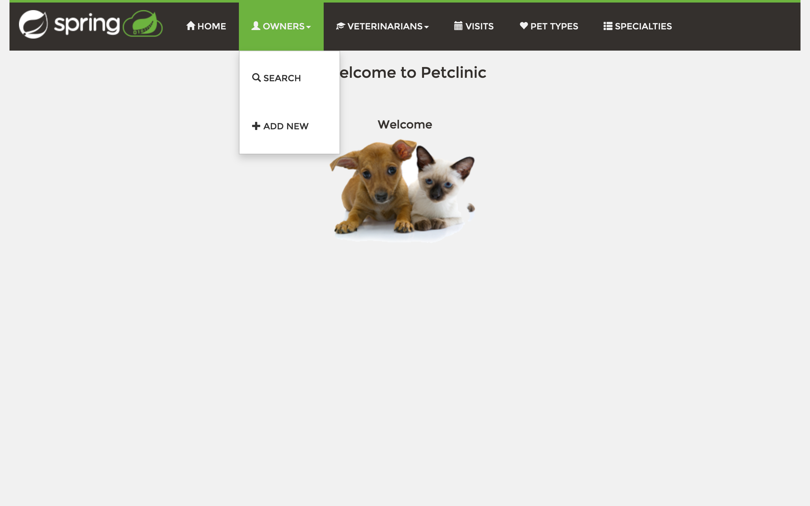

In the screenshot above, the *OWNERS* menu has been opened, showing *SEARCH* (the owners list) and *ADD NEW* (the new-owner form).

---

## Welcome

The welcome screen is what you see when you open PetClinic or click *HOME*. It is purely a starting point — no records or actions live here. Use the navigation bar to jump to whichever area you need.

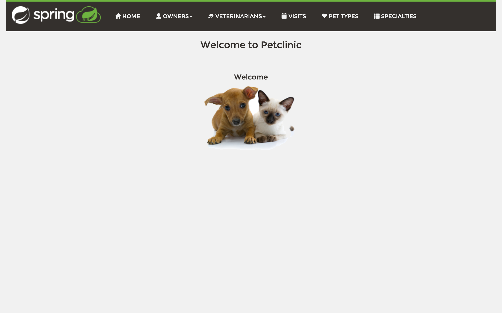

---

## Owners

The Owners area is where you keep records for the people who bring pets to the clinic. From here you can search the existing owners, look up a specific owner's pets and visit history, register a new owner, and edit an owner's contact details.

### Viewing the list

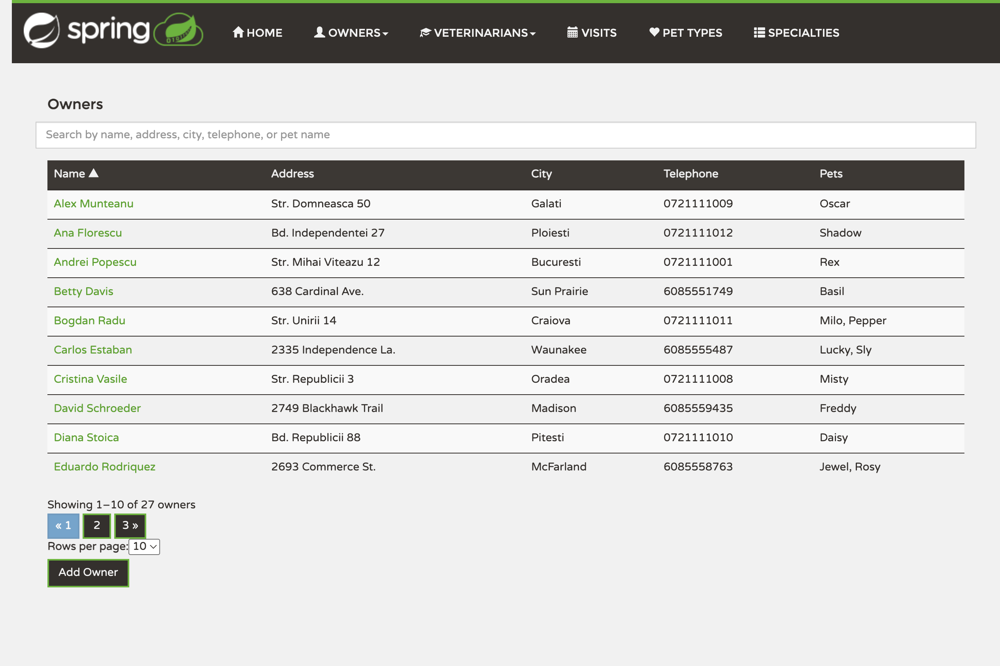

The list shows every registered owner, sorted by name. Each row includes the address, city, telephone, and the names of the pets associated with that owner. Use the search box at the top to filter by name, address, city, telephone, or even pet name — useful when a caller can only remember their pet's name. The list is paginated; pick a page from the navigation buttons or change the *Rows per page* dropdown to see more rows at once. Click an owner's name to open their full record.

### Creating a new owner

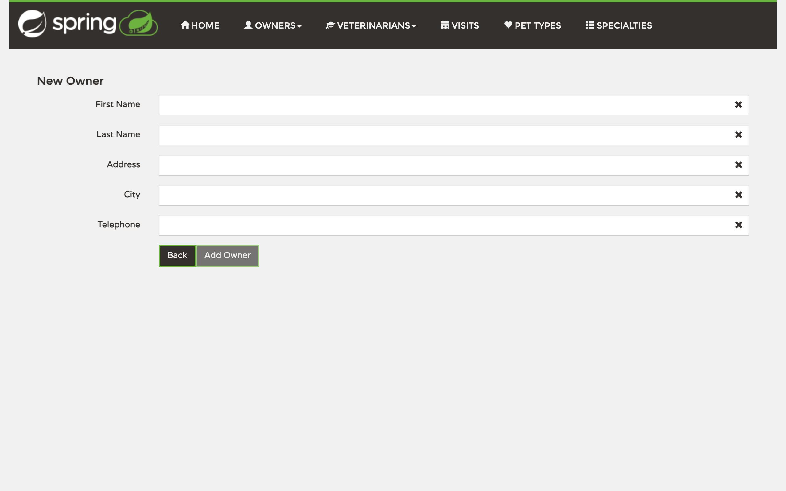

Click *Add Owner* on the list page (or *ADD NEW* under the *OWNERS* menu) to open the registration form. Fill in *First Name*, *Last Name*, *Address*, *City*, and *Telephone* — every field is required. The *Add Owner* button stays disabled until all fields have valid values. Submitting takes you back to the owners list with the new record added.

### Looking at an owner's record

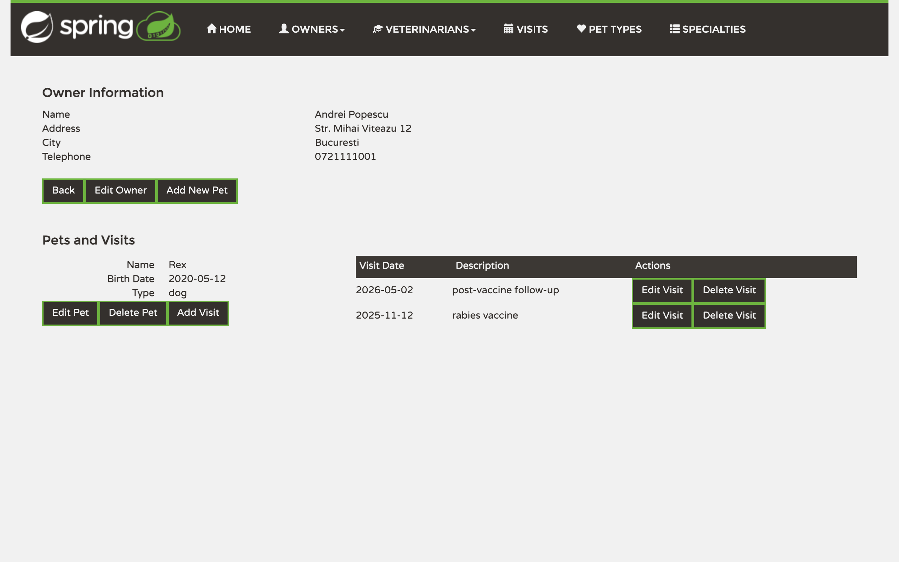

Clicking any owner name on the list opens their detail page. The top section shows the owner's contact info with three actions: *Back* returns to the list, *Edit Owner* opens the edit form (see below), and *Add New Pet* registers a pet against this owner. Below that, the *Pets and Visits* section lists each of the owner's pets with their birth date and type, plus per-pet *Edit Pet*, *Delete Pet*, and *Add Visit* buttons. Each pet's visit history follows, with *Edit Visit* and *Delete Visit* actions on every entry.

### Editing an owner

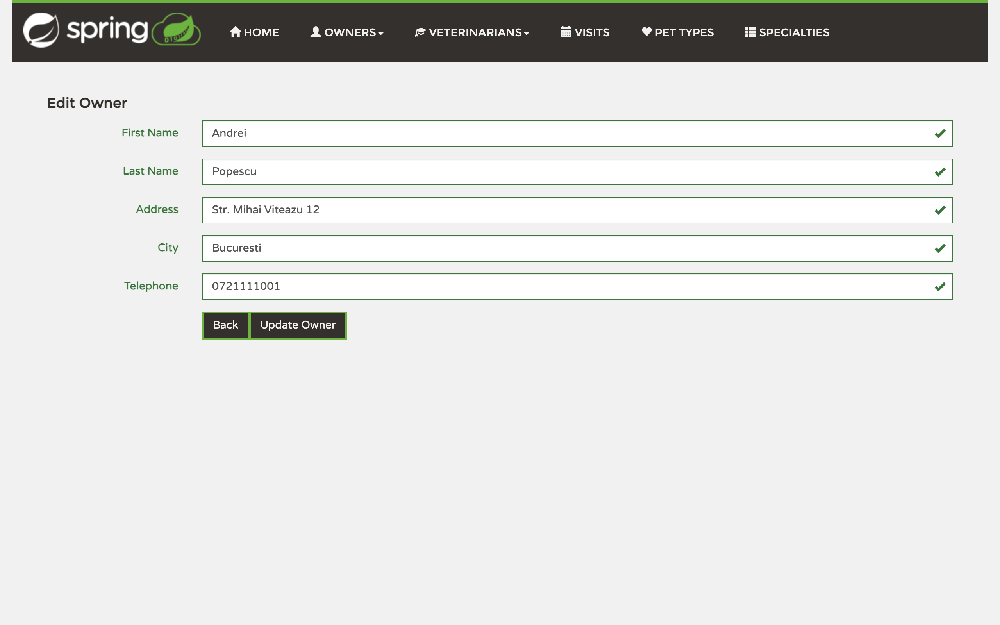

From the owner's record click *Edit Owner*. The form is pre-filled with the current values; change what you need and click *Update Owner* to save. *Back* discards your changes and returns to the record.

---

## Pets

Pets always belong to an owner — there is no standalone "all pets" listing in the staff workflow. You manage a pet through its owner's record: add a new pet from the owner detail screen, then edit, delete, or schedule visits for it from the same place.

### Adding a pet to an owner

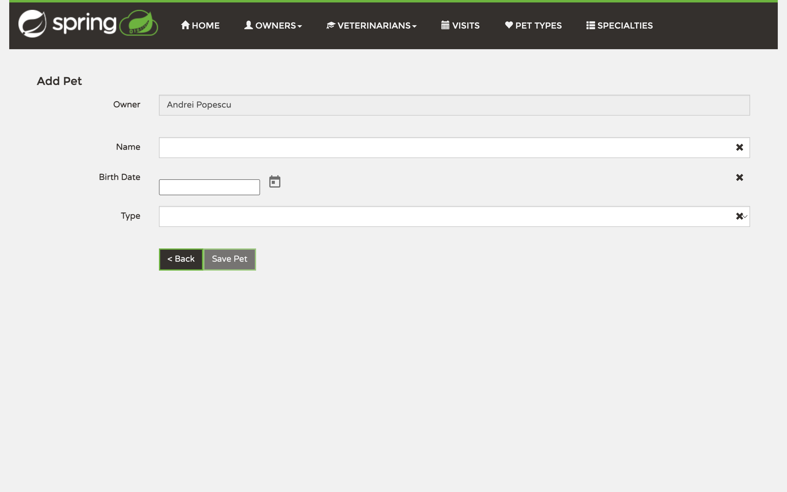

From the owner's detail page click *Add New Pet*. The form locks the *Owner* field to whoever you came from. Enter the pet's *Name*, pick a *Birth Date* from the calendar picker, and choose the *Type* (cat, dog, lizard, snake, bird, hamster, or horse). Click *Save Pet* to add it to the owner's record. *< Back* returns to the owner without saving.

### Editing or deleting a pet

Open the owner's detail page and use the *Edit Pet* or *Delete Pet* button next to the pet you want to change. Editing opens the same form as above with the existing values pre-filled. Delete removes the pet and all of its visit history from the owner.

---

## Visits

The Visits area gives you a chronological view of every visit across the clinic. It is the right place to check what's been happening recently or to find a specific visit. To register a new visit, however, you start from a specific pet — see [Pets](#pets) above.

### Viewing all visits

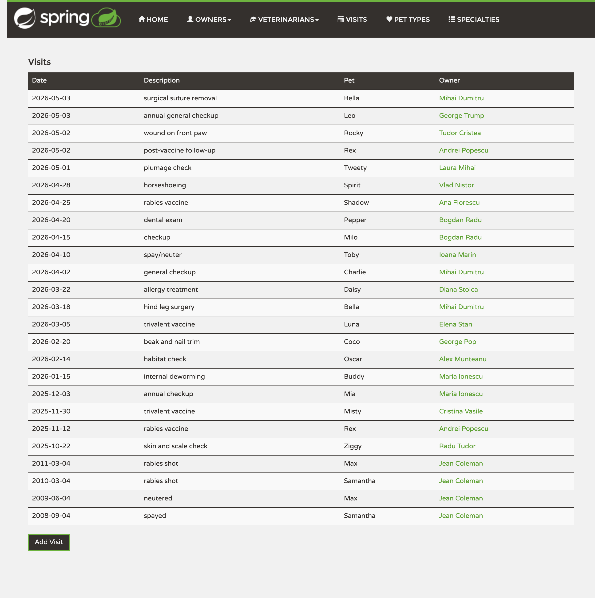

The list is sorted with the most recent visit first. Each row shows the visit date, the description of what was done, the pet's name, and a link to the owner's record. Click an owner name to jump to their detail page; from there you can see the visit in the context of that pet's history.

### Adding a visit

To add a visit, open the owner's record (see [Owners](#owners)), find the pet that came in for the visit, and click *Add Visit* in that pet's section. A form opens where you pick the *Date*, write a *Description*, and click *Add Visit* to save. The visit appears under that pet on the owner record and in the chronological *Visits* list.

---

## Pet Types

Pet Types is the list of species the clinic accepts as patients. Whenever you register a new pet, the *Type* dropdown is populated from this list. Edit it sparingly — adding rare types is fine, but renaming or deleting a type changes how every existing pet of that type is shown.

### Viewing and editing the list

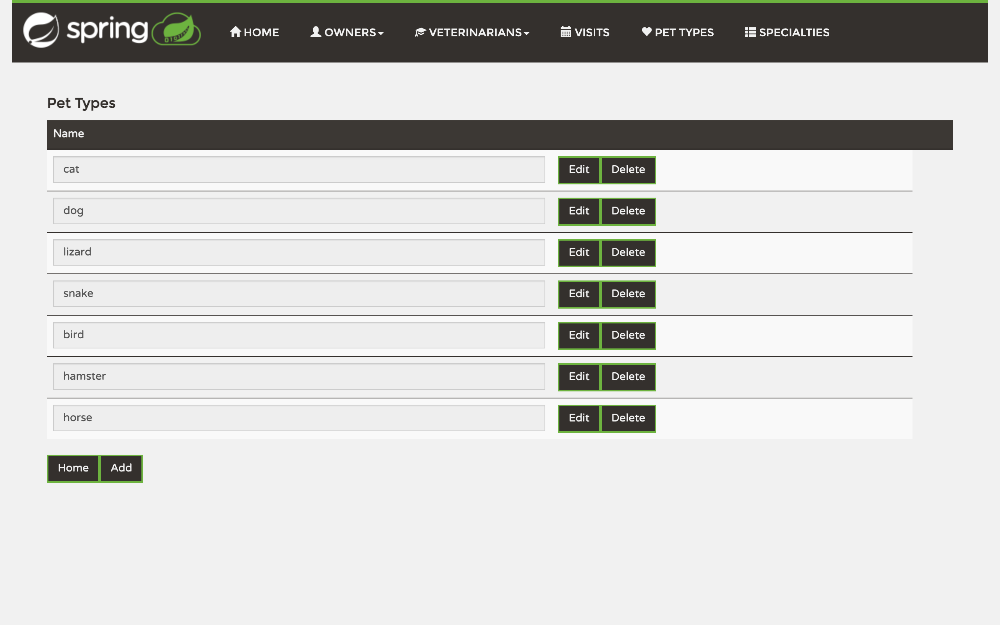

Each pet type appears as a single row with its name in a read-only field and *Edit* and *Delete* buttons on the right. Click *Edit* to make the name field editable and rename the type, then save. Click *Delete* to remove a type the clinic no longer accepts. *Home* returns to the welcome screen; *Add* opens the new-type form below.

### Adding a new pet type

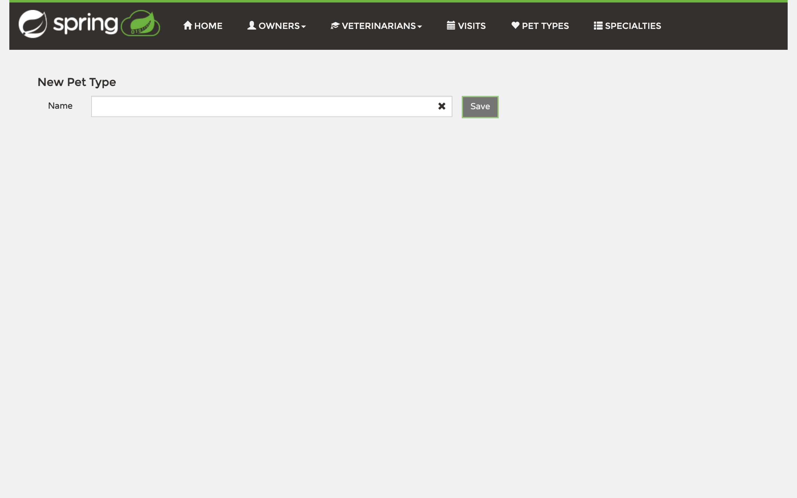

Click *Add* on the Pet Types list. Enter the new type's *Name* in the field — for example, "rabbit" or "ferret" — and click *Save*. The new type immediately becomes available in the *Type* dropdown when registering a pet.

---

## Veterinarians

The Veterinarians area is where you keep the staff roster. You can browse the current vets along with the specialties they practice, register new vets, edit their assignments, or remove vets who have left the clinic.

### Viewing the list

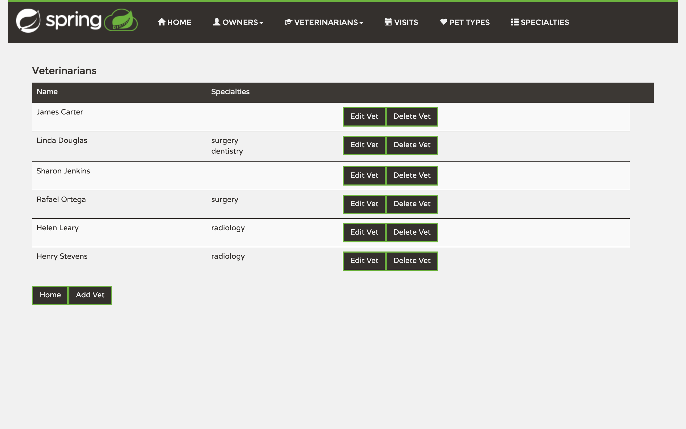

The list shows each veterinarian with their name and the specialties they are qualified in. *Edit Vet* opens the edit form for that vet — useful for changing their specialty assignments. *Delete Vet* removes them from the roster. *Add Vet* at the bottom opens the new-vet form; *Home* returns to the welcome screen.

### Adding a new veterinarian

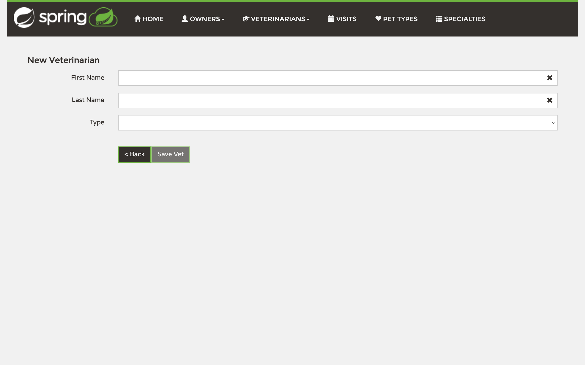

Enter the vet's *First Name* and *Last Name*, then choose a *Type* (specialty) from the dropdown — radiology, surgery, or dentistry. Click *Save Vet* to add them to the roster. *< Back* discards the entry.

To assign more than one specialty to a vet, save them with their first specialty here, then open *Edit Vet* from the list to add additional ones.

---

## Specialties

Specialties is the list of veterinary disciplines a vet can be qualified in. The list is short by design — radiology, surgery, dentistry — but you can add, rename, or remove specialties to match how your clinic actually works.

### Viewing and editing the list

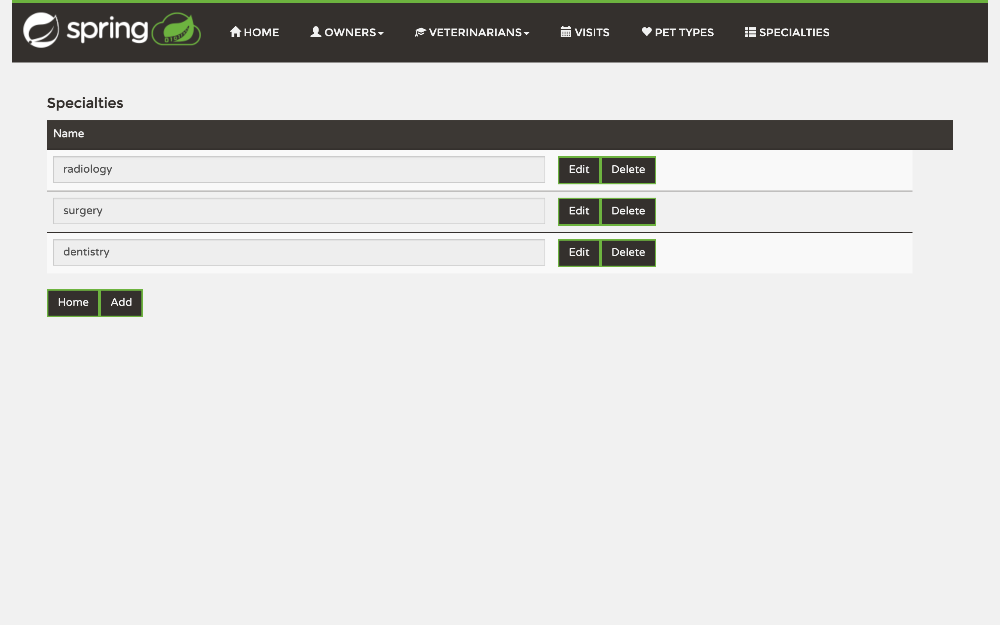

Each specialty appears as a row with its name in a read-only field and *Edit* and *Delete* buttons. Click *Edit* to rename a specialty, then save. *Delete* removes a specialty from the list. *Add* lets you create a new one. Removing a specialty unassigns it from any vet who currently practices it, so be careful before deleting.
