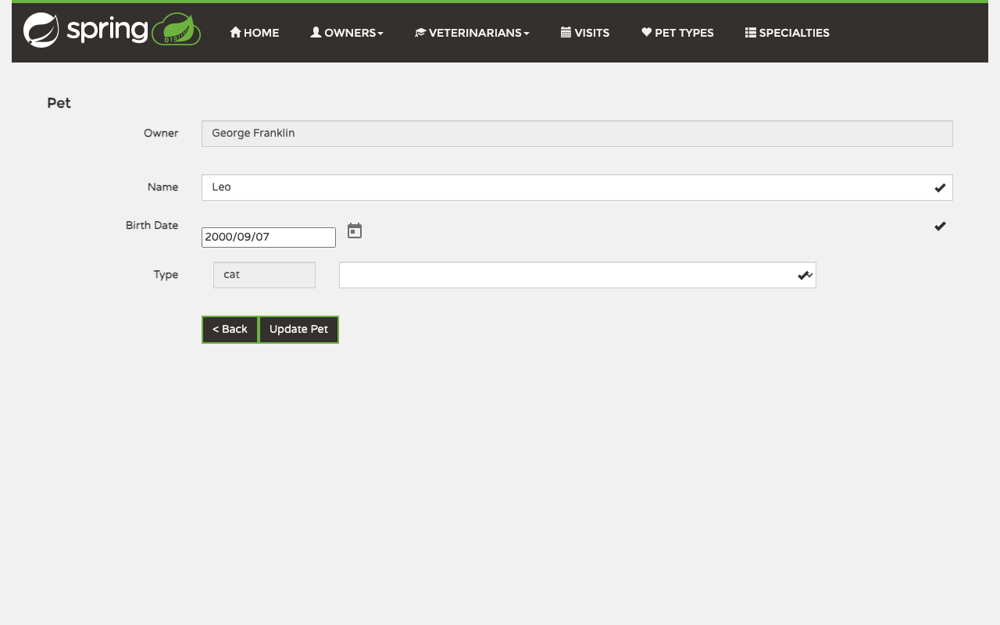
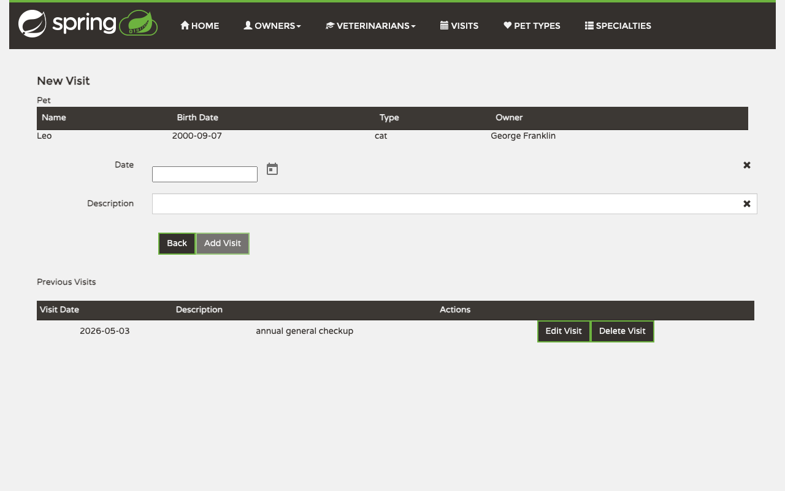
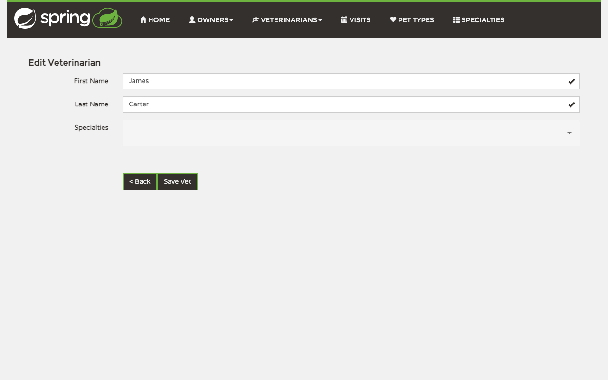
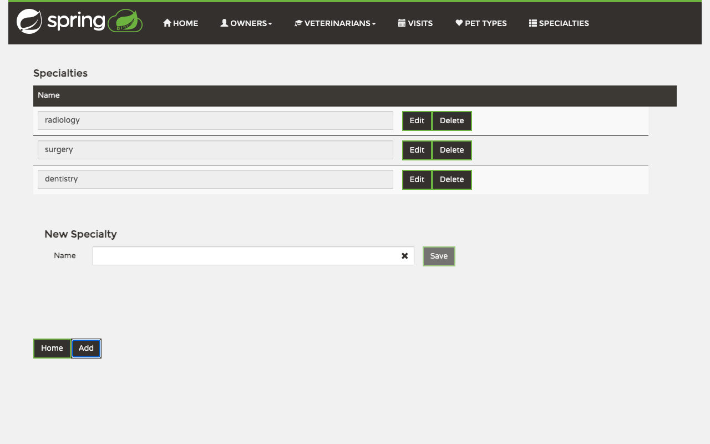

# PetClinic User Manual

PetClinic helps clinic staff manage owners, pets, visits, veterinarians, pet types, and specialties from one place. This file is regenerated by `/regen-manual`; do not edit by hand, because your changes will be overwritten on the next regeneration.

## Contents

- [Welcome](#welcome)
- [Owners](#owners)
- [Pets](#pets)
- [Visits](#visits)
- [Pet Types](#pet-types)
- [Veterinarians](#veterinarians)
- [Specialties](#specialties)

## Welcome

The welcome page is the starting point for the application. From here, use the navigation bar to move into the records area you want to work with.

### Opening the home page

When you open PetClinic, you arrive on the welcome screen. Click *Home* at any time to return here and start a different task.

### Using the navigation bar

Use the top navigation bar to move between areas of the application. The *Owners* and *Veterinarians* menus open dropdowns with shortcuts to the list and add screens, while *Visits*, *Pet Types*, and *Specialties* open directly.

## Owners

The Owners area is where you manage the people who bring pets to the clinic. From here you can search existing owners, open a full owner record, add a new owner, and update contact details.

### Viewing the list

Open *Owners* -> *Search* to see the owner list. Use the *Search* field to filter the table as you type; it matches visible information such as the owner's name, address, city, telephone number, and pet names. Click an owner's name to open that record, or click *Add Owner* to register someone new.

### Creating a new owner

Open *Owners* -> *Add New* or click *Add Owner* from the list. Enter the owner's contact details and save the form to create the new record.

### Looking at an owner's record

The owner record shows the contact details at the top and the owner's pets and visits below. Use *Back* to return to the list, *Edit Owner* to change the owner's details, and *Add New Pet* to register another pet for this owner.

### Editing an owner

From the owner record, click *Edit Owner*. Update the fields you need and save to return to the owner record with the new details in place.

## Pets

Pets are always managed in the context of an owner. From an owner record you can add a pet, update that pet later, or continue on to record visits.

### Adding a pet to an owner

Open an owner record and click *Add New Pet*. Enter the pet's name, birth date, and type, then save to attach the pet to that owner.

### Editing a pet

On the owner record, click *Edit Pet* next to the pet you want to change. Update the pet details and save to return to the owner record.

## Visits

The Visits area gives you a clinic-wide timeline of recorded visits. You can review recent activity there, and you can add a new visit from the relevant pet on an owner record.

### Viewing the list

Open *Visits* to see all visits in one place. Each row shows the visit date, description, pet, and owner so you can quickly review recent activity and jump back to the related owner.

### Creating a new visit

Open the relevant owner, find the pet, and click *Add Visit*. Enter the visit date and description, then save to add it both to the pet's history and to the clinic-wide visits list.

## Pet Types

Pet Types is the list used by the pet registration forms. Maintain it when the clinic needs to add, rename, or remove the kinds of animals it accepts.

### Viewing the list

Open *Pet Types* to review the available entries. Use *Edit* to rename an existing type or *Delete* to remove one you no longer need.

### Creating a new pet type

Click *Add* on the Pet Types page to open the inline form below the table. Enter the new type name and save it to make it available in pet forms.

## Veterinarians

The Veterinarians area is the staff roster. You can review the current vets, add new ones, and keep their specialty assignments up to date.

### Viewing the list

Open *Veterinarians* -> *All* to see the full roster. The list shows each veterinarian together with their current specialties. Use *Edit Vet* to change a record or *Add Vet* to register a new colleague.

### Creating a new veterinarian

Open *Veterinarians* -> *Add New* or click *Add Vet* from the list. Enter the vet's first name, last name, and initial specialty, then save the form.

### Editing a veterinarian

From the list, click *Edit Vet* for the record you want to change. Update the name fields or adjust the *Specialties* selection, then save to return to the roster.

## Specialties

Specialties is the shared list of veterinary disciplines used by veterinarian records. Keep it aligned with the services your clinic offers.

### Viewing the list

Open *Specialties* to review the available specialties. Use *Edit* to rename one or *Delete* to remove it from the shared list.

### Creating a new specialty

Click *Add* on the Specialties page to open the inline form below the table. Enter the new specialty name and save it so it becomes available in veterinarian records.
