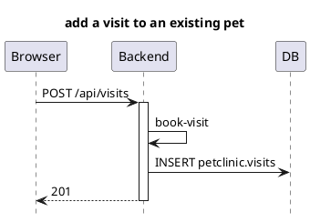

# Sequence diagrams from Tempo after e2e tests — Design

**Date:** 2026-06-25
**Status:** Approved design (pending spec review)

## Goal

Reproduce, in a **simplified** form, the Training Assistant concept: after the
end-to-end UI tests run, pull the browser↔backend interactions that were
recorded as OpenTelemetry traces in **Grafana/Tempo** and turn each test
scenario into a **PlantUML sequence diagram**. Additionally add one **explicit
custom span** in the backend so it visibly appears in the diagram next to the
auto-instrumented spans.

This is a demonstration of the idea — not a port of Training Assistant's ~480-line
`traces_to_puml.py` with its full collapse-rule engine.

## What already exists (no work needed)

The full tracing pipeline is already wired and verified (see
`petclinic-observability/grafana-trace-full.png`):

- **Frontend** — `petclinic-frontend/src/otel.ts` sets up a `WebTracerProvider`
  (`service.name = petclinic-frontend`), auto-instruments fetch/XHR/user-interaction
  (emits a `click` span + `GET/POST …` fetch spans), and propagates `traceparent`
  to `localhost:8080`. Exports OTLP HTTP to `/v1/traces`.
- **Backend** — `start-backend.sh` attaches the **OpenTelemetry Java agent v2.10.0**,
  exporting OTLP to `http://localhost:4318`. Produces SERVER spans (`GET /api/owners`),
  JDBC CLIENT spans (`SELECT petclinic.owners`, `INSERT …`), `Transaction.commit`, etc.
- **Collector + store** — `petclinic-observability/` runs `grafana/otel-lgtm` (Grafana
  on `:3300`, OTLP on `:4317/:4318`). The collector exports traces to **Tempo**.
- The browser → backend → DB chain arrives in Tempo **as a single linked trace**.
- Grafana datasources confirmed live: `tempo` (uid `tempo`), `loki`, `prometheus`.
  The "three sources" = Tempo/Loki/Prometheus; for sequence diagrams we only need **Tempo**.

## Decisions (from brainstorming)

| Decision | Choice |
|---|---|
| Diagram format | **PlantUML** (`.puml`) |
| Script language / location | **TypeScript** in `petclinic-ui-test/` |
| Trigger | Playwright **`globalTeardown`** + reusable module → also `npm run trace:diagram` |
| Trace correlation | **Per-test tag** `test.name`, set as a **frontend span attribute** (+ time window as safety net) |
| Custom span | Backend **`@WithSpan("book-visit")`** on a private method in `VisitRestController` |

## Architecture & data flow

```
Playwright test (per scenario)
  │  fixture: addInitScript → window.__E2E_TEST_NAME__ = test title
  │  record [startMs, endMs] + title  ──►  test-results/trace-windows.json
  ▼
Browser (otel.ts)
  │  custom SpanProcessor.onStart → span.setAttribute('test.name', window.__E2E_TEST_NAME__)
  │  auto fetch/click spans, traceparent → backend
  ▼
Backend (OTel agent)  →  Collector  →  Tempo  (single linked trace, tagged test.name)
  ▲
  │  @WithSpan("book-visit") custom span nested under POST /api/visits
  ▼
globalTeardown → trace-diagram/generate.ts
  1. read trace-windows.json
  2. for each test: Tempo search  {  .test.name = "<title>"  }  in [start,end]  → traceIDs
  3. for each traceID: GET trace JSON
  4. build participant/message model
  5. emit petclinic-ui-test/diagrams/<test-slug>.puml   (+ optional .svg)
```

### Tempo access (via Grafana proxy, admin/admin)

Tempo's native port is not exposed by docker-compose; query through Grafana:

- Search: `GET http://localhost:3300/api/datasources/proxy/uid/tempo/api/search?q=<TraceQL>&start=<unixSec>&end=<unixSec>&limit=N`
- Trace:  `GET http://localhost:3300/api/datasources/proxy/uid/tempo/api/traces/<traceID>`
- Auth: HTTP Basic `admin:admin` (configurable via env `GRAFANA_URL` / `GRAFANA_USER` / `GRAFANA_PASSWORD`).

TraceQL filter: `{ span.test.name = "<title>" }`. The attribute lives on the
frontend span; TraceQL returns the whole trace. The `[start,end]` window is the
robustness net if the tag is ever missing.

### Trace → diagram mapping (simplified)

Per span, choose a participant:

- `resource.service.name == petclinic-frontend` → **Browser**
- `resource.service.name == petclinic-backend` and `kind == SERVER` → **Backend**
- `kind == CLIENT` with a `db.system` attribute (e.g. `SELECT petclinic.owners`) → **DB**
- the custom span `book-visit` → a named self-message on **Backend** (distinct from SELECT/INSERT)

Build the span tree (parent/child via spanId/parentSpanId), then emit messages in
`startTimeUnixNano` order, drawing an arrow whenever a parent→child edge crosses a
participant boundary. One `.puml` per test; if a test produced several traces they
are concatenated in time order under `== <trace label> ==` separators.

Example output:



## Components (new / touched)

**New (TypeScript, `petclinic-ui-test/`):**
- `src/trace-diagram/tempo-client.ts` — Grafana-proxy client: `searchTraceIds(traceql, startMs, endMs)`, `getTrace(traceId)`.
- `src/trace-diagram/trace-to-puml.ts` — pure model builder + PlantUML serializer (the testable core).
- `src/trace-diagram/generate.ts` — reads `trace-windows.json`, calls Tempo, writes `.puml` files; entry point for both teardown and the npm script.
- `tests/support/trace-window.fixture.ts` — Playwright fixture: sets `window.__E2E_TEST_NAME__` via `addInitScript`; records `{title, startMs, endMs}` to `test-results/trace-windows.json`.
- `diagrams/` — output dir for generated `.puml` (+ `.svg`).

**Touched:**
- `petclinic-frontend/src/otel.ts` — add a tiny `SpanProcessor` whose `onStart` stamps `test.name` from `window.__E2E_TEST_NAME__` (no-op when absent).
- `petclinic-ui-test/playwright.config.ts` — register `globalTeardown` (and the fixture).
- `petclinic-ui-test/package.json` — add `"trace:diagram": "ts-node src/trace-diagram/generate.ts"`.
- `petclinic-backend/pom.xml` — add `io.opentelemetry.instrumentation:opentelemetry-instrumentation-annotations:2.10.0`.
- `petclinic-backend/.../rest/VisitRestController.java` — extract the body of `addVisit` into a private `@WithSpan("book-visit")` method.

## Custom span detail

```java
// VisitRestController
@PostMapping
public ResponseEntity<Void> addVisit(@RequestBody @Validated VisitDto visitDto) {
    int id = bookVisit(visitDto);
    return ResponseEntity.created(...buildAndExpand(id).toUri()).build();
}

@WithSpan("book-visit")
private int bookVisit(VisitDto visitDto) {
    Visit visit = visitMapper.toVisit(visitDto);
    visitRepository.save(visit);
    return visit.getId();
}
```

The OTel Java agent instruments `@WithSpan` methods at the bytecode level, so it
works on a **private, self-invoked** method (unlike Spring AOP) — keeping the
repository-only, "no service layer" house style. Falls back to package-private if
a private method is ever not picked up.

## Telemetry prerequisite (important)

Diagrams only appear when the apps run **with telemetry on**, i.e. started the
canonical way: `./start-database.sh`, `./start-grafana.sh`, `./start-backend.sh`
(agent attached), `./start-frontend.sh`, then `npm test` in `petclinic-ui-test/`.

`petclinic-ui-test/scripts/start-apps.ts` launches the backend with a plain
`mvn spring-boot:run` (no agent) — so the experimental `npm run test:with-apps`
path produces **no traces**. `generate.ts` must **degrade gracefully**: if Grafana
is unreachable or a test window yields zero traces, log a clear warning and skip
(never fail the test run). Wiring the agent into `start-apps.ts` is out of scope.

## Testing

- Unit-test `trace-to-puml.ts` against a small **fixture trace JSON** (captured once
  from a real Tempo response, saved under `src/trace-diagram/__fixtures__/`):
  assert participants, ordered messages, the `book-visit` self-message, and
  activate/deactivate balance. This is the TDD core and needs no running stack.
- `tempo-client.ts` kept thin (just HTTP + URL building) and tested with a mocked fetch.
- Manual end-to-end check: start the stack, run `npm test`, confirm
  `diagrams/<slug>.puml` is generated and contains `book-visit`.

## Out of scope (YAGNI)

- Training Assistant's generic collapse-rule engine (proxy/broadcast collapse).
- Loki/Prometheus correlation — Tempo only.
- Auto-committing or auto-rendering SVG in CI (SVG render is best-effort, local only).
- Adding the OTel agent to `start-apps.ts`.
- Browser-side `step:` spans (custom span is backend-only per decision).
```
