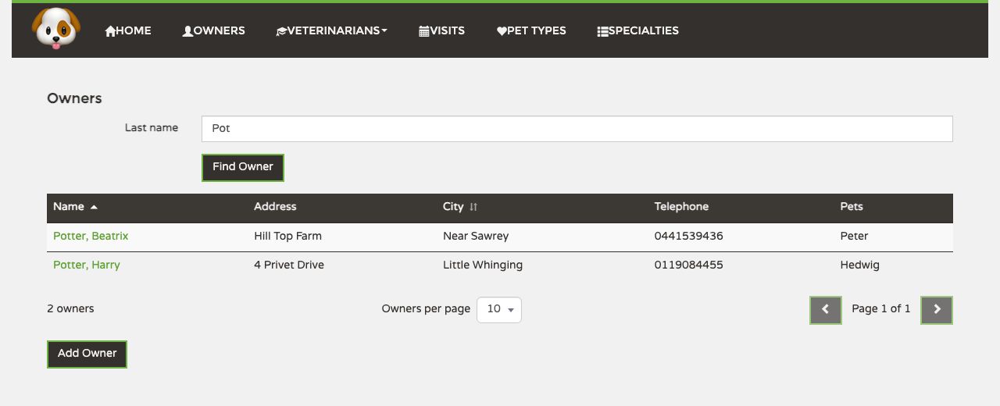

# Proposal

## Why

The Owners screen shows every owner the clinic has, all at once, on a single page. That works
with today's few dozen owners, but the business expects around 100,000 within a year. At that
size the screen would take a long time to open, become impossible to scan, and slow the clinic
down for everyone else using it at the same time. (GitHub issue #25)

## What Changes

- The Owners list shows **one page of owners at a time**. Staff choose 5, 10 or 20 owners
  per page; 10 is the default.
- Staff move between pages with **previous / next** buttons and see which page they are on
  and how many owners matched.
- Staff can **sort by Name or by City**, ascending or descending, by clicking the column
  header. Name sorts by last name first, so the list now shows names as
  "Potter, Harry" to match. The owner's own page still says "Harry Potter".
- Address, Telephone and Pets stay **not sortable**. The issue asked for "any column"; we
  are deliberately narrowing that, because sorting those columns gives no useful order.
- **Find Owner keeps working as today** (last name starts with what you typed, upper/lower
  case matters), and now works together with the pages and the sorting.
- The **page address remembers what you see**: the search, the page, the page size and the
  sort. Refreshing, going Back/Forward in the browser, or sending the link to a colleague
  shows exactly the same list.
- Changing the search, the sort or the page size **goes back to page 1**, so nobody lands on
  a page that no longer exists. A link to a page past the end opens the last page instead.
- While a page is loading the table keeps its place instead of jumping around. If loading
  fails, staff see an error message that is clearly different from "no owners match".
- The list shows only what the grid needs (name, address, city, telephone, pet names). The
  full pet and visit history stays on each owner's own page, as today.

What the screen will look like ([mockup](mockup/owners-grid.html)):

## Capabilities

### New Capabilities
- `owners-grid`: browsing, filtering, sorting and paging the list of owners.

### Modified Capabilities
<!-- none: no specs exist yet under openspec/specs/ -->

## Impact

- **Who notices:** everyone who uses the Owners screen. Nothing changes on an owner's own
  page, on adding or editing owners, or on any other list.
- **Links:** old bookmarks to the Owners screen keep working and open page 1.
- **Out of scope:** sorting by Address, Telephone or Pets; searching inside names or by
  other fields; paging the Vets or Visits lists; changing how names with accents or special
  letters are ordered alphabetically (that stays as it is today).
