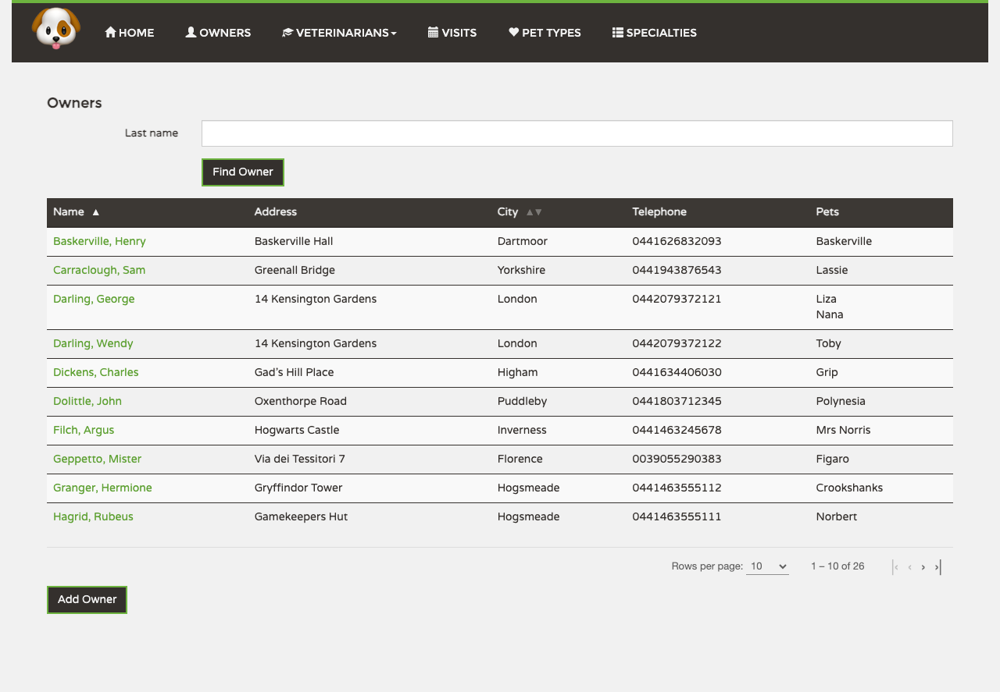

# Proposal

## Why

The business expects about 50,000 pet owners within a year. Today the Owners screen loads every
owner, with all their pets and visits, each time it opens. At that size the screen becomes slow
and the server risks running out of memory. GitHub issue #25 asks to show the owners a page at a
time and to let staff sort them.

## What Changes

The new screen, with the clinic's sample owners:

The same screen with every decision below pinned on it: `mockup/owners-grid-notes.png`.
Sorted by city, Z→A, on page 2: `mockup/owners-grid-city-desc.png`. To try it, open
`mockup/owners-grid.html` in a browser: sorting, paging and search all work.

- **The Owners screen shows one page at a time.** Staff choose 5, 10 or 20 owners per page
  (10 by default), see how many owners there are in total, and move between pages.
- **Staff can sort by Name or by City**, A→Z or Z→A, by clicking the column heading. The screen
  opens sorted by Name, A→Z.
  - **Name sorts by surname, then first name**, and is now shown surname first:
    "McCallister, Kevin" instead of "Kevin McCallister". Owners are looked up by surname, so the
    list reads like a phone book, and relatives with the same surname sit together.
  - **City sorts by city; owners in the same city are listed by name.** Sorting cities Z→A
    reverses the cities only — within London, the owners still read A→Z.
  - **Romanian alphabet rules**: Ș comes after S, Ț after T, Î after I. Polish, Spanish and other
    accented names sort next to their plain letter instead of at the end of the list, as they
    do today.
- **Address, Telephone and Pets cannot be sorted** — fewer columns than the issue asks for,
  because their data would make any order look broken:
  - Addresses are typed freely, so "221B Baker Street" comes before "4 Privet Drive".
  - Phone numbers are stored in several formats, so the UK numbers would be split into two
    separate groups.
  - Every owner has one or two pets, so there is nothing meaningful to sort by.
- **Searching by surname happens as you type**: there is no Find Owner button any more; the
  list updates once you stop typing. The search box spans the screen with "Last name" written
  inside it; Add Owner stays below the list. The search is still
  sensitive to upper/lower case. A new search, page size or sort goes back to page 1.
- **Staff keep their place.** After opening an owner and going back, or after refreshing the
  page, they return to the same page, sort and search.
- **"No owners found" means that no owner matched.** Today the same message also appears when the
  server fails; a failure will now show as an error.
- **Other systems are not affected.** Only this application reads the list of owners, and it
  changes together with the screen.

## Capabilities

### New Capabilities
- `owner-list`: browsing the clinic's owners — a page at a time, sorted by name or city, and
  searched by surname.

### Modified Capabilities
<!-- none: no capability is specified yet -->

## Impact

- **Staff** get an Owners screen that stays fast as the clinic grows. They can no longer see
  every owner at once, nor sort by address, telephone or pets, and names now read surname first.
- **Test data** gains one owner, Ana Șerban of Brașov, to check the Romanian alphabet rules.
- **Not included in this change**, each one could be a request of its own: searching regardless
  of upper/lower case, cleaning up the stored phone formats, and searching by phone number.
- The technical details — how the server, the database and the screen change — are in
  `design.md`; the exact expected behaviour, as testable examples, is in
  `specs/owner-list/spec.md`.
