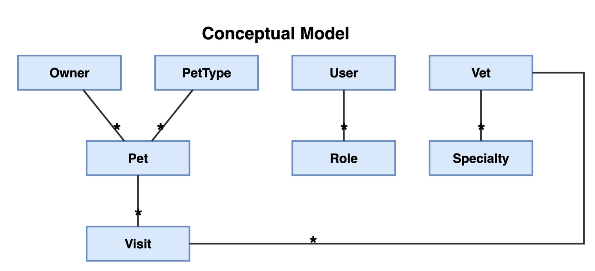

# PetClinic Architecture Docs

This folder holds the source-of-truth architecture artifacts. Hand-written sources sit here directly; auto-generated outputs land in [`generated/`](generated/). Both are kept in sync with the code by guardrail tests in [`src/test/java/.../guardrail/`](../src/test/java/victor/training/petclinic/guardrail/) (see also [GUARDRAILS.md](../../GUARDRAILS.md)).

Diagrams are rendered live via the public [PlantUML proxy](https://plantuml.com/) from the GitHub-hosted sources. If the renderer ever blocks the URL, swap `www.plantuml.com/plantuml/proxy?...&src=` for `kroki.io/plantuml/svg/<base64>` or render locally with the PlantUML CLI.

## Hand-written sources

### Packages (logical architecture)

Source: [`packages.puml`](packages.puml). Validated by `PackagesArchTest`: every package in code must appear here, and ArchUnit asserts cross-package deps match the diagram.

One reading convention, project-agnostic — the recipe is written out at the top of `packages.puml` so it can be copied into any codebase that guards its packages with ArchUnit:
- **Red double-headed line = cycle.** A bidirectional dependency is drawn as a single red line with an arrowhead at each end. ArchUnit's PlantUML parser can't read `<-->` arrows, so each red line is backed by two `-[hidden]->` arrows, which it *does* parse as the two directed dependencies. No such cycle exists today.


### Conceptual model (hand-arranged map of the domain)

Source: [`ConceptualModel.drawio.png`](ConceptualModel.drawio.png) — a real draw.io file, so the
picture and the mxGraph XML behind it are one committed artifact. Validated by
`ConceptualModelDiagramTest`.

It draws the same concepts and links as the generated `DomainModel.puml`, and exists for
the one thing a generated diagram cannot do: **stay in the same place**. PlantUML re-lays
out the whole graph on every regeneration, so adding one class moves Owner across the page
and erases the spatial memory of everyone who had learned the map. Here the layout belongs
to the humans — and only the layout does:

- **content is the code's.** A box declares `concept="Owner"`, a line `assoc="Owner-Pet"`
  (both ends, alphabetically). The test refuses a box, a line or a cardinality the domain
  classes do not have, refuses a missing one just as hard, and refuses a line between two
  concepts that declares no `assoc` — so nothing can opt out of the check in silence.
  Cardinalities are read from the **visible** end labels, never from an attribute: a second
  copy of the claim could drift, and a diagram that passes while showing the wrong number
  is worse than no diagram. The map marks only what is worth reading — a bare `*` at a many
  end, and **nothing** at a to-one end, where an unmarked line says "exactly one". Silence
  is a claim like any other here, so it is asserted too: a stray marker on a to-one end
  fails just as a missing `*` does. Role names are not drawn at all — the map shows the
  shape of the model; `DomainModel.puml` next to it names the fields and links them to the
  code.
- **position is the human's.** No coordinate is ever read as truth, so any box can be
  dragged, resized or restyled without breaking a check.

When the model grows, `scripts/conceptual-model-patch.py` adds the new box in the staging lane
down the left-hand side, marked `placed="auto"`, and draws the new line. The test then
**keeps failing** until a human has dragged the box where it belongs and re-run the script
to clear the marker. That failure is the point: an automatic layout would be quicker and
would cost exactly what this diagram is for.

```sh
python3 docs/scripts/conceptual-model-patch.py --dry-run   # what is missing
python3 docs/scripts/conceptual-model-patch.py             # add it, re-render the PNG
```

Needs the draw.io desktop CLI (`brew install --cask drawio`) to re-render. CI only reports
the drift — a check whose fix is a human judgement about layout has no business rendering
Electron on a runner.



### C4 model (workspace, containers, components)

Source: hand-written Structurizr DSL, split by stability:
- [`c4model.c1+c2.dsl`](c4model.c1+c2.dsl) — **stable, human-maintained** C1/C2: people, containers and their high-level wiring. Purely declarative — the backend can't introspect the Angular SPA or PostgreSQL.
- [`c4model.c3.dsl`](c4model.c3.dsl) — **code-coupled** C3: Backend components + their dependencies, `!include`d into the Backend container. Every line is unit-tested against the real code, so this is the file that changes when packages/dependencies do.

Open `c4model.c1+c2.dsl` (which pulls in the C3 fragment) in [structurizr.com/dsl](https://structurizr.com/dsl) or the Structurizr CLI for the interactive view. The C3 layer is validated by `C3ArchTest`:
- Every code package must match one component's `pkg:<pattern>` tag.
- Every component-to-component edge in the DSL must correspond to a real cross-package dependency, and vice versa.

## Generated diagrams

Regenerated on every push by the guardrail tests; committed so they're reviewable in PRs.

### Domain model (reflection-derived class diagram)

Generated by `DomainModelExtractorTest` from the domain classes by plain reflection — no JPA
annotation is read, so the picture survives a model that stops using them.

How to read an association:

```
Visit "*" --> "vet" Vet              only Visit maps the other side
Pet "pet" <--> "* visits" Visit      each side maps the other
```

- **the arrow is navigability, not decoration.** A single arrow says exactly one of the two
  classes declares a field for the other, and points the way the code can actually walk;
  a double arrow says both do. The undirected `--` this replaced hid that distinction —
  a real fact about the code — behind a line that looked the same either way.
- **the role name belongs to an end, so it is drawn there**, next to that end's
  multiplicity, instead of dangling off the middle of the line as a trailing `: label`
  that never said which of the two classes it named.
- **multiplicity is only what informs:** `*` at a many end, and **nothing** at a to-one
  end, where an unmarked line already says "exactly one" — the same convention the
  hand-arranged conceptual model uses. In the `.puml` source the star is written `~*`,
  PlantUML's Creole escape, because an end label starting with `* ` renders as a bullet.


Source: [`generated/DomainModel.puml`](generated/DomainModel.puml)

### C4 views (rendered from `c4model.c1+c2.dsl`)

Regenerated by `C3ArchTest` by re-exporting the parsed `c4model.c1+c2.dsl` workspace.

#### C1 — System Context


Source: [`generated/c4views/C1-Context.puml`](generated/c4views/C1-Context.puml)

#### C2 — Containers


Source: [`generated/c4views/C2-Containers.puml`](generated/c4views/C2-Containers.puml)

#### C3 — All components


Source: [`generated/c4views/C3-Components-All.puml`](generated/c4views/C3-Components-All.puml)

#### C3 — Mapper focus (nearest neighbours)


Source: [`generated/c4views/C3-Mapper.puml`](generated/c4views/C3-Mapper.puml)

#### C3 — Repository focus (nearest neighbours)


Source: [`generated/c4views/C3-Repository.puml`](generated/c4views/C3-Repository.puml)
