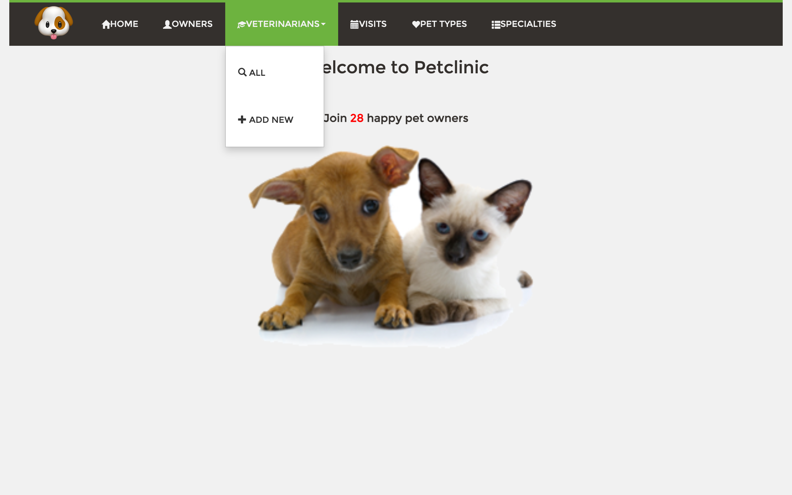
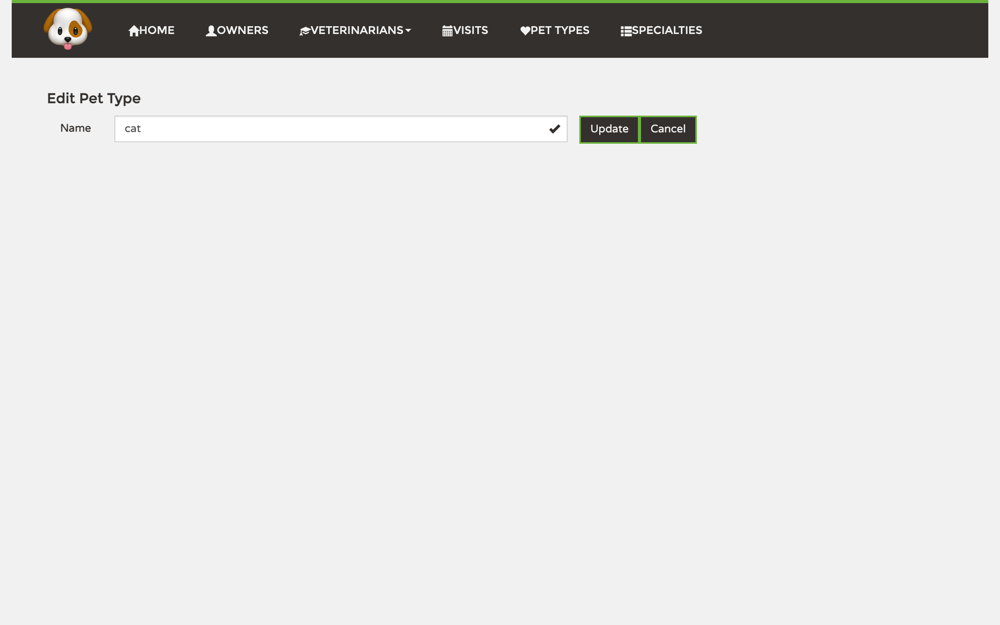

# PetClinic User Manual

PetClinic is a small veterinary practice management application. You can use it to keep records of pet owners, the pets in their care, the veterinarians on staff, the specialties those vets practice, and the visits the pets make to the clinic.

_This file is regenerated by the `/regen-user-manual` slash command. Do not edit by hand — your changes will be overwritten on the next regeneration._

## Contents

- [Getting around](#getting-around)
- [Welcome](#welcome)
- [Owners](#owners)
- [Pets](#pets)
- [Visits](#visits)
- [Pet Types](#pet-types)
- [Veterinarians](#veterinarians)
- [Specialties](#specialties)

---

## Getting around

Every screen carries the same dark navigation bar across the top. The 🐶 logo and **Home** both take you back to the welcome screen. **Owners**, **Visits**, **Pet Types**, and **Specialties** are direct links that open the matching list. **Veterinarians** is the only dropdown: clicking it reveals **All** (the full vet list) and **Add New** (the new-vet form). Pets do not have their own menu item — you always reach a pet through its owner's record.

The screenshot above shows the **Veterinarians** dropdown expanded over the welcome screen.

---

## Welcome

The welcome screen is the application's landing page. It greets you and shows how many owners are currently on file, but it holds no controls of its own — use the top navigation bar to move into the area you want to work in.

---

## Owners

The Owners area is the heart of the application. Every pet, and through it every visit, hangs off an owner's record, so most of your day-to-day work starts here. You can browse and search the owner list, open an owner to see their pets and visit history, register new owners, and edit their contact details.

### Viewing the list

The list shows each owner's name, address, city, telephone, and the names of their pets. To narrow it down, type part of a surname into the **Last name** box and click **Find Owner** — leaving the box empty lists everyone. Click an owner's name to open their full record, or click **Add Owner** at the bottom to register someone new.

### Creating a new owner

The **New Owner** form asks for First Name, Last Name, Address, City, and Telephone. Fill in all five fields and click **Add Owner** to save; the **×** at the end of each field clears it. **Back** returns to the list without saving. After saving, you land on the new owner's record, ready to add their first pet.

### Looking at an owner's record

The record opens with the **Owner Information** panel (name, address, city, telephone) and three buttons: **Back** to the list, **Edit Owner** to change those details, and **Add New Pet** to register a pet for this owner. Below, the **Pets and Visits** section lists each pet with its birth date and type, plus per-pet buttons to **Edit Pet**, **Delete Pet**, and **Add Visit**, followed by that pet's visit history.

### Editing an owner

The edit form is pre-filled with the owner's current details. Change whatever you need and click **Update Owner** to save, or **Back** to return without keeping the changes.

---

## Pets

A pet always belongs to an owner, so you create and manage pets from inside the owner's record rather than from the main menu. Each pet has a name, a birth date, and a type chosen from the clinic's [Pet Types](#pet-types). From a pet you can also start booking its [Visits](#visits).

### Adding a pet

Open the **Add New Pet** button on an owner's record to reach this form. The **Owner** field is fixed to the owner you came from. Enter the pet's **Name**, pick a **Birth Date** with the calendar button, and choose a **Type** from the dropdown. **Save Pet** stays disabled until the required fields are filled; click it to save, or **< Back** to cancel.

### Editing a pet

The edit form is pre-filled with the pet's current name, birth date, and type, while the owner stays fixed. Adjust the details and click **Update Pet** to save, or **< Back** to discard your changes.

---

## Visits

A visit records one appointment for one pet — its date and a short description of what was done. The [Visits](#visits) menu item shows every visit across the whole clinic, but you always *book* a new visit from the specific pet it belongs to, reached through that pet's owner.

### Viewing the list

The Visits screen lists every visit in the clinic, newest first, showing the date, description, the pet, and a link to the pet's owner. Click an owner's name to jump straight to their record. This screen is read-only — to add or change a visit, work from the pet it concerns.

### Adding a visit

Reached from a pet's **Add Visit** button, the **New Visit** form shows the pet and owner details for confirmation at the top. Pick a **Date** with the calendar button and type a **Description** of the visit. **Add Visit** stays disabled until both are filled. The pet's **Previous Visits** are listed below for reference.

### Editing a visit

The **Edit Visit** form shows the pet and owner for context and pre-fills the visit's date and description. Change either field and click **Update Visit** to save, or **Back** to return without saving.

---

## Pet Types

Pet Types is a short reference list of the kinds of animal the clinic treats — cat, dog, bird, and so on. These values populate the **Type** dropdown when you add or edit a pet, so keeping the list tidy keeps pet records consistent.

### Viewing the list

Each type is shown in its own row with **Edit** and **Delete** buttons. Use **Add** at the bottom to create a new type, or **Home** to return to the welcome screen.

### Creating a new pet type

The **New Pet Type** form has a single **Name** field. Type the new type's name and click **Save**; the **×** clears the field.

### Editing a pet type

Editing opens the type's name in the same single-field form. Change the name and save to apply it everywhere that type is used.

---

## Veterinarians

The Veterinarians area lists the clinic's vets and the [Specialties](#specialties) each one practises. Open it from the **Veterinarians** dropdown in the top bar — **All** for the list, **Add New** to register a vet.

### Viewing the list

The list shows each vet's name alongside their specialties (a vet may have several, or none). Each row has **Edit Vet** and **Delete Vet** buttons; **Add Vet** at the bottom opens the new-vet form and **Home** returns to the welcome screen.

### Creating a new veterinarian

The **New Veterinarian** form asks for a **First Name**, **Last Name**, and a **Type** (specialty) chosen from the dropdown. **Save Vet** stays disabled until the required fields are filled; click it to save or **< Back** to cancel.

### Editing a veterinarian

The edit form is pre-filled with the vet's name and lets you adjust their **Specialties** from the selector. Click **Save Vet** to keep the changes or **< Back** to discard them.

---

## Specialties

Specialties is the reference list of veterinary disciplines — radiology, surgery, dentistry — that you can assign to vets. Each specialty also carries a description used to help match incoming cases to the right discipline.

### Viewing the list

Each specialty appears in its own row with **Edit** and **Delete** buttons. **Home** returns to the welcome screen.

### Editing a specialty

The **Edit Specialty** form shows the specialty's **Name** and a longer **Description**. Adjust either field and click **Update** to save, or **Cancel** to return without keeping the changes.
