# PetClinic User Manual

PetClinic is a small veterinary practice management application. You can use it to keep records of pet owners, the pets in their care, the visits those pets make to the clinic, the veterinarians on staff, and the specialties those vets practice.

_This file is regenerated by the `/regen-manual` slash command. Do not edit by hand — your changes will be overwritten on the next regeneration._

## Contents

- [Getting around](#getting-around)
- [Welcome](#welcome)
- [Owners](#owners)
- [Pets](#pets)
- [Visits](#visits)
- [Pet Types](#pet-types)
- [Veterinarians](#veterinarians)
- [Specialties](#specialties)

---

## Getting around

The dark bar across the top of every screen is the main navigation. From left to right it holds the dog logo (a quick link back to the start), **HOME**, **OWNERS**, **VETERINARIANS**, **VISITS**, **PET TYPES** and **SPECIALTIES**. **OWNERS** and **VETERINARIANS** are dropdown menus — click them to reveal their sub-links. The remaining items (**HOME**, **VISITS**, **PET TYPES**, **SPECIALTIES**) take you straight to that screen.

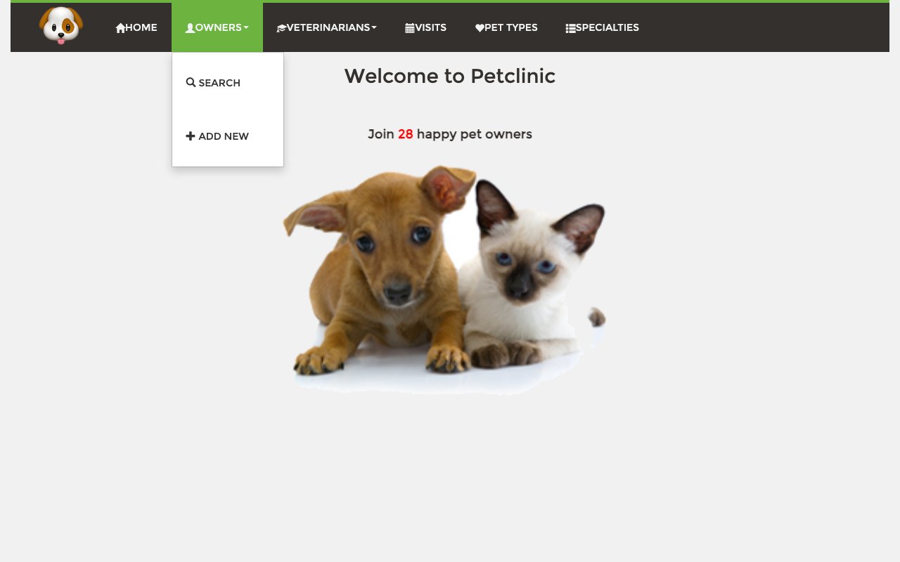

The **OWNERS** menu opens to *Search* (the owner list) and *Add New* (the new-owner form).

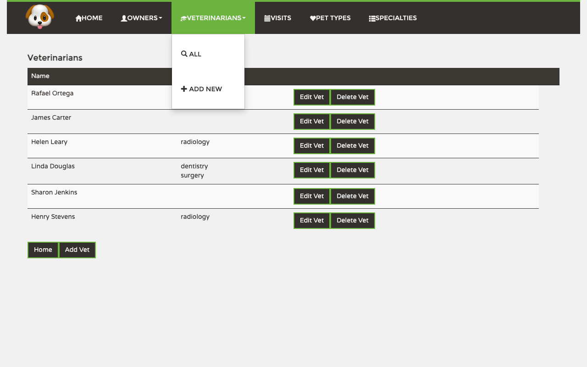

The **VETERINARIANS** menu opens to the list of vets and the form for adding a new one.

---

## Welcome

The Welcome screen is the application's landing page. It greets you, shows how many pet owners are currently on file, and is simply a starting point — use the top navigation to go wherever you need.

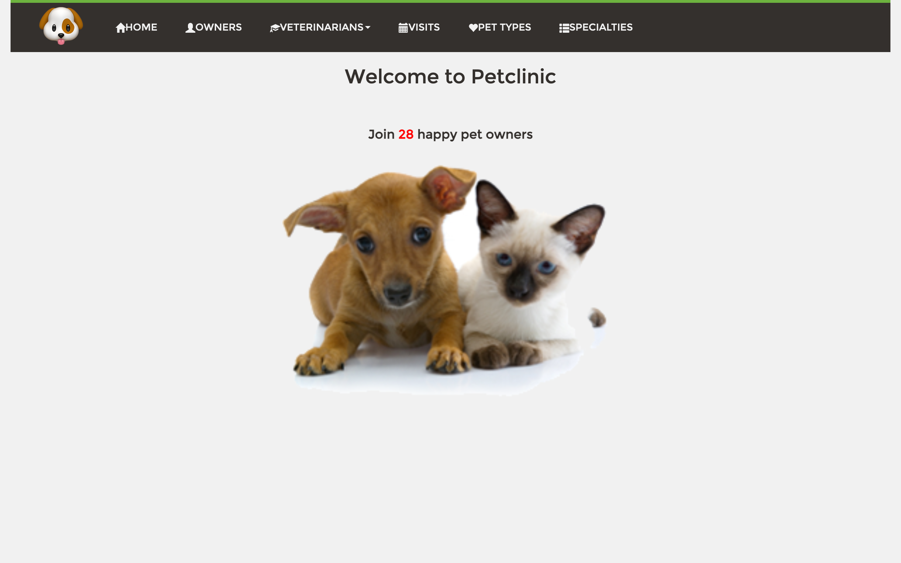

---

## Owners

The Owners area is where you manage the people who bring their pets to the clinic. You can search the full list, register new owners, open an owner's record to see their pets and visit history, and update their contact details. Pets and visits both hang off the owner's record — see [Pets](#pets) and [Visits](#visits).

### Viewing the list

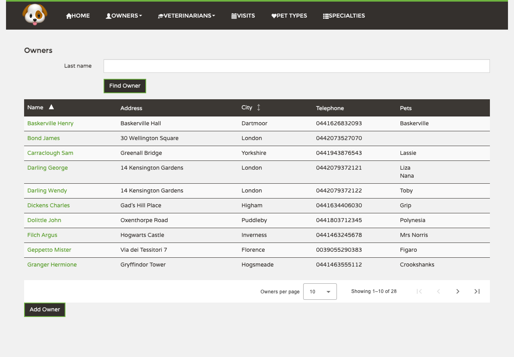

Open **OWNERS → Search** to see every owner in a table showing name, address, city, telephone and the names of their pets. Each owner's name is a link that opens their record. Use the **Add Owner** button at the bottom to register someone new.

### Searching for an owner

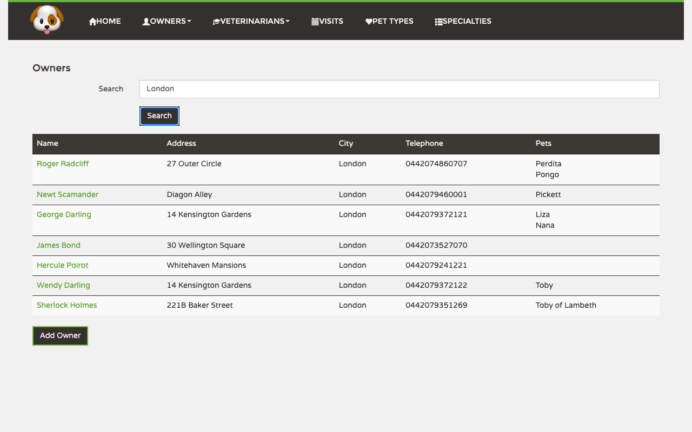

Type any part of a name, address, city, phone number or pet name into the **Search** box and click **Search**. The list narrows to matching owners — here, searching for "London" keeps only the owners who live there. Clear the box and search again to see everyone.

### Creating a new owner

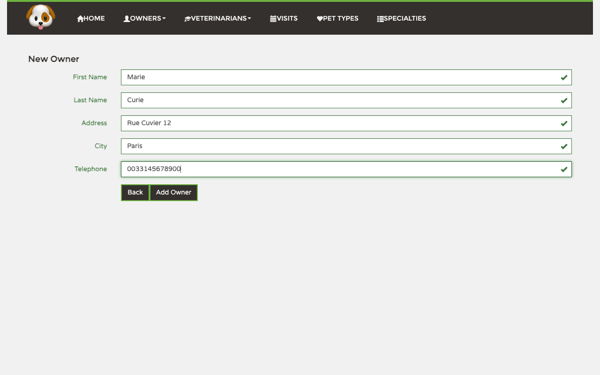

Click **Add Owner** (or **OWNERS → Add New**) to open the **New Owner** form. Fill in First Name, Last Name, Address, City and Telephone — all five are required, so the **Add Owner** button stays disabled until they are complete. Click **Add Owner** to save, or **Back** to discard and return to the list.

### Looking at an owner's record

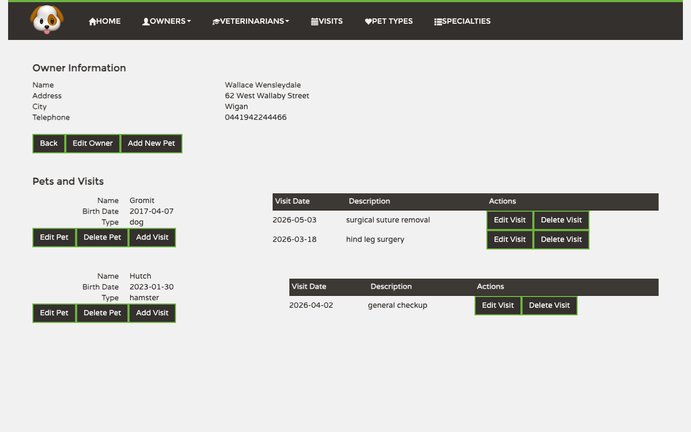

Clicking an owner's name opens **Owner Information**: their contact details at the top, followed by a **Pets and Visits** section listing each pet with its birth date and type. From here you can **Edit Owner**, **Add New Pet**, or — for any pet — **Edit Pet**, **Delete Pet**, or **Add Visit**.

### Editing an owner

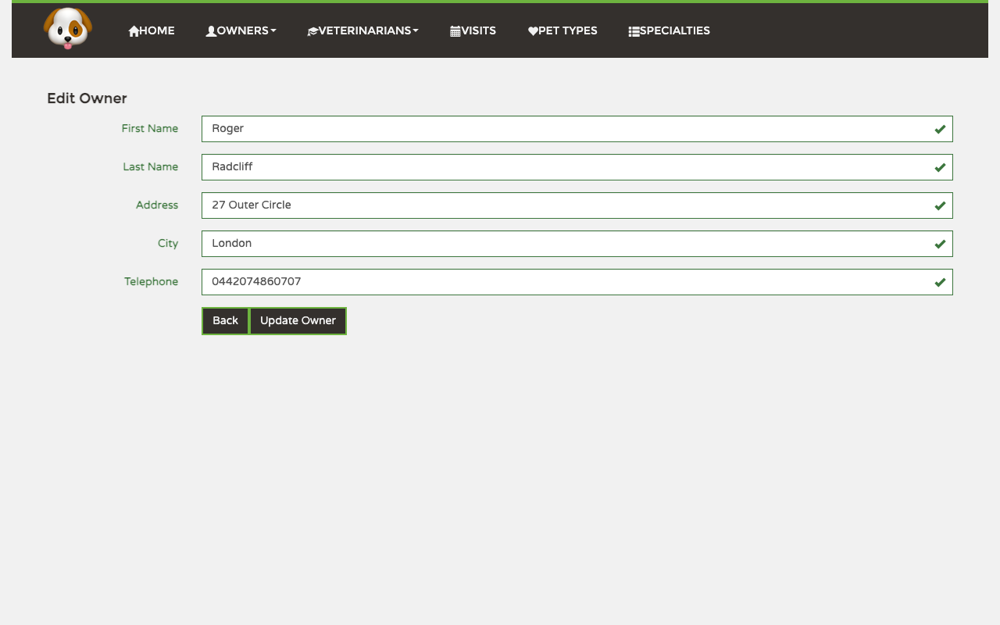

Click **Edit Owner** on the record to open the form pre-filled with the current details. Change whatever you need and save; use **Back** to leave without saving.

---

## Pets

Pets are always managed through their owner's record rather than as a standalone list. From an owner's page you can register a new pet or update an existing one. To log a clinic appointment for a pet, see [Visits](#visits).

### Adding a pet

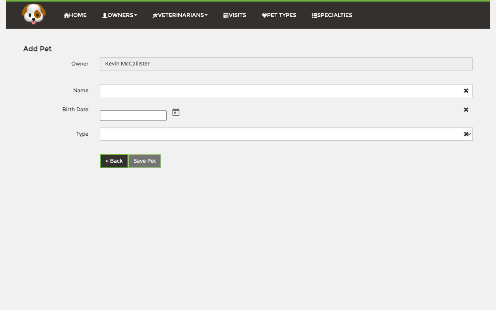

On an owner's record, click **Add New Pet** to open the **Add Pet** form. The Owner is shown read-only at the top. Enter the pet's Name, pick a Birth Date from the calendar, and choose a Type (cat, dog, lizard, snake, bird, hamster or horse). The **Save Pet** button enables once everything is filled in; **< Back** returns to the owner's record.

### Editing a pet

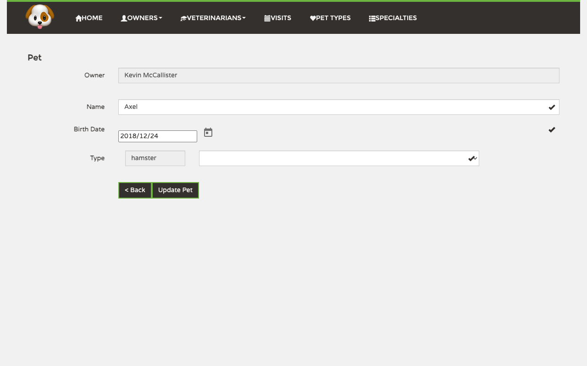

Click **Edit Pet** next to a pet on the owner's record. The form opens pre-filled with the pet's name, birth date and type. Make your changes and click **Update Pet** to save.

---

## Visits

A visit is a single appointment for one pet. The Visits screen gives you a clinic-wide history of every appointment, while individual visits are booked and edited from a pet's record.

### Viewing the list

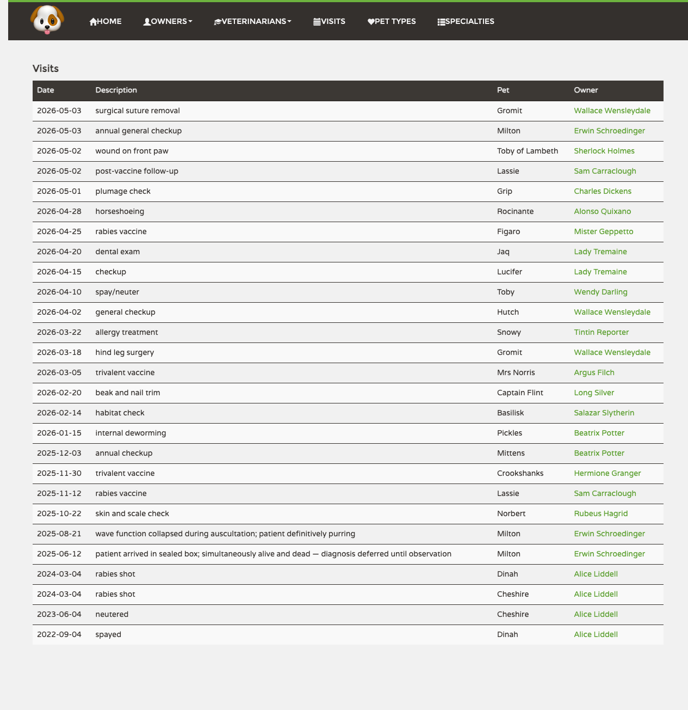

Open **VISITS** for a table of every appointment, newest first, showing the date, description, the pet seen and its owner. The owner's name links straight to that owner's record.

### Adding a visit

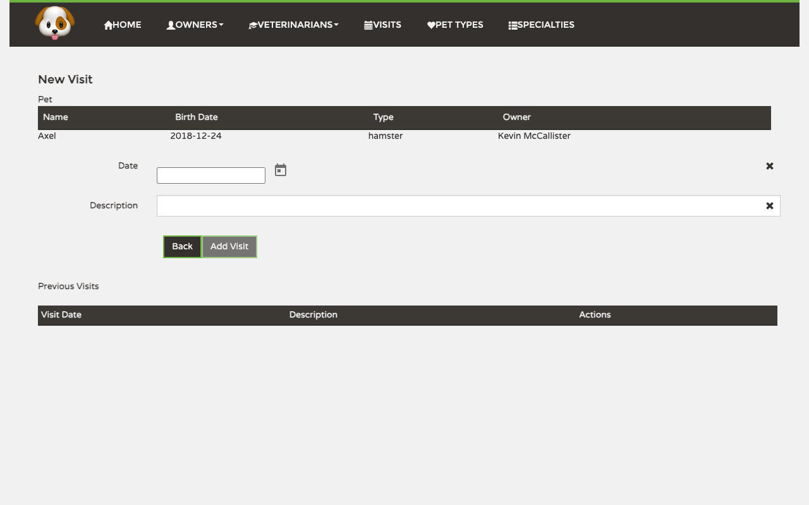

From an owner's record, click **Add Visit** next to the relevant pet to open the **New Visit** form. The pet's details are shown at the top for confirmation. Choose the visit Date from the calendar and type a Description of the appointment, then click **Add Visit**. Any earlier visits for that pet are listed below under *Previous Visits*.

### Editing a visit

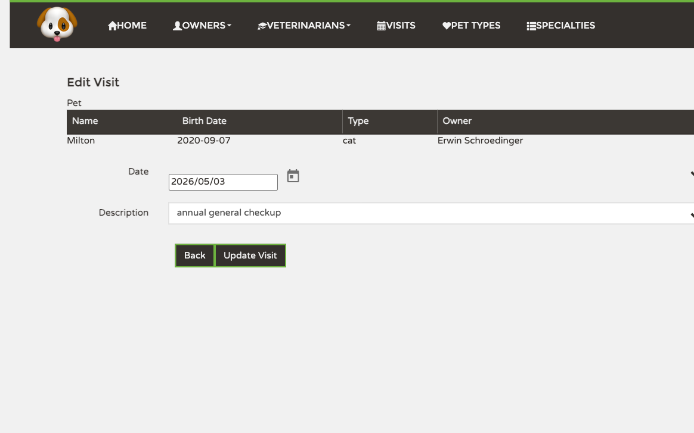

Open a visit's edit form to change its date or description. The form is pre-filled with the existing details; click **Update Visit** to save or **Back** to leave it unchanged.

---

## Pet Types

Pet Types is the master list of the kinds of animal the clinic treats. These values populate the Type dropdown when you add or edit a pet, so keeping them up to date keeps those forms accurate.

### Viewing the list

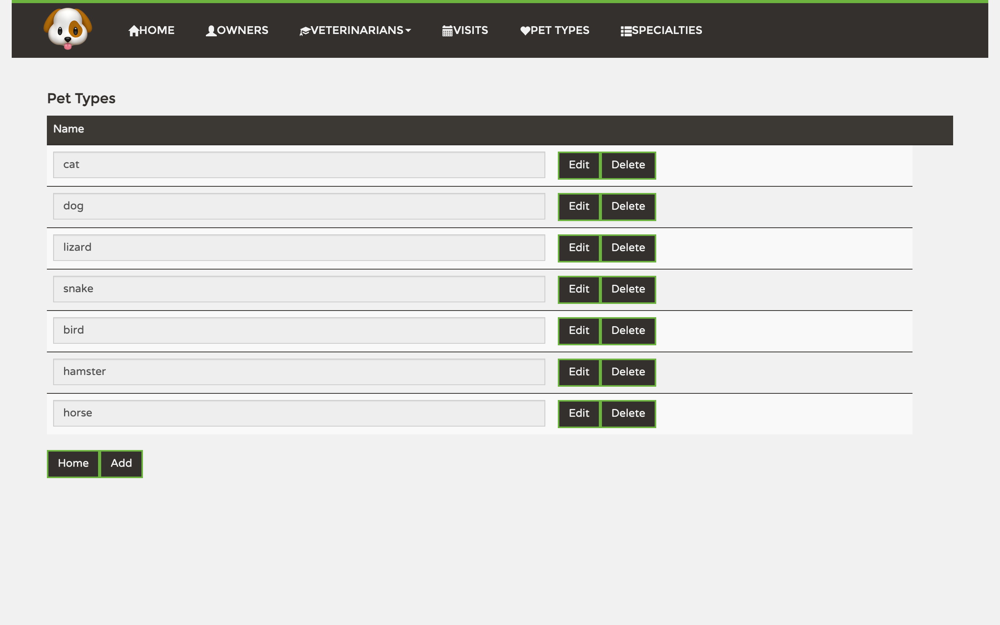

Open **PET TYPES** to see every type in a column of rows, each with **Edit** and **Delete** buttons. **Add** at the bottom creates a new type, and **Home** returns to the Welcome screen.

### Adding a pet type

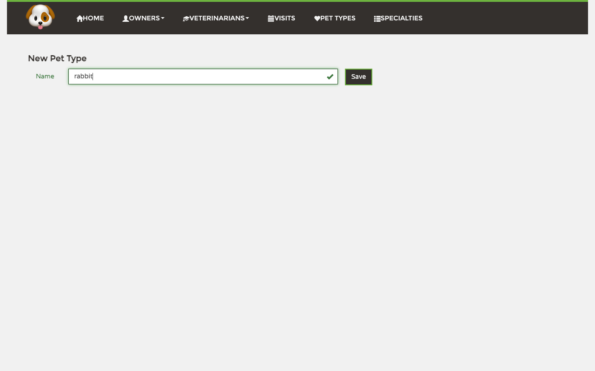

Click **Add** to open the **New Pet Type** form, enter a Name, and click **Save**. The new type immediately becomes available wherever pet types are chosen.

---

## Veterinarians

The Veterinarians area lists the clinic's vets and the specialties each one holds. You can add new vets, edit existing ones, and assign their specialties.

### Viewing the list

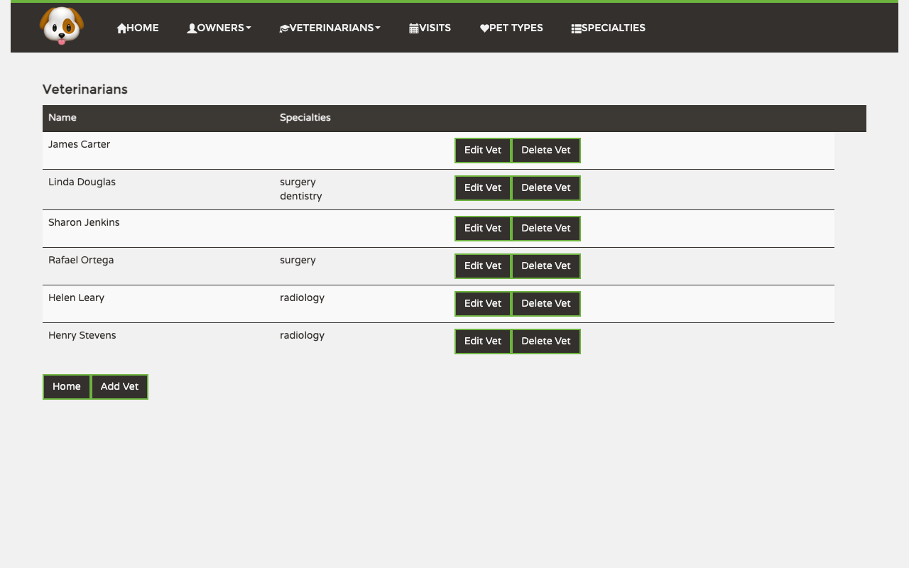

Open **VETERINARIANS** (or its menu) to see each vet with their specialties. Every row has **Edit Vet** and **Delete Vet** buttons; **Add Vet** at the bottom registers a new vet.

### Creating a new vet

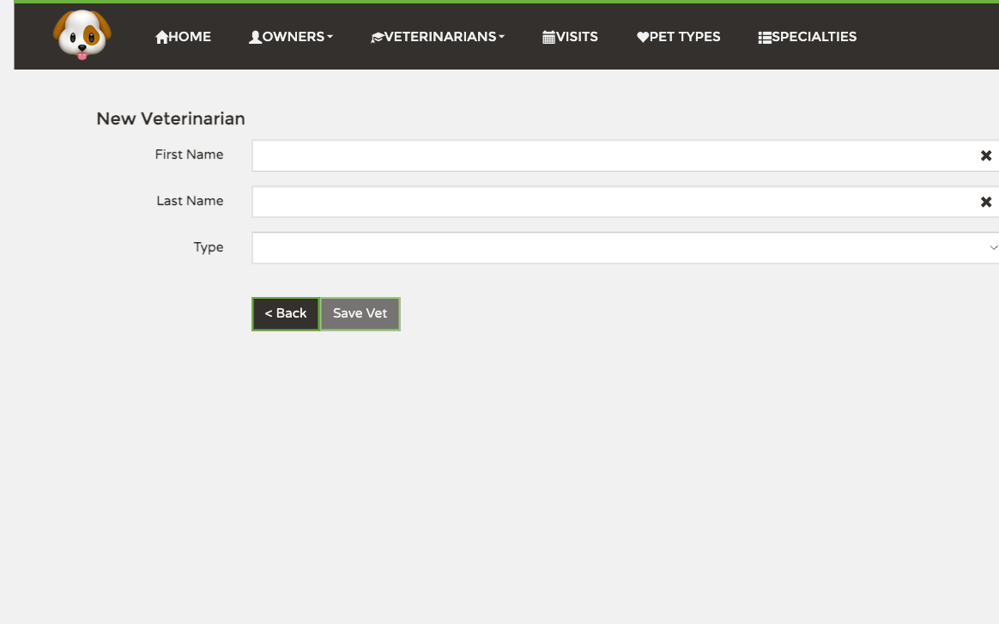

Click **Add Vet** to open the **New Veterinarian** form. Enter First Name and Last Name and pick a Type (radiology, surgery or dentistry). **Save Vet** enables once the form is complete; **< Back** returns to the list.

### Editing a vet

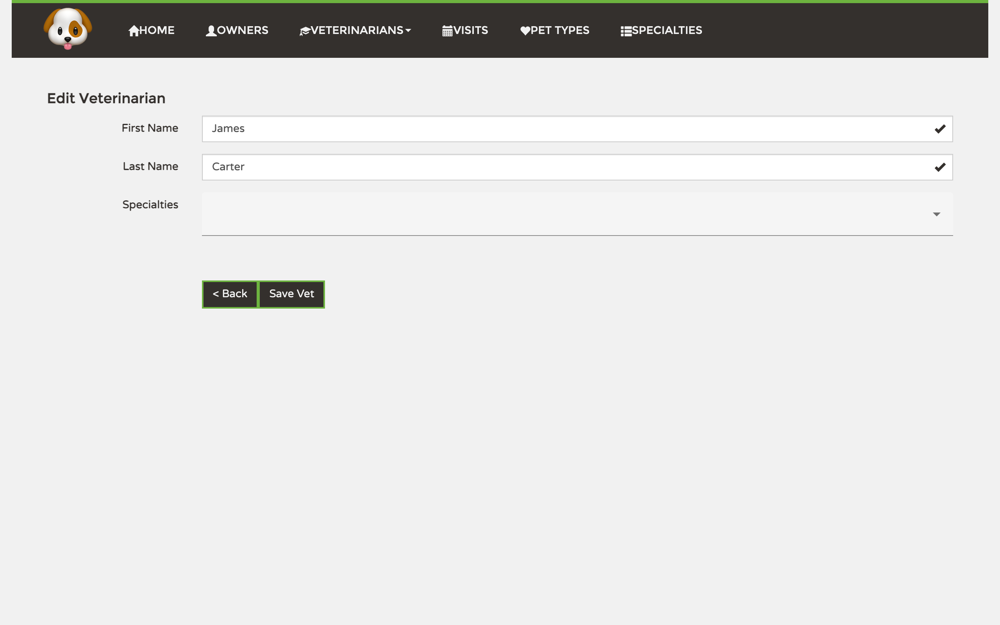

Click **Edit Vet** to open the form pre-filled with the vet's name. Use the **Specialties** picker to add or remove specialties, then click **Save Vet**.

---

## Specialties

Specialties are the areas of veterinary expertise (such as radiology, surgery and dentistry) that you can assign to vets. Each specialty also carries a description used by the clinic's assistant to match owners' questions to the right expertise.

### Viewing the list

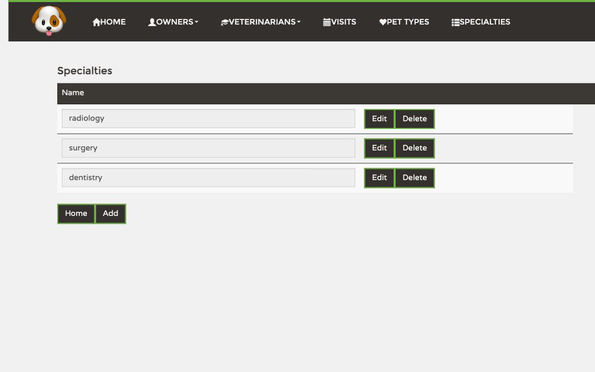

Open **SPECIALTIES** to see every specialty in a column of rows, each with **Edit** and **Delete** buttons. **Add** creates a new specialty and **Home** returns to the Welcome screen.

### Editing a specialty

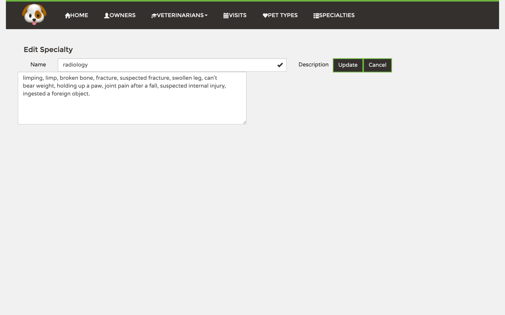

Click **Edit** next to a specialty to open the **Edit Specialty** form. Adjust the Name and the Description (the symptoms that identify this specialty), then click **Update** to save or **Cancel** to discard your changes.
