# PetClinic User Manual

PetClinic is a small veterinary practice management application. You can use it to keep records of pet owners, the pets in their care, the veterinarians on staff, the specialties those vets practice, and the visits the pets make to the clinic.

_This file is regenerated by the `/regen-user-manual` slash command. Do not edit by hand — your changes will be overwritten on the next regeneration._

## Contents

- [Getting around](#getting-around)
- [Welcome](#welcome)
- [Owners](#owners)
- [Pets](#pets)
- [Visits](#visits)
- [Pet Types](#pet-types)
- [Veterinarians](#veterinarians)
- [Specialties](#specialties)

---

## Getting around

The dark bar at the top of every screen is your main navigation. *Home*, *Owners*, *Visits*, *Pet Types* and *Specialties* are plain links that take you straight to that screen. *Veterinarians* is a dropdown menu: click it to choose between *All*, which lists the vets on staff, and *Add New*, which opens the form for registering a new vet. Pets have no menu item of their own — you reach them through their owner's record.

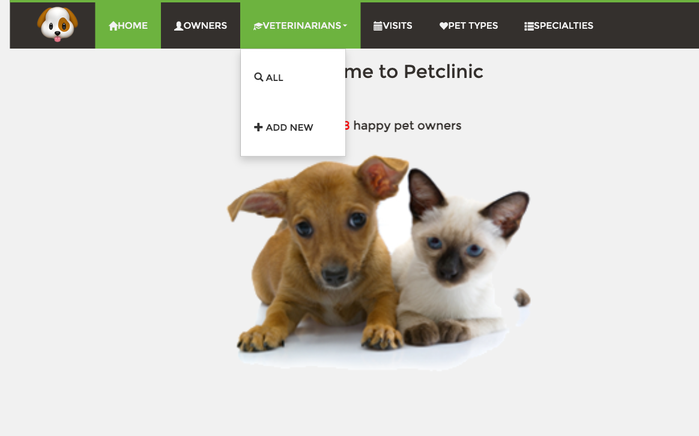

The screenshot above shows the *Veterinarians* dropdown open, with its *All* and *Add New* entries.

---

## Welcome

The welcome screen is what you see when you first open PetClinic, or whenever you click *Home*. It greets you, shows how many pet owners the clinic currently has on record, and is simply a starting point — use the navigation bar to go where you need.

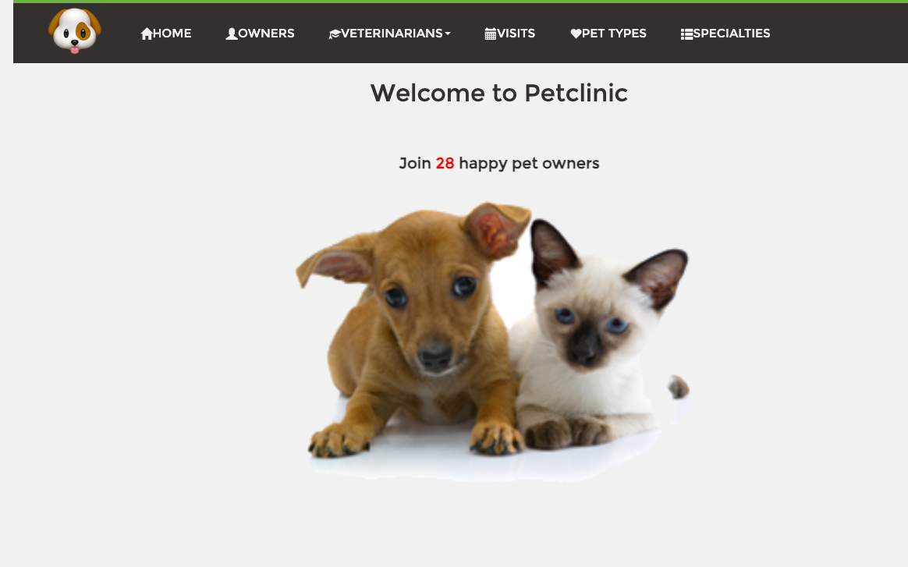

---

## Owners

The Owners area is the heart of the clinic's records. Here you find a pet owner, register a new one, and open an owner's record to see their contact details together with all their pets and each pet's visits. Adding a pet and booking a visit both start from the owner's record — see [Pets](#pets) and [Visits](#visits).

### Viewing the list

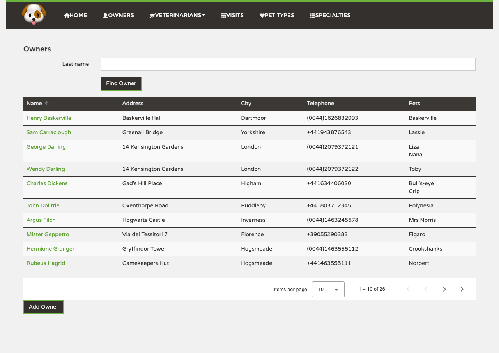

1. Click *Owners* in the navigation bar.
2. The table shows the first 10 owners, in alphabetical order of last name. Each owner is written last name first — *McCallister, Kevin* — followed by their address, city, telephone number and the names of their pets.
3. An owner's pets share one line. When they do not all fit, the line ends in *…* — click the ▾ beside it to see every pet, one under another, and click it again to fold them back.
4. Below the table you see which owners are on screen and how many there are in all, for example *1 – 10 of 26*. Use the arrows beside it to move to the next or previous page, or straight to the first or the last one.
5. Click an owner's name to open their record. When you come back, or refresh the screen, you find the list on the same page, sorted and searched the same way.
6. Click *Add Owner*, at the bottom left of the list, to register a new owner.

### Sorting and changing the page size

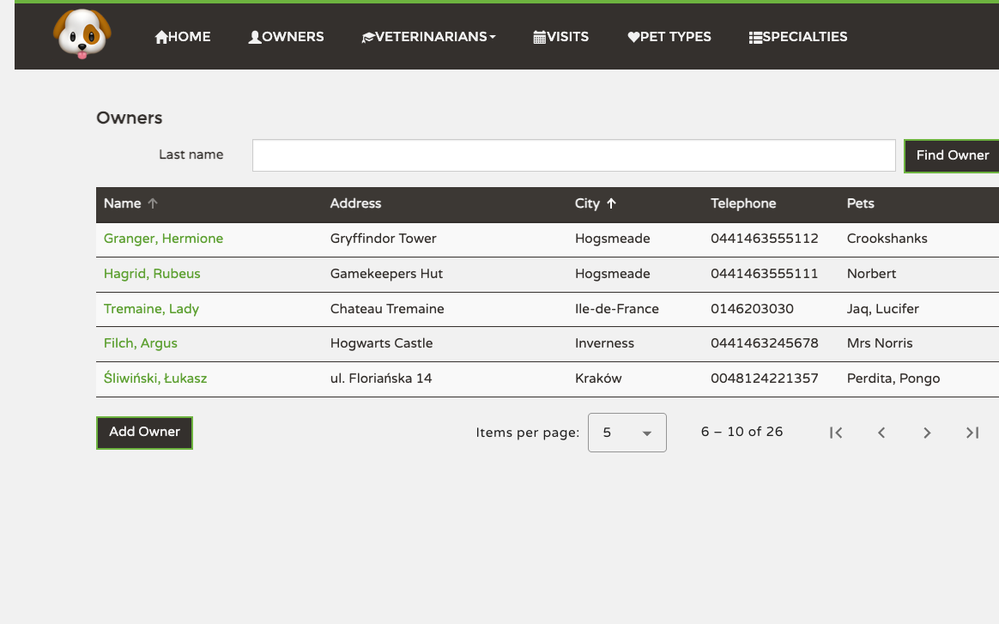

1. Click the *Name* or *City* column heading to sort the table by it. Both headings carry an arrow; the white one shows which column the table is sorted by.
2. Click the same heading again to reverse the order, from Z to A. Owners in the same city are listed by name.
3. *Address*, *Telephone* and *Pets* cannot be sorted.
4. Pick 5, 10 or 20 in *Items per page* to see fewer or more owners at a time.
5. A new sort or page size always takes you back to the first page.

### Finding an owner

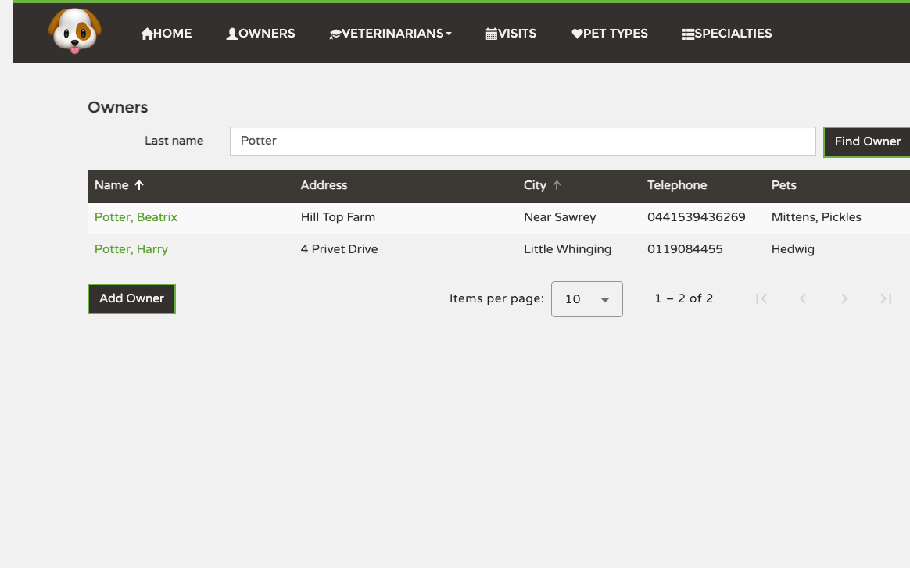

1. Type all or the start of the owner's last name into the *Last name* box above the table. Capital and small letters must match.
2. Click *Find Owner*, or press Enter. The table shrinks to the owners whose last name matches, starting from the first page, and the count below it shows how many matched.
3. If no owner's last name starts with what you typed, a message says so — check the spelling, or click *Add Owner* if they are new to the clinic.
4. To see everyone again, clear the box and click *Find Owner*.

### Creating a new owner

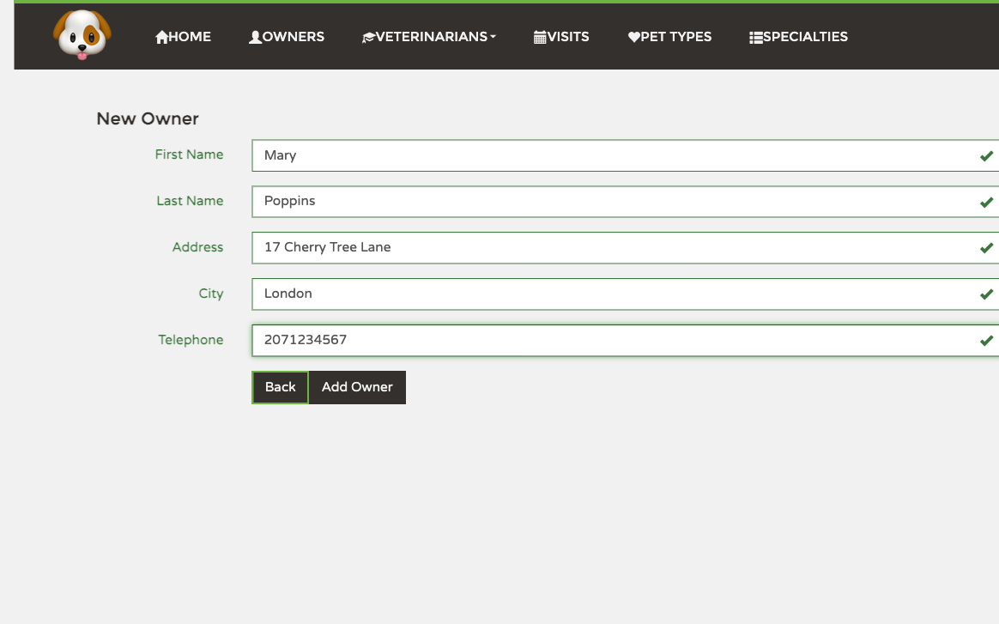

1. On the owners list, click *Add Owner*.
2. Fill in *First Name*, *Last Name*, *Address*, *City* and *Telephone*. A green tick appears beside each field once it is filled in correctly.
3. The *Add Owner* button stays greyed out until every field is filled in. Click it to save.
4. You return to the owners list, where the new owner now appears.
5. Click *Back* instead to leave without saving.

### Looking at an owner's record

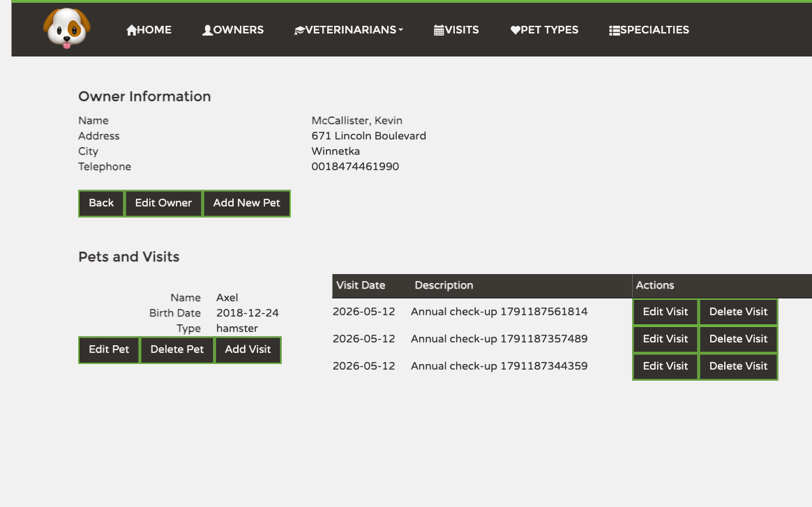

1. Click an owner's name on the owners list.
2. *Owner Information* at the top shows their name (last name first), address, city and telephone.
3. Below it, *Pets and Visits* shows every pet the owner has. On the left you see the pet's name, birth date and type; on the right, a table of that pet's visits.
4. The buttons under the owner's details let you go *Back* to the list, *Edit Owner*, or *Add New Pet*.
5. Each pet has its own *Edit Pet*, *Delete Pet* and *Add Visit* buttons, and each visit has *Edit Visit* and *Delete Visit*.

### Editing an owner

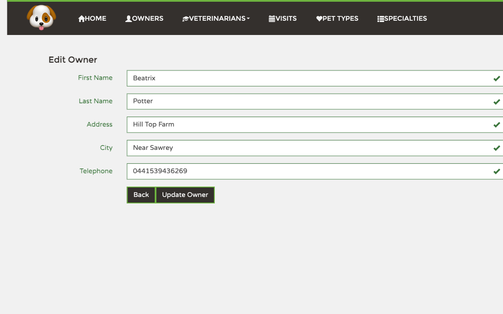

1. On the owner's record, click *Edit Owner*.
2. The form opens already filled in with the owner's current details. Change whatever needs correcting.
3. Click *Update Owner* to save your changes, or *Back* to discard them.

---

## Pets

A pet always belongs to an owner, so you add, view and edit pets from the owner's record — see [Owners](#owners). Each pet has a name, a birth date and a type (cat, dog, and so on — the list of types is managed under [Pet Types](#pet-types)).

### Adding a pet

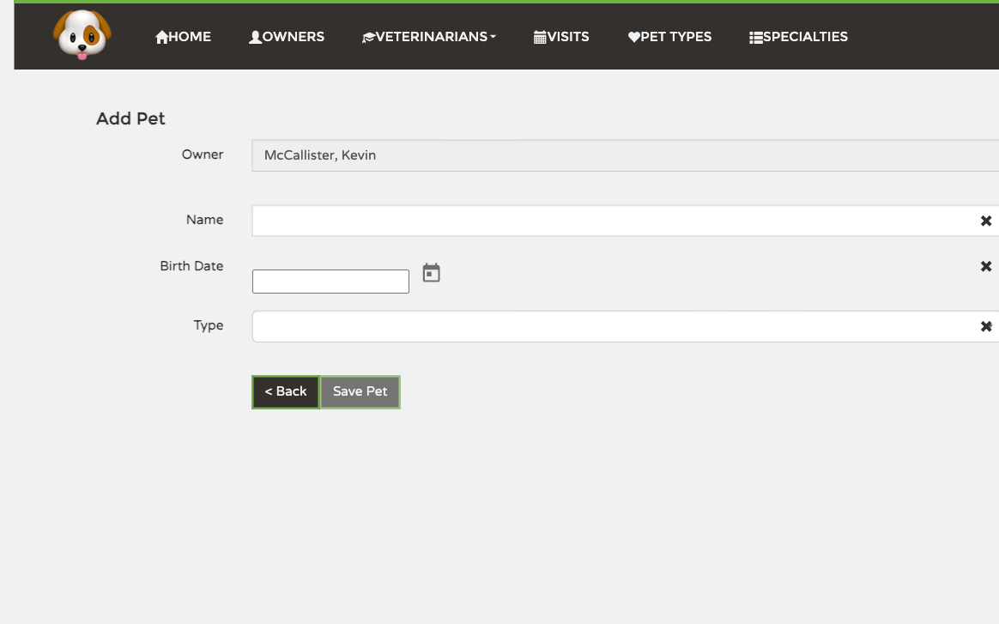

1. Open the owner's record and click *Add New Pet*.
2. The *Owner* field is already filled in and cannot be changed.
3. Type the pet's *Name*.
4. Enter the *Birth Date*, or click the calendar icon to pick it.
5. Choose the *Type* from the dropdown.
6. Click *Save Pet*. The button stays greyed out until all fields are filled in. Click *< Back* to leave without saving.

### Looking at a pet

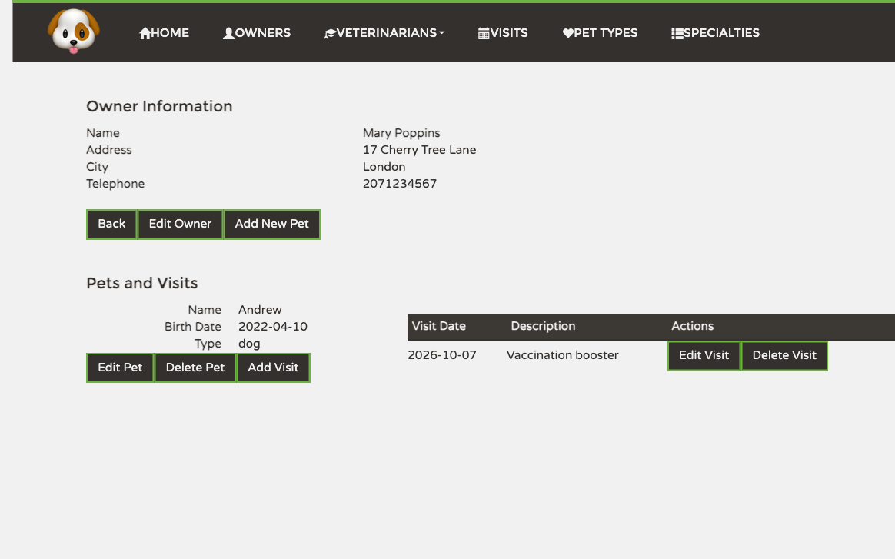

1. After you save, you return to the owner's record, where the new pet appears under *Pets and Visits*.
2. Next to the pet you see its visits; a newly added pet has none until you book one with *Add Visit* (see [Visits](#visits)).
3. Click *Delete Pet* to remove a pet from the owner's record.

### Editing a pet

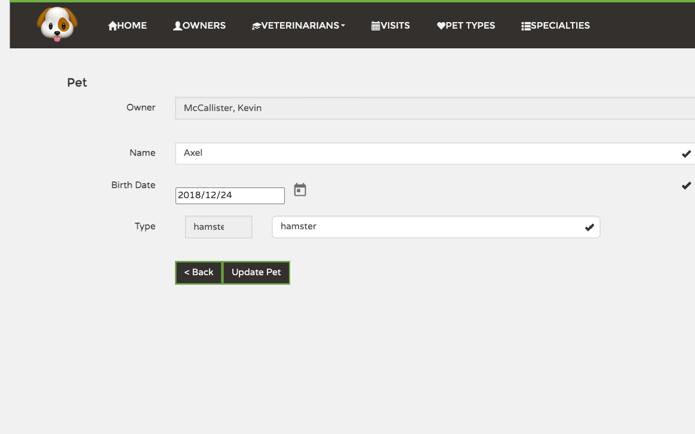

1. On the owner's record, click *Edit Pet* next to the pet.
2. The form opens already filled in with the pet's name, birth date and type. The owner cannot be changed here.
3. Make your changes and click *Update Pet* to save them, or *< Back* to discard them.

---

## Visits

A visit records when a pet came to the clinic and why. You can see every visit across the clinic on the Visits screen, while booking and editing visits happens from the owner's record — see [Owners](#owners).

### Viewing the list

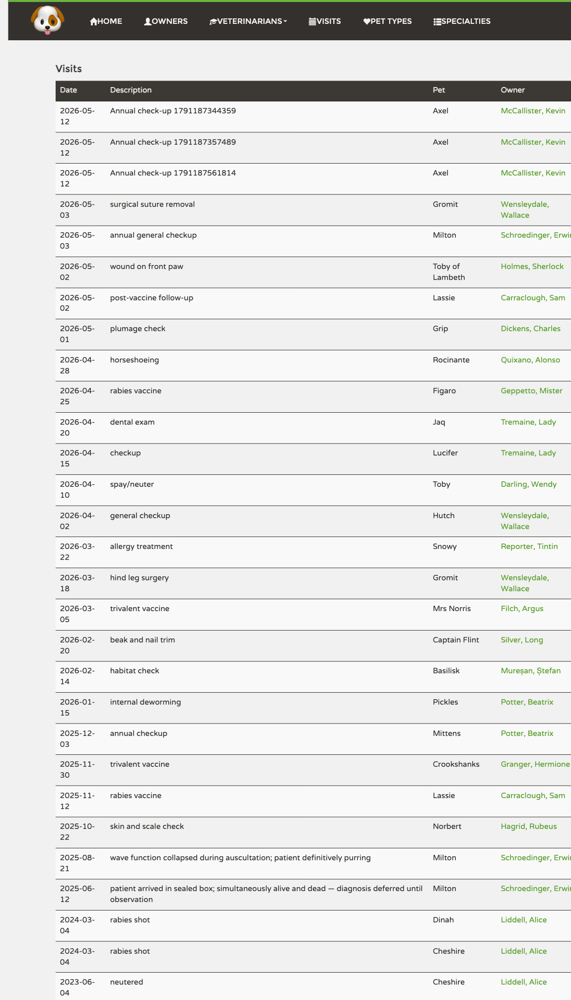

1. Click *Visits* in the navigation bar.
2. The table lists every visit, newest first, with its date, description, the pet and the pet's owner.
3. Click an owner's name to open their record.

### Booking a new visit

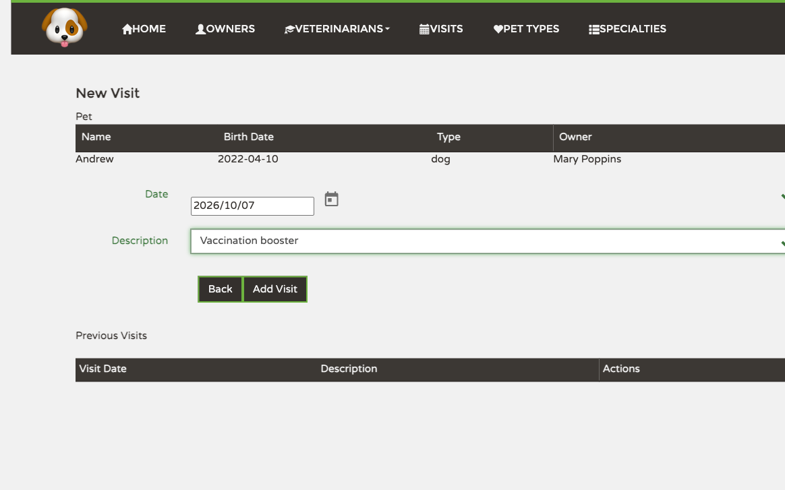

1. Open the owner's record and click *Add Visit* next to the pet.
2. The top of the screen repeats the pet's name, birth date, type and owner, so you can check you picked the right pet.
3. Enter the visit *Date*, or click the calendar icon to pick it. The calendar only lets you pick dates from the pet's birth up to one year ahead; days outside that range are greyed out.
4. Type a *Description* of the reason for the visit.
5. Click *Add Visit* to save. You return to the owner's record, where the visit is listed next to the pet.
6. *Previous Visits* at the bottom lists the pet's earlier visits for reference. Click *Back* to leave without saving.

### Editing a visit

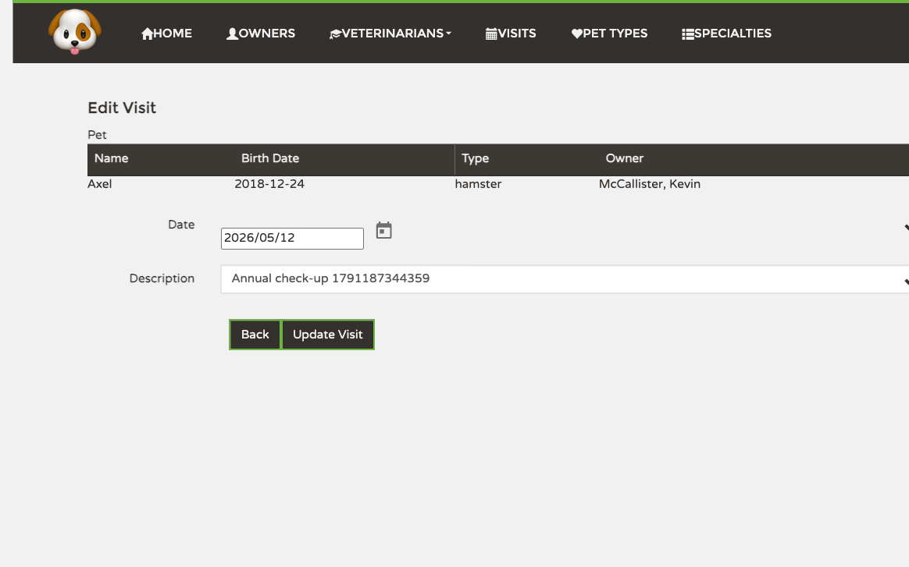

1. On the owner's record, click *Edit Visit* next to the visit.
2. The form opens already filled in with the visit's date and description.
3. Make your changes and click *Update Visit* to save them, or *Back* to discard them.
4. To remove a visit altogether, click *Delete Visit* on the owner's record instead.

---

## Pet Types

Pet types are the kinds of animal the clinic treats — cat, dog, hamster, and so on. This list feeds the *Type* dropdown you use when adding or editing a pet (see [Pets](#pets)).

### Viewing the list

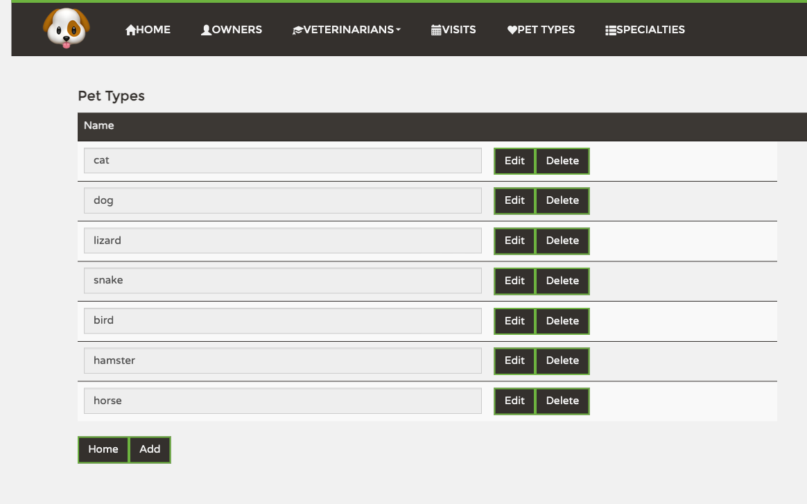

1. Click *Pet Types* in the navigation bar.
2. The table lists every pet type, each with *Edit* and *Delete* buttons.
3. Click *Home* to go back to the welcome screen, or *Add* to create a new type.

### Creating a new pet type

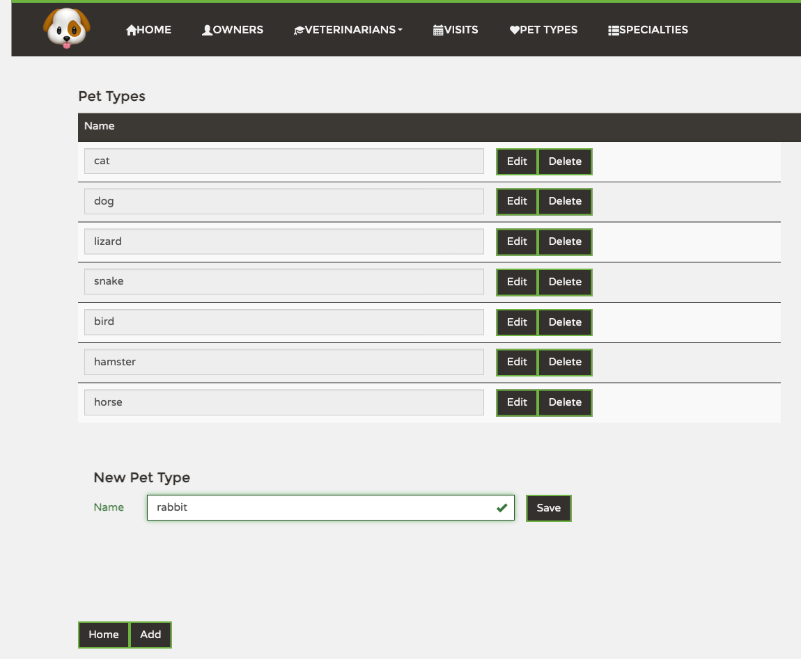

1. Click *Add* below the list. A *New Pet Type* form opens underneath the table.
2. Type the name of the new type.
3. Click *Save*. The new type is added to the list and becomes available when adding a pet.

### Editing a pet type

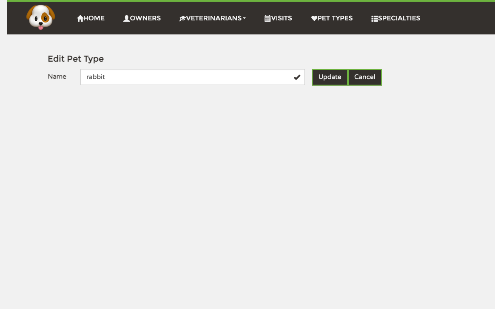

1. Click *Edit* next to the type you want to rename.
2. The *Edit Pet Type* form opens with the current name filled in.
3. Change the name and click *Update* to save, or *Cancel* to discard your change.

---

## Veterinarians

This area lists the vets on staff and the specialties each one practises. You can register a new vet, change a vet's name or specialties, and remove a vet. The specialties you choose from are managed under [Specialties](#specialties).

### Viewing the list

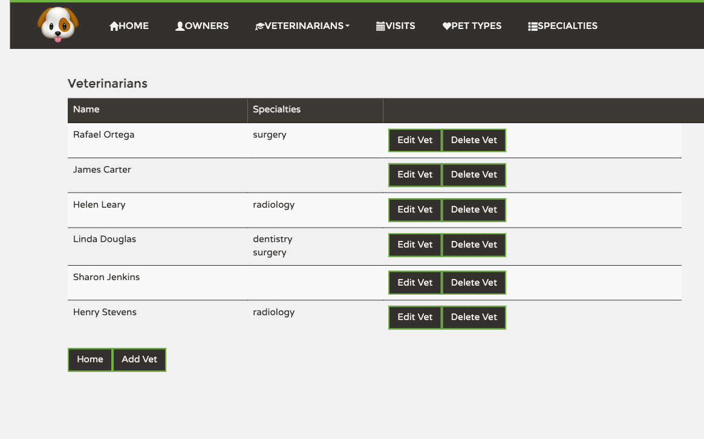

1. Click *Veterinarians* in the navigation bar, then *All*.
2. The table lists each vet with their specialties; vets with no specialty show an empty cell.
3. Click *Edit Vet* or *Delete Vet* on a row to change or remove that vet.
4. Click *Add Vet* to register a new vet, or *Home* to go back to the welcome screen.

### Creating a new vet

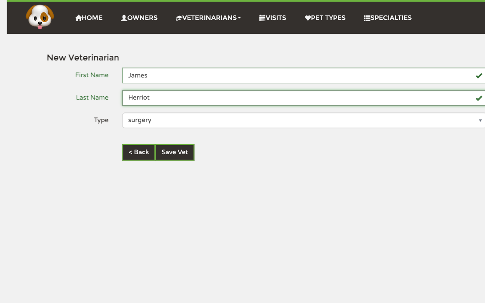

1. Click *Add Vet* below the list, or choose *Veterinarians* → *Add New* in the navigation bar.
2. Fill in *First Name* and *Last Name*.
3. Choose the vet's specialty from the *Type* dropdown.
4. Click *Save Vet*. You return to the vet list, where the new vet now appears. Click *< Back* to leave without saving.

### Editing a vet

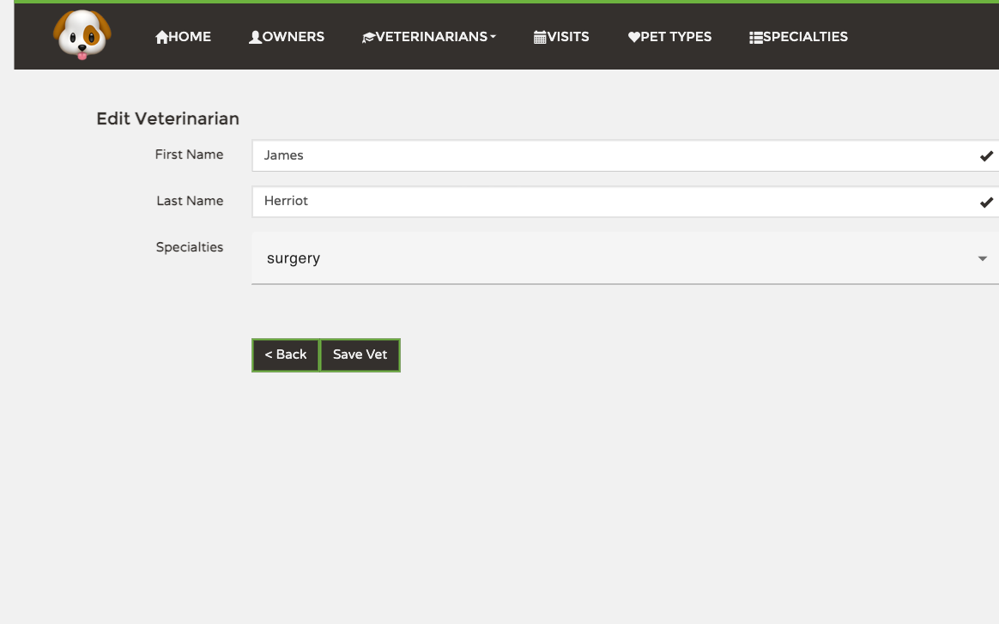

1. Click *Edit Vet* next to the vet on the list.
2. The form opens already filled in with the vet's name and current specialties.
3. Make your changes and click *Save Vet*, or *< Back* to discard them.

### Choosing a vet's specialties

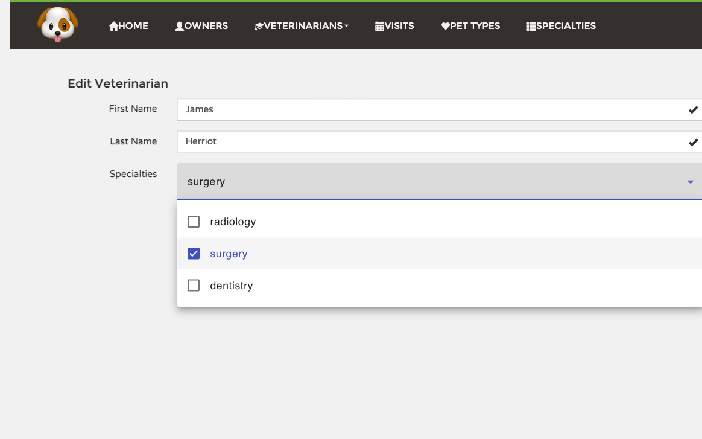

1. On the *Edit Veterinarian* form, click the *Specialties* box to open the list.
2. Tick every specialty the vet practises and untick any they no longer do — a vet can have several.
3. Click anywhere outside the list to close it, then click *Save Vet*.

---

## Specialties

Specialties are the areas of veterinary medicine the clinic's vets practise, such as radiology, surgery or dentistry. Each specialty can carry a description of the symptoms it deals with, which the clinic's assistant uses to point an owner to the right kind of vet. Assigning specialties to vets is done under [Veterinarians](#veterinarians).

### Viewing the list

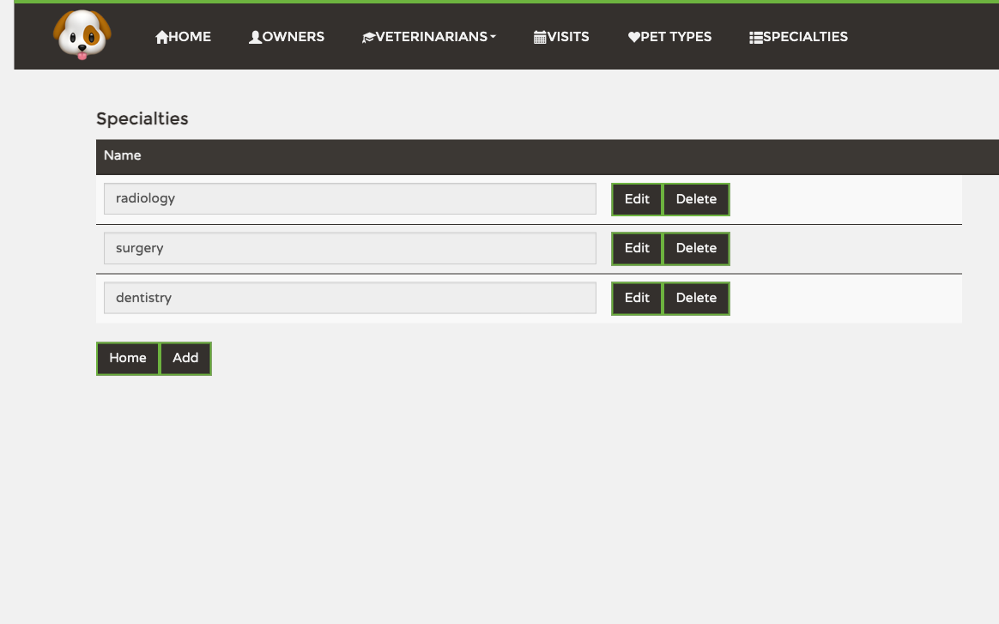

1. Click *Specialties* in the navigation bar.
2. The table lists every specialty, each with *Edit* and *Delete* buttons.
3. Click *Home* to go back to the welcome screen, or *Add* to create a new specialty.

### Creating a new specialty

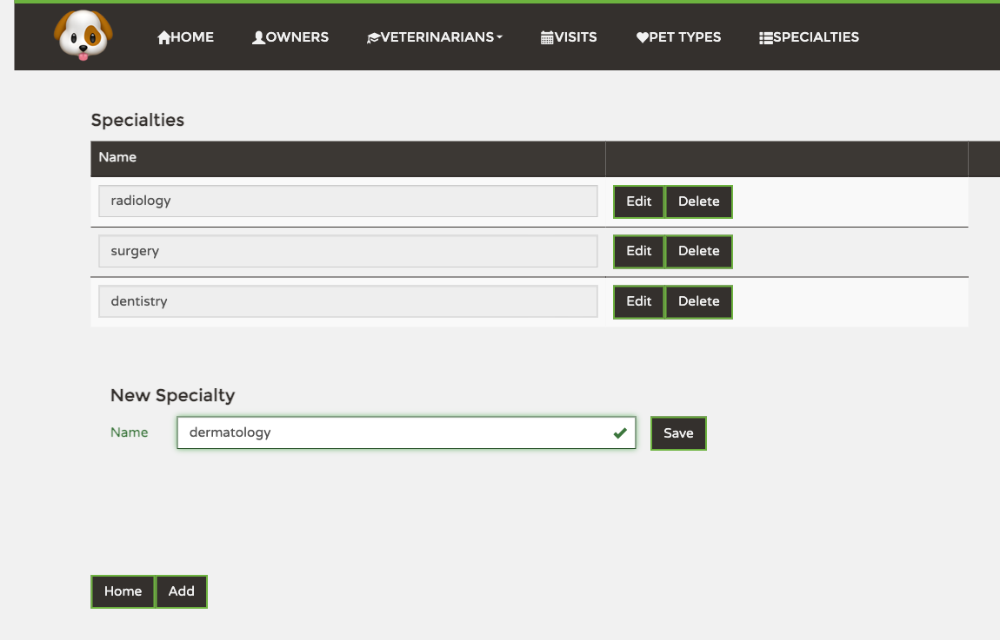

1. Click *Add* below the list. A *New Specialty* form opens underneath the table.
2. Type the name of the specialty.
3. Click *Save*. The new specialty is added to the list and can now be assigned to vets.

### Editing a specialty

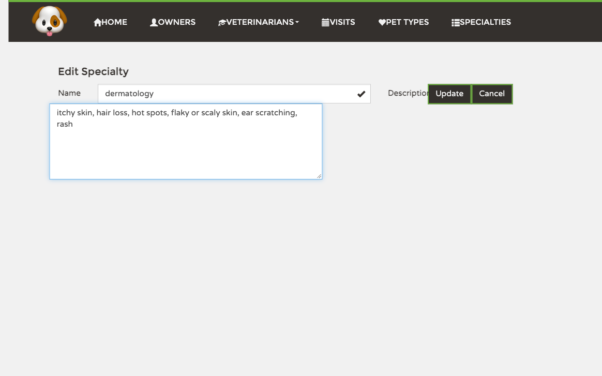

1. Click *Edit* next to the specialty.
2. The *Edit Specialty* form opens with its current name and description.
3. Change the *Name* if needed, and use *Description* to list the symptoms this specialty covers — for example "itchy skin, hair loss, rash" for dermatology.
4. Click *Update* to save, or *Cancel* to discard your changes.
